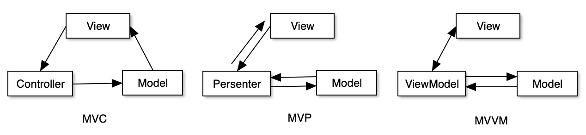

# Android架构

> 安卓架构有：MVC，MVP，MVVM
> 
> 谷歌 architecture demo: [https://github.com/googlesamples/android-architecture](https://github.com/googlesamples/android-architecture)
> 

---

### MVC

- 定义：
	- MVC全名是Model View Controller，用一种业务逻辑、数据、界面显示分离的方法组织代码。
- Android中的MVC：
	- Model：我们针对业务模型，建立的数据结构和相关的类，就可以理解为Model。
	- View：一般采用XML文件进行界面的描述，这些XML可以理解为View。
	- Controller：Activity/Fragment
- MVC的缺点：
	- Activity/Fragment既充当控制层又充当视图层，这就导致了V和C这两层耦合在一起。当业务比较复杂时，Activity/Fragment文件就很庞大，导致难以维护和测试。

### MVP

- 定义
	- MVP框架由3部分组成：View负责显示，Presenter负责逻辑处理，Model提供数据。此外，View通过View Interface与Presenter进行交互。
- Android中的MVP：
	- Model：负责存储、检索、操纵数据(有时也实现一个Model Interface用来降低耦合)
	- View：负责绘制UI元素、与用户进行交互(在Android中体现为Activity)
	- Presenter：作为View与Model交互的中间纽带，处理与用户交互的逻辑。
	- View Interface：需要View实现的接口，View通过View Interface与Presenter进行交互，降低耦合，方便进行单元测试。
- MVP的缺点：
	- 相对MVC增加了很多的接口和实现类，但是代码量要庞大一些。所以MVP比较适用于中小型的项目，大型项目慎用。

### MVVM

- 将 Presenter 改名为 ViewModel
- 唯一的区别是，它采用双向数据绑定(data-binding)：View的变动自动反映在ViewModel，反之亦然。
