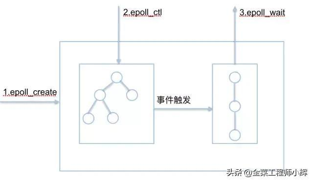

**epoll的通俗解释**

结合以上三条，epoll的通俗解释是一种当文件描述符的内核缓冲区非空的时候，发出可读信号进行通知，当写缓冲区不满的时候，发出可写信号通知的机制

**epoll的API详解**

epoll的核心是3个API，核心数据结构是：1个红黑树和1个链表

JDK在Linux已经默认使用epoll方式，但是JDK的epoll采用的是水平触发，而Netty重新实现了epoll机制，采用边缘触发方式，netty epoll transport 暴露了更多的nio没有的配置参数，如 TCP_CORK, SO_REUSEADDR等等；另外像Nginx也采用边缘触发。

#### **1.2 epoll与select、poll的对比**

**1.2.1. 用户态将文件描述符传入内核的方式**

**select：**创建3个文件描述符集并拷贝到内核中，分别监听读、写、异常动作。

这里受到单个进程可以打开的fd数量限制，默认是1024。

**poll：**将传入的struct pollfd结构体数组拷贝到内核中进行监听。

epoll：执行epoll_create会在内核的高速cache区中建立一颗红黑树以及就绪链表(该链表存储已经就绪的文件描述符)。

接着用户执行的epoll_ctl函数添加文件描述符会在红黑树上增加相应的结点。

##### 1.2.3 内核态检测文件描述符读写状态的方式**

**select：**采用轮询方式，遍历所有fd，最后返回一个描述符读写操作是否就绪的mask掩码，根据这个掩码给fd_set赋值。

**poll：**同样采用轮询方式，查询每个fd的状态，如果就绪则在等待队列中加入一项并继续遍历。

**epoll：**采用回调机制。在执行epoll_ctl的add操作时，不仅将文件描述符放到红黑树上，而且也注册了回调函数，

内核在检测到某文件描述符可读/可写时会调用回调函数，该回调函数将文件描述符放在就绪链表中。

##### **1.2.4 . 找到就绪的文件描述符并传递给用户态的方式**

select：将之前传入的fd_set拷贝传出到用户态并返回就绪的文件描述符总数。用户态并不知道是哪些文件描述符处于就绪态，需要遍历来判断。

poll：将之前传入的fd数组拷贝传出用户态并返回就绪的文件描述符总数。用户态并不知道是哪些文件描述符处于就绪态，需要遍历来判断。

epoll：epoll_wait只用观察就绪链表中有无数据即可，最后将链表的数据返回给数组并返回就绪的数量。内核将就绪的文件描述符放在传入的数组中，所以只用遍历依次处理即可。这里返回的文件描述符是通过mmap让内核和用户空间共享同一块内存实现传递的，减少了不必要的拷贝。

##### **1.2.5 重复监听的处理方式**

select：将新的监听文件描述符集合拷贝传入内核中，继续以上步骤。

poll：将新的struct pollfd结构体数组拷贝传入内核中，继续以上步骤。

epoll：无需重新构建红黑树，直接沿用已存在的即可。

##### 1.2.6 **epoll更高效的原因**

 select和poll的动作基本一致，只是poll采用链表来进行文件描述符的存储，

   而select采用fd标注位来存放，所以select会受到最大连接数的限制，而poll不会。

 select、poll、epoll虽然都会返回就绪的文件描述符数量。**但是select和poll并不会明确指出是哪些文件描述符就绪，而epoll会。**

**造成的区别就是，系统调用返回后，调用select和poll的程序需要遍历监听的整个文件描述符找到是谁处于就绪，**

而epoll则直接处理即可。select、poll都需要将有关文件描述符的数据结构拷贝进内核，最后再拷贝出来。而epoll创建的有关文件描述符的数据结构本身就存于内核态中，

**系统调用返回时利用mmap()文件映射内存加速与内核空间的消息传递：即epoll使用mmap减少复制开销。**

select、poll采用轮询的方式来检查文件描述符是否处于就绪态，而epoll采用回调机制。造成的结果就是，随着fd的增加，select和poll的效率会线性降低，而epoll不会受到太大影响，除非活跃的socket很多。epoll的边缘触发模式效率高，系统不会充斥大量不关心的就绪文件描述符虽然epoll的性能最好，但是在连接数少并且连接都十分活跃的情况下，select和poll的性能可能比epoll好，毕竟epoll的通知机制需要很多函数回调。