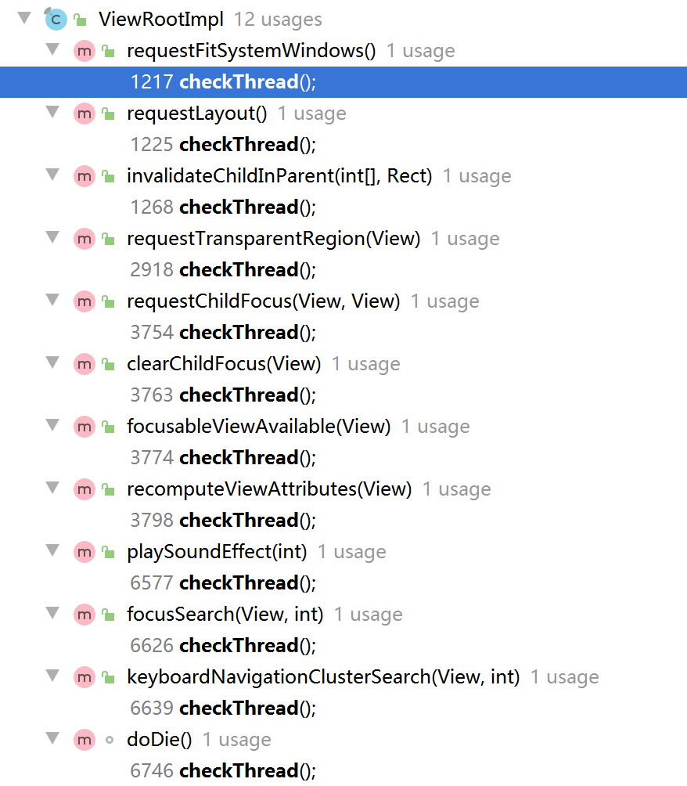

## 一、‘非UI线程更新UI’问题探究

Android开发的时候**非UI线程**不能**更新UI**，这个是大家都知道的开发常识。但是当问到为什么？可能我们就会有些含糊了。

本文我们就针对这个问题进行探讨并进行一定的思维发散，来加深我们对Android界面刷新机制的理解。


### 1. UI线程的工作机制

主线程的工作机制可以概况为 **生产者 - 消费者 - 队列** 模型。


### 2. 为什么UI线程不设计成线程安全的

总所周知，如果设计成线程安全的，那性能肯定是大打折扣的，而UI更新的要求有如下特性：

- UI是具有可变性的，甚至是高频可变。
- UI对响应时间很敏感，这就要求UI操作必须要高效。
- UI组件必须批量绘制来保证效率。

所以为了保证渲染性能，UI线程不能设计成线程安全的。Android设计了Handler机制来更新UI是避免多个子线程更新UI导致的UI错乱的问题，也避免了通过加锁机制设计成线程安全的，因为那样会导致性能下降的很厉害。


### 3. 子线程能创建Handler吗？

能。但是需要先调用Looper.prepare()方法，否则会抛出运行时异常[Can't create handler inside thread that has not call Looper.prepared()]。


### 4. 子线程的Looper和主线程的Looper有什么区别

子线程的Looper可以退出的，主线程的Looper时不能退出的。


### 5. 非UI线程一定不能更新UI吗？

答：不一定。

说明：我们知道在Android提供的SurfaceView、GLSurfaceView里面是都能在非UI线程更新UI的。

并且在一些特定的场景下，子线程更新View也是能更新成功的。

例如，下面的代码在子线程中更新界面是可以成功的：

[](javascript:void(0);)

```
import android.app.Activity;
import android.os.Bundle;
import android.widget.Button;
 
public class TestActivity extends Activity {

    Button btn = null;

    public void onCreate(Bundle savedInstanceState) {
       super.onCreate(savedInstanceState);
       setContentView(R.layout.main);
       btn = (Button) findViewById(R.id.Button01);
       new TestThread(btn).start();
    }
 

    class TestThread extends Thread {
       Button btn = null;
       public TestThread(Button btn) {
           this.btn = btn;
       }

       @Override
       public void run() {
           btn.setText("TestThread.run");
       }
    }
}
```

[](javascript:void(0);)

当我们深入分析其原理的时候，就可以知道，能否更新成功的关键点在于是否会触发checkThead()导致更新失败，抛出异常：

```
void checkThread() {
    if (mThread != Thread.currentThread()) {
        throw new CalledFromWrongThreadException("Only the original thread that created a view hierarchy can touch its views.");
    }
}
```

而在ViewRootImpl中，会有这些方法调用到checkThread()方法：



经过分析，最终可以得到，在子线程中给TextView setText 不会抛出异常的两个场景：

1：TextView 还没来得及加入到ViewTree中

2：TextView已经被加入了ViewTree，但是被设置了固定宽高，且开启了硬件加速

子线程操作View 确实不一定导致Crash，那是因为刚好满足一定的条件并没有触发checkThread机制，但这并不代表我们在开发过程中可以这么写，其实我们还是应该遵循google的建议，更新UI始终在UI线程里去做。