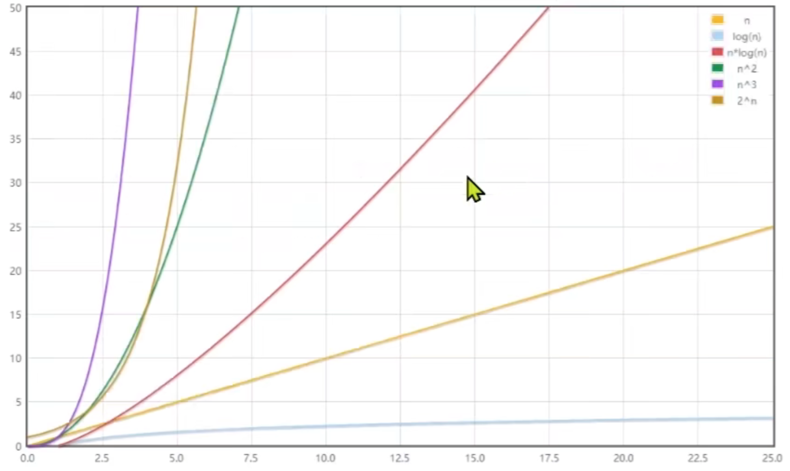
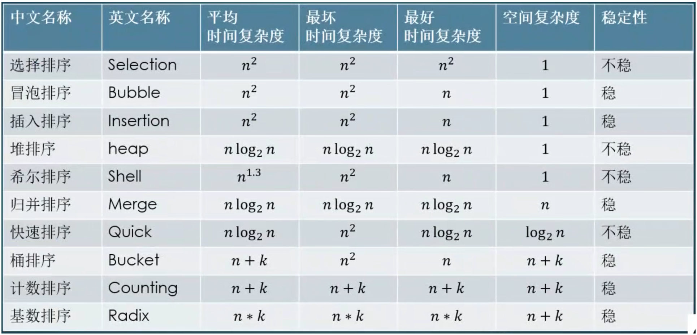
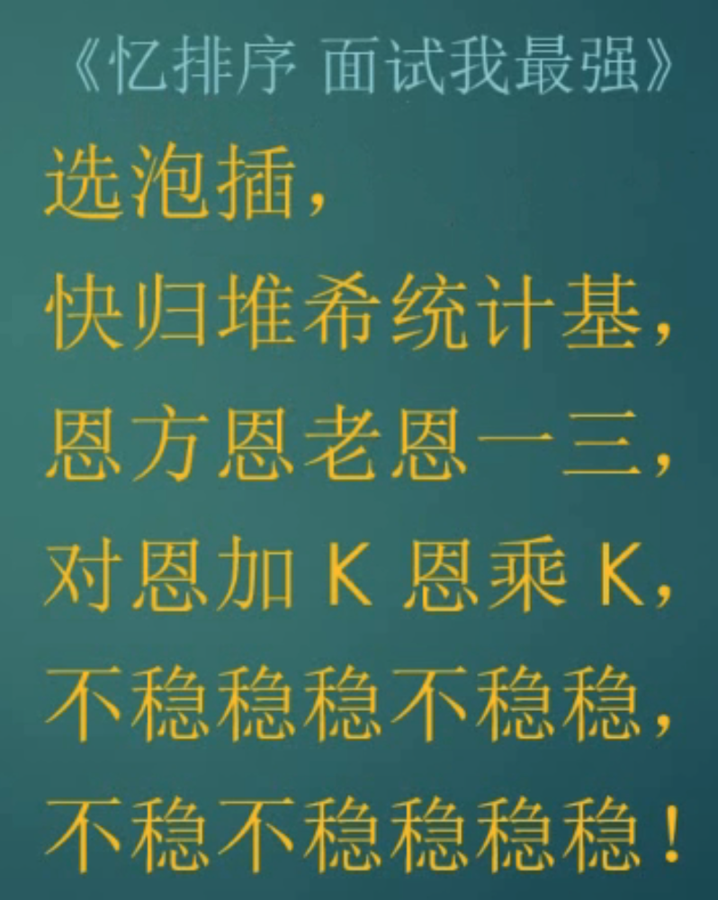
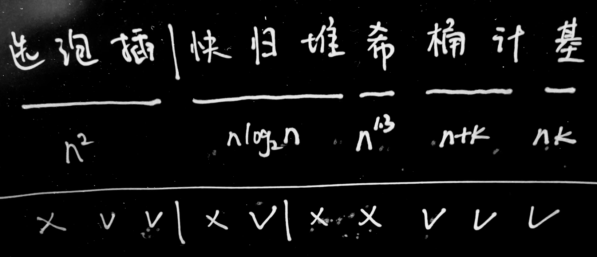

## 时间复杂度

| 分类       | 记作     |
| :--------- | -------- |
| 常量阶     | O(1)     |
| 对数阶     | O(logn)  |
| 线性阶     | O(n)     |
| 线性对数阶 | O(nlogn) |
| 平方阶     | O(n^2)   |
| 立方阶     | O(n^3)   |
| 指数阶     | O(2^n)   |

## 排序算法

## 写算法的步骤

- 由简单到复杂
- 先局部后整体
- 先粗糙后精细