# JVM对象分配过程

## 1、对象的内存布局

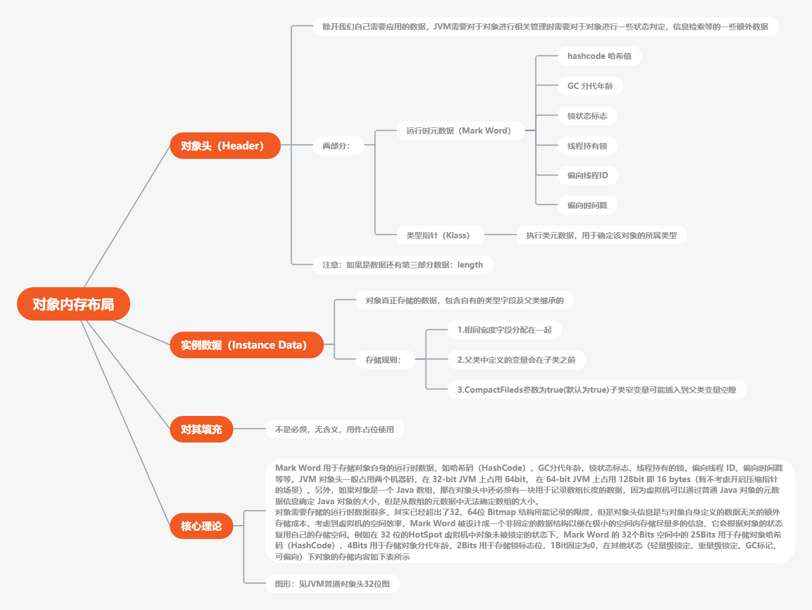

## 2、对象创建步骤

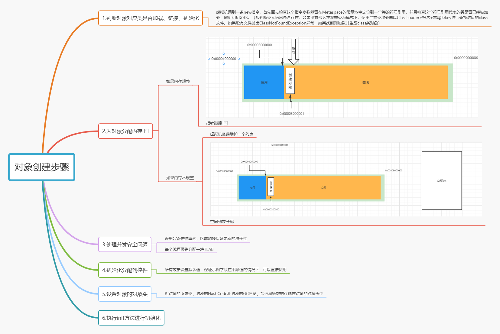

## 3、堆区

### 运行时数据区

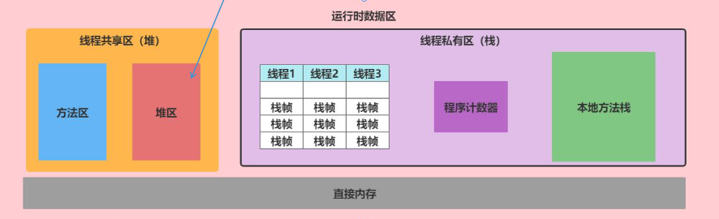

### 堆概述

- 一个JVM进程存在一个堆内存，堆是JVM内存管理的核心区域
- java 堆区在JVM启动时被创建，其空间大小也被确定，是JVM管理的最大一块内存(堆内存大小可以调整)
- 本质上堆是一组在物理上不连续的内存空间，但是逻辑上是连续的空间(参考上节课HSDB分析的内存结构)
- 所有线程共享堆，但是堆内对于线程处理还是做了一个线程私有的 部分(TLAB)

### 堆的对象管理

- 在《JAVA虚拟机规范》中对Java堆的描述是: 所有的对象示例以及数组都应当在运行时分配在堆上
- 但是从实际使用角度来看，不是绝对，存在某些特殊情况下的对象产 生是不在堆上分配
- 这里请注意，规范上是绝对、实际上是相对
- 方法结束后，堆中的对象不会马上移除，需要通过GC执行垃圾回收后才会回收

### 堆的内存细分

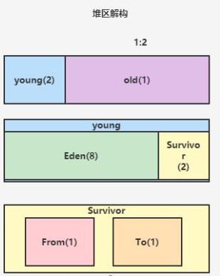

Java7之前内存逻辑划分为:

​		**新生区 + 老年区 + 永久区** 

Java8之后内存逻辑划分为:

​		**新生去 + 老年区 + 元空间**

实际上不管永久代与元空间，都是方法区中对于长期存在的常量对象的保存

### 体会堆空间的分代思想

- 为什么需要分代?有什么好处? 

- 经研究表明，不同对象的生命周期不一致，但是在具体使用过程中70%-90的对象是临时对象

- 分代唯一的理由是优化GC性能。如果没有分代，那么所有对象在一块空 间，GC想要回收扫描他就必须扫描所有的对象，分代之后，长期持有的对象可以挑出，短期持有的对象可以固定在一个位置进行回收，省掉很大一部分空间利用。

### 堆的默认大小

默认空间大小:

- 初始大小: 物理电脑内存大小 / 64

- 最大内存大小: 物理电脑内存大小 / 4

### 工具jstat

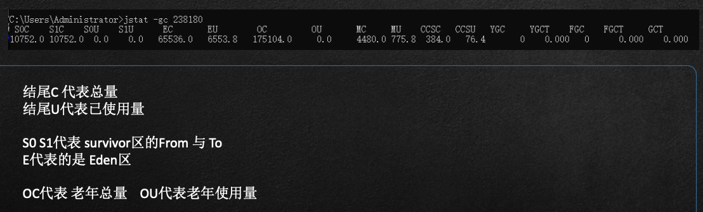

### 对象的分配过程

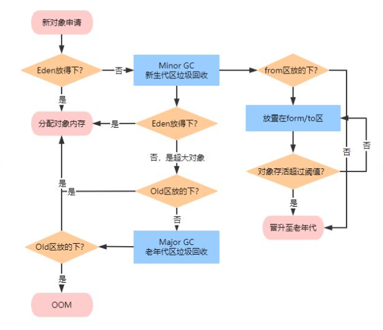

### JVisualVm演示对象分配过程

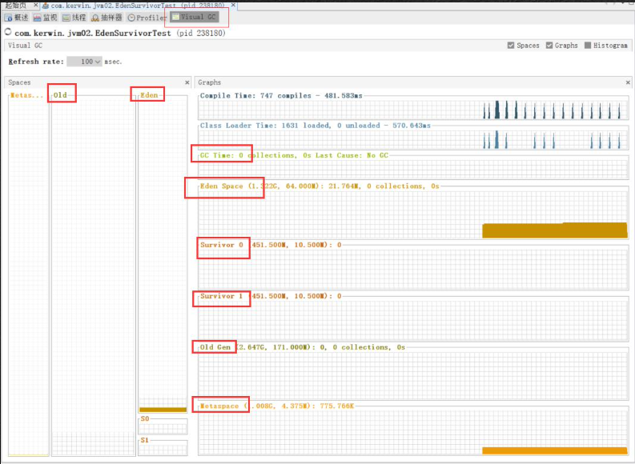

### 对象的生产过程

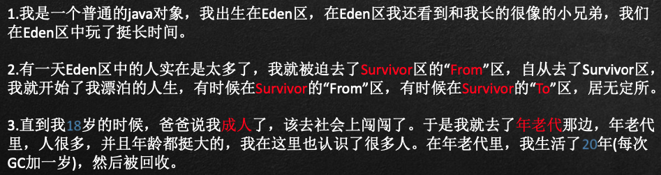

### MinorGc、MajorGC、FullGC的区别

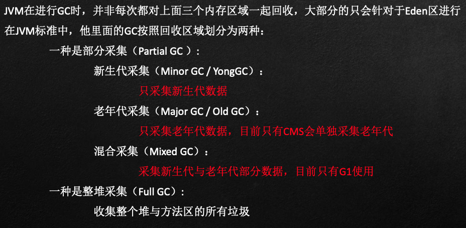

### GC触发策略

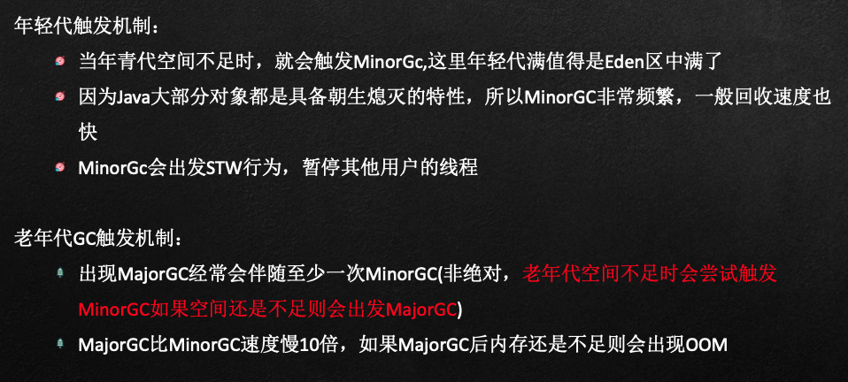

### TLAB(Thread Local Allocation Buffer)

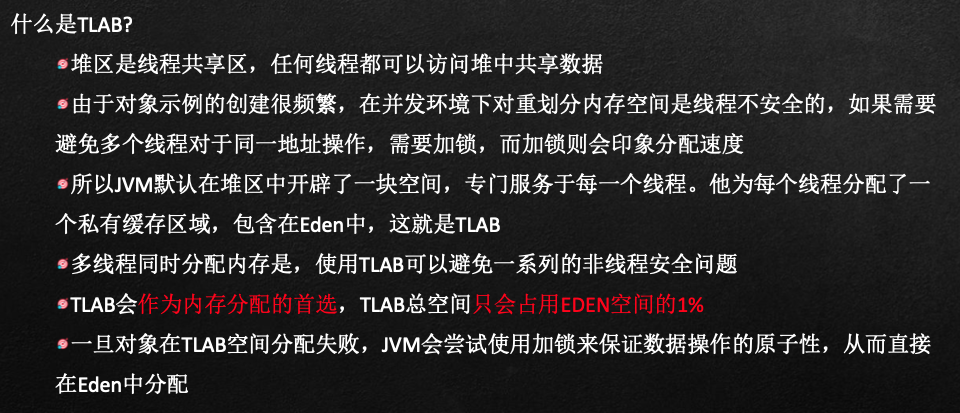

## 4、逃逸分析和标量替换

### 对象逃逸

一个对象的作用域仅限于方法区域内部在使用的情况下，此种状况叫做非逃逸

一个对象如果被外部其他类调用，或者是作用于属性中，则此种现 象被称之为对象逃逸

此种行为发生在字节码被编译后JIT对于代码的进一步优化

### 标量替换

标量：指一个无法再分解成更小的数据的数据。Java中的原始数据类型就是标量。

聚合量：Java中的聚合量指的是类，封装的行为就是聚合。

标量替换：指的是，在未发生逃逸的情况下，函数内部生成的聚合量在经过 JIT优化后会将其拆解成标量。

### 逃逸分析案例

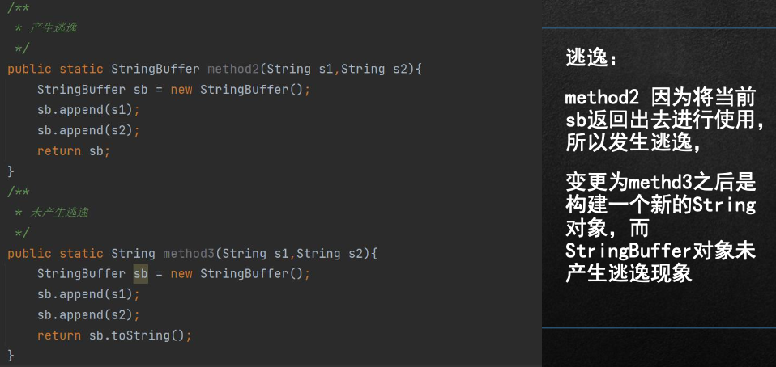

### 逃逸分析-代码优化

使用逃逸分析，编译器可以堆代码做如下优化：

- 栈上分配: JIT编译器在编译期间根据逃逸分析计算结果，如果发现当前对象没有发生逃逸现象，那么当前对象就可能被优化成栈上分配，会将对象直接分配在栈中

- 标量替换: 有的对象可能不需要作为一个连续的内存结构存在也能被访问到，那么对象部分可以不存储在内存，而是存储在CPU寄存器中

### 逃逸分析弊端

虽然逃逸分析可以做标量替换、栈上分配、锁消除等操作。但是逃逸分析无法保证的性能消耗一定高于他的实际消耗。因为逃逸分析自身也需要进行一系列的复杂分析算法的运算，这也是一个相对耗时的过程。

## 5、JVM架构图--详细

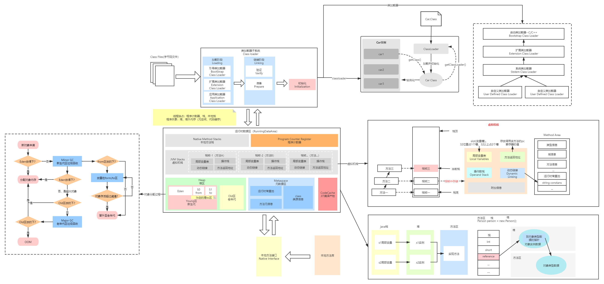

## 6、JVM普通对象头32位Mark word解析

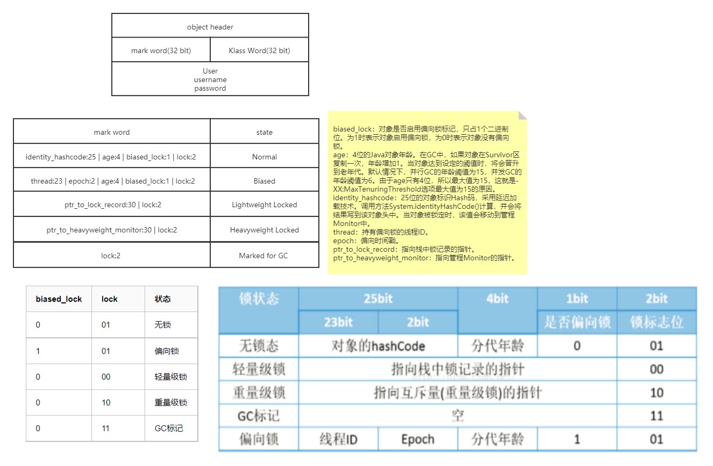