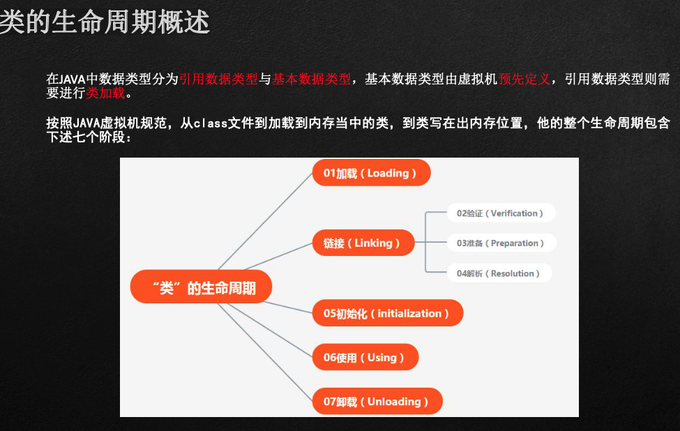
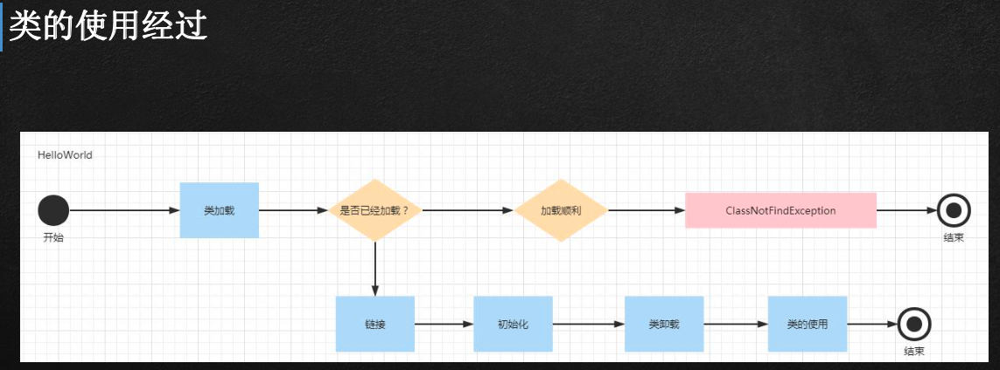
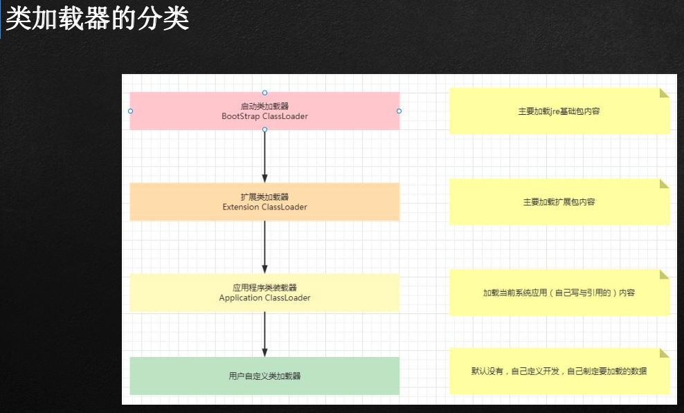
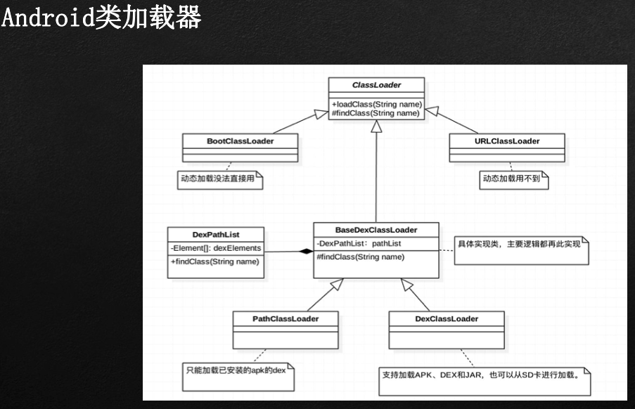
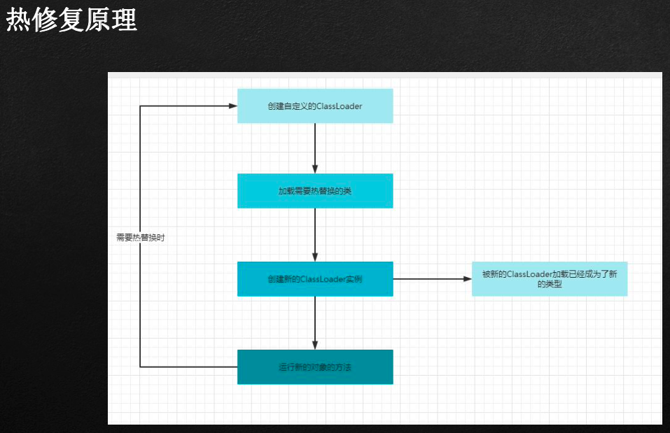
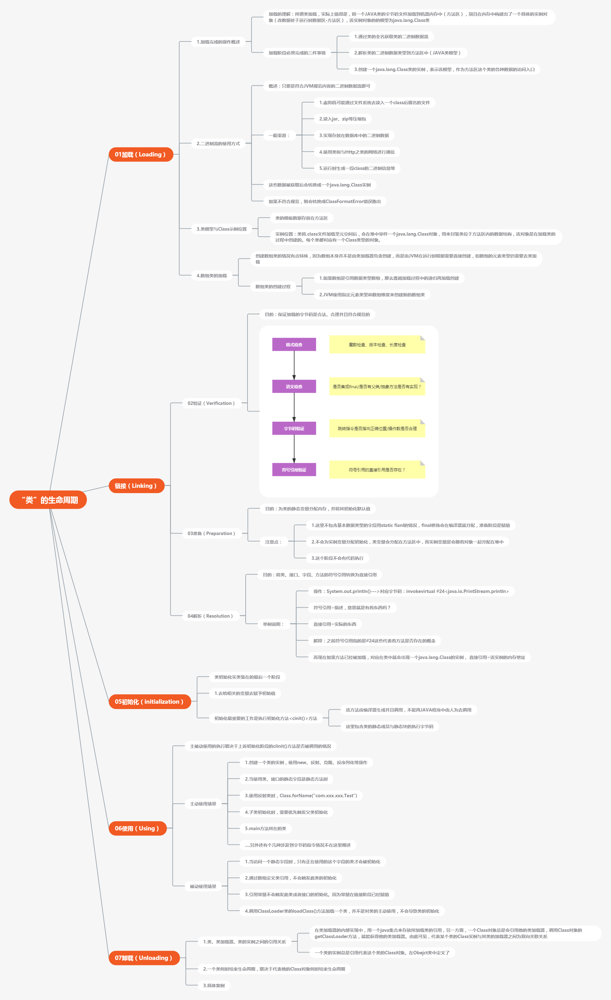
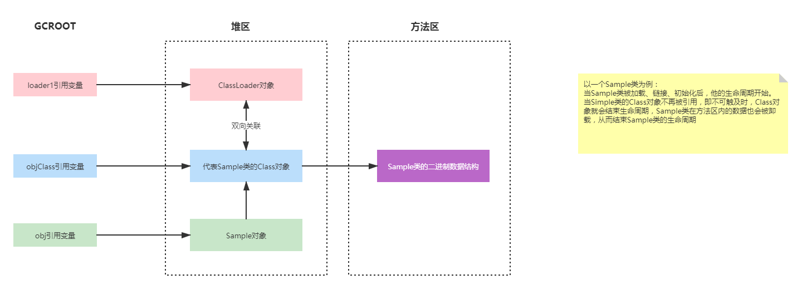
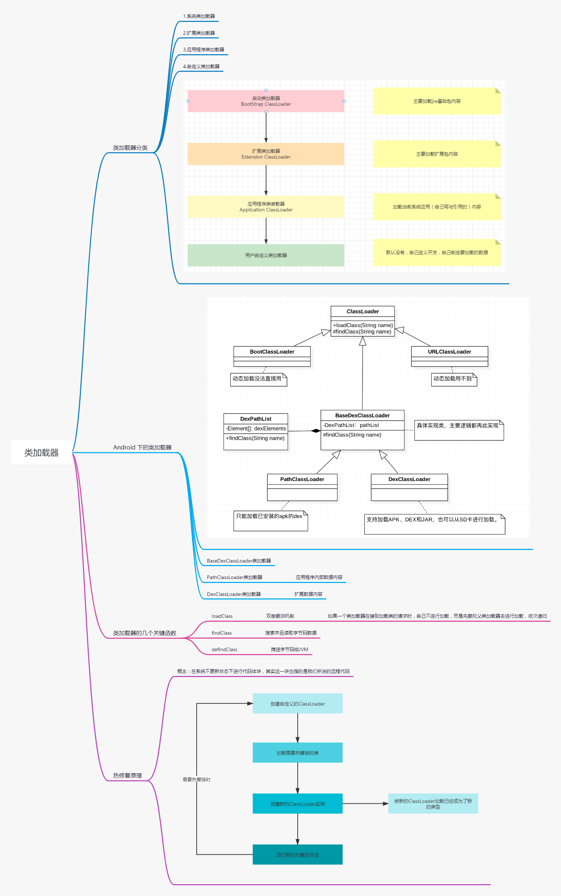

[TOC]

# 字节码文件与类加载

## 类的生命周期

## 类加载器

## 热修复原理

## 附件

### “类”的生命周期

### 生命周期-类卸载

### 类加载器

## 其他资料

### 上课笔记

https://app.yinxiang.com/fx/434a6611-40ea-4a63-9d02-884266a75e21

### 字节码资料-Class文件结构

https://app.yinxiang.com/fx/d67c6992-d4db-4a81-817d-cdf38048d0d5

### 字节码资料-操作指令

https://app.yinxiang.com/fx/35dcfb71-102c-4961-8cdd-b1f286202b50
