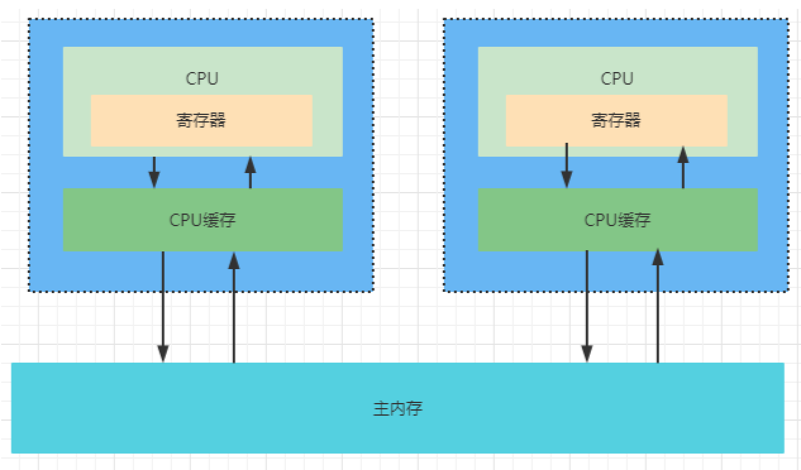
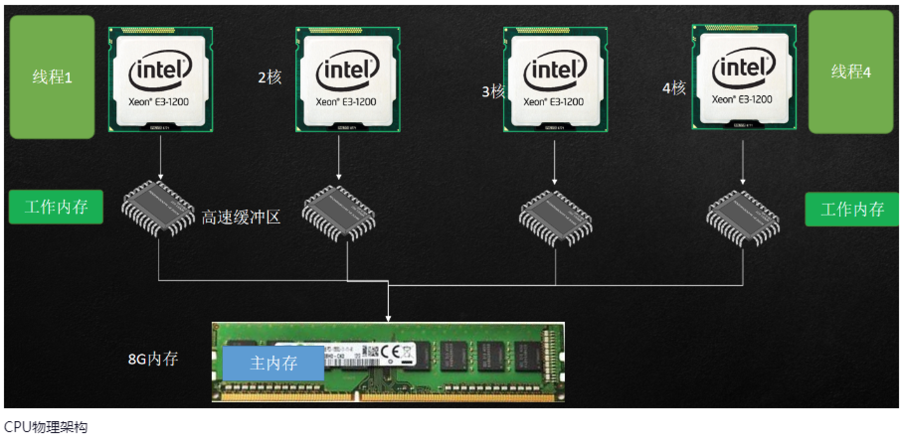
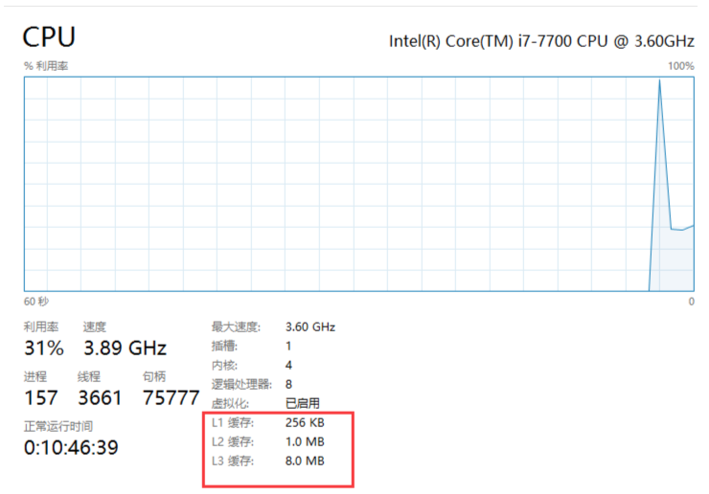
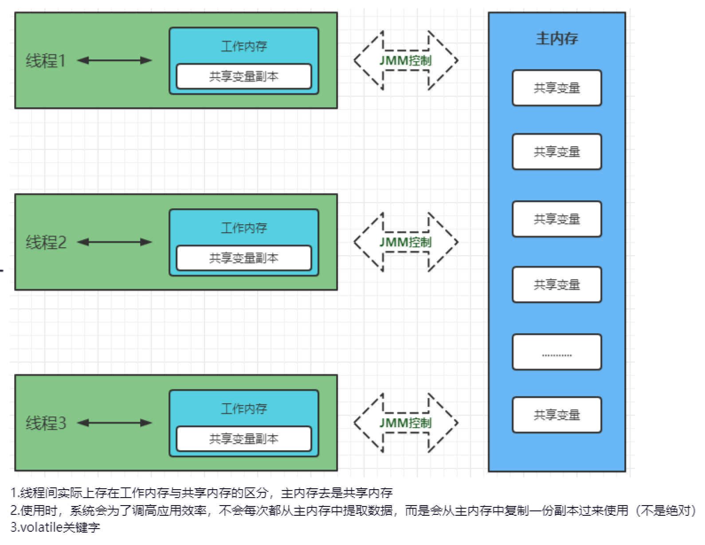
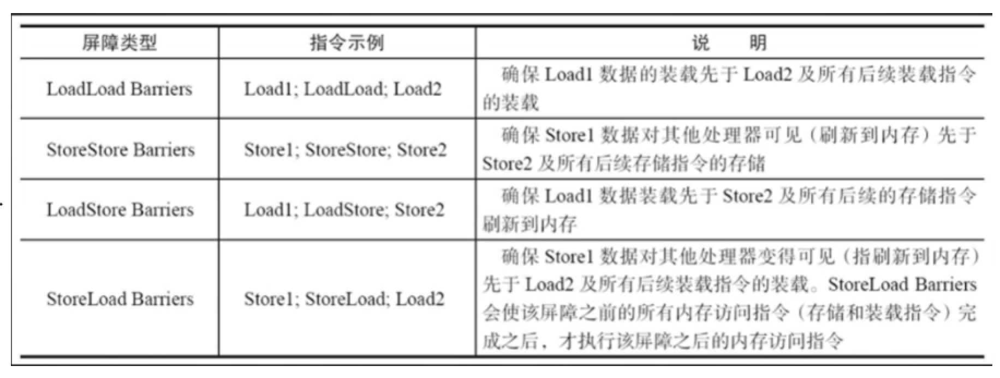

# JMM内存模型

## 多核CPU缓存架构



为什么要引入高速缓存区？因为住内存的速度满足不了CPU的运行速度，所以引入高速缓存区。





1. 单核CPU一次处理一个线程
2. CPU采用抢占或者是时间片轮转机制
3. 并发从本质上讲是串行的，他是宏观并发，微观串行。

## JAVA多线程内存模型解析



## 高并发体系下面临的三大问题

- 原子性：多线程情况下执行结果不一致问题
  - 问题的源头：cpu切换引起的（时间片轮转机制）
- 可见性：多线程的数据通信及同步问题
  - 问题的源头：cpu高速缓存引起的（工作内存和主存）

- 有序性：指令重排可能会带来的线程间的处理问题
  - 问题的源头：编译器重排序、处理器重排序（指令优化）

## volatile关键字分析

> volatile可以可以用来处理可见性和有序性问题

1）什么情况下需要volatile：

当存在多个线程对同一个共享变量进行操作的时候，需要增加volatile，保证数据的实时可见。

2）Lock指令的作用：保证数据的可见性

- 将当前处理器缓存的数据写回到系统内存
- 这个写回到系统内存的操作会使在其他cpu里的该数据缓存失效

3）如何保证有序性：内存屏障



4）总结

- volatile通过内存屏障来防止指令重排，从而保障数据的有序性
- volatile通过Lock指令，从而禁止cpu高速缓存，来解决可见性问题。
- Lock指令，它本意是禁止高速缓存来解决可见性问题，但实际上在这里，它是一种内存屏障的功能。也就是说针对当前的硬件环境，JMM层面采用Lock指令作为内存屏障来解决可见性问题。

5）代码举例

```java
public class Test {
    public static void main(String[] args) {
        Aobling a = new Aobling();
        a.start();
        for (; ; ) {
            if (a.isFlag()) {
                System.out.println("有点东西");
            }
        }
    }
}

class Aobling extends Thread {
    // 不加 volatile 的话，会导致无法打印 “有点东西”
    // private volatile boolean flag = false;
    private boolean flag = false;

    public boolean isFlag() {
        return flag;
    }

    @Override
    public void run() {
        try {
            Thread.sleep(1000);
        } catch (InterruptedException e) {
            e.printStackTrace();
        }
        flag = true;
        System.out.println("flag = " + flag);
    }
}
```