# 线程安全性分析

## 并发编程问题的源头

原子性：线程切花引起

可见性：cpu高速缓存引起

有序性：编译器重排序、处理器冲排序

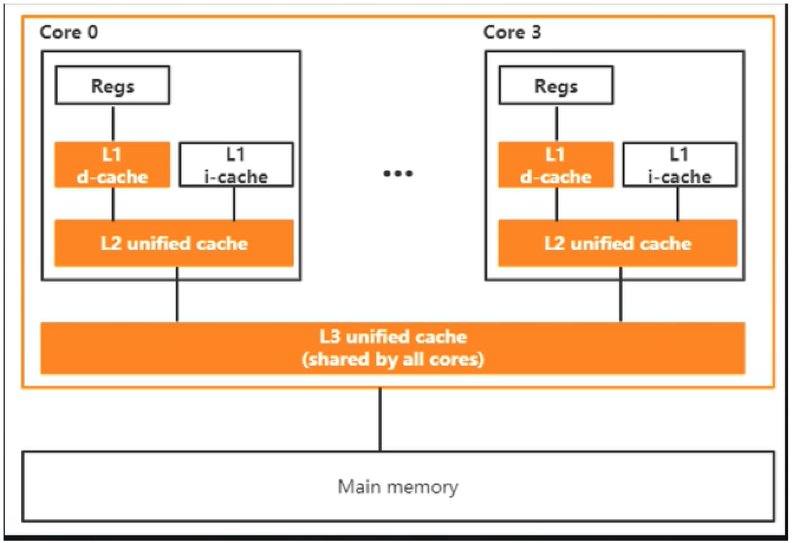

1. cpu增加了高速缓存，均衡和内存的速度差异
2. 操作系统增加进程、线程以及分时复用cpu，均衡cpu与i/o设备的速度差异
3. 编译程序优化指令的执行顺序，使得能够更合理的利用缓存

## java内存模型（JMM）

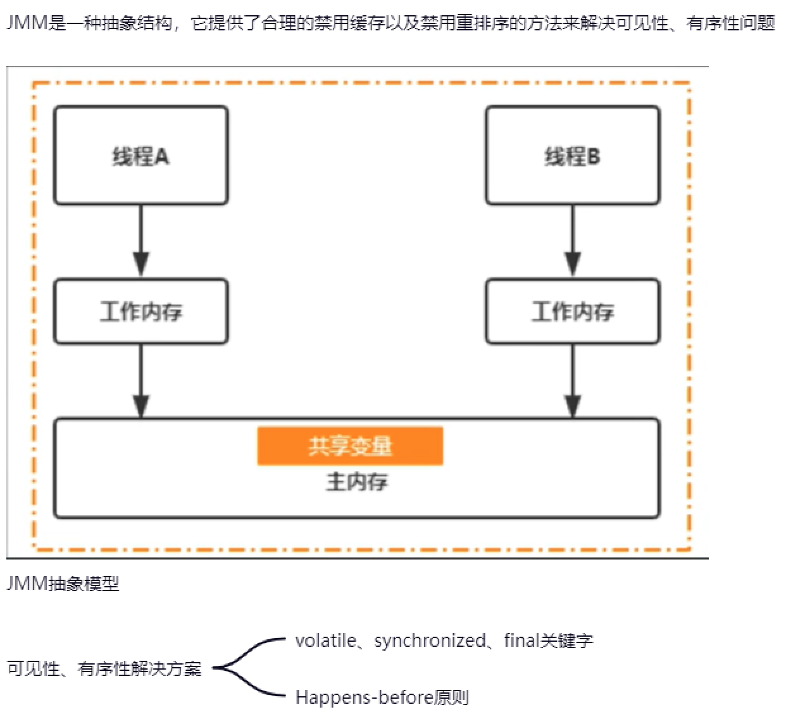

## volatile关键字分析

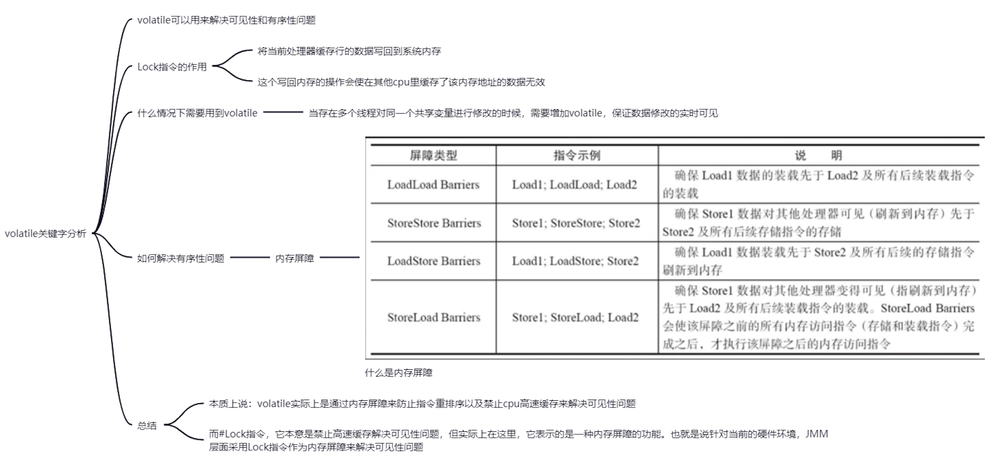

## final域

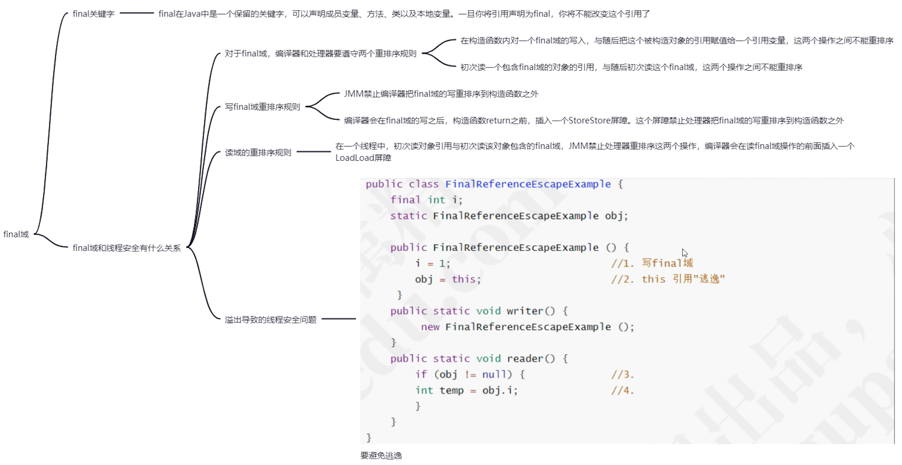

## Happens-before

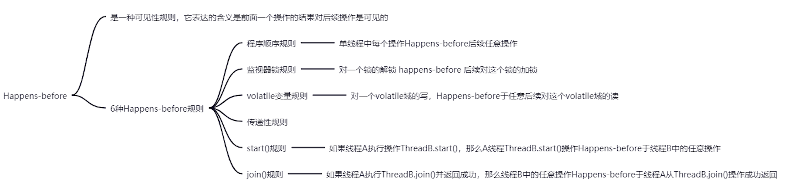

## 原子操作

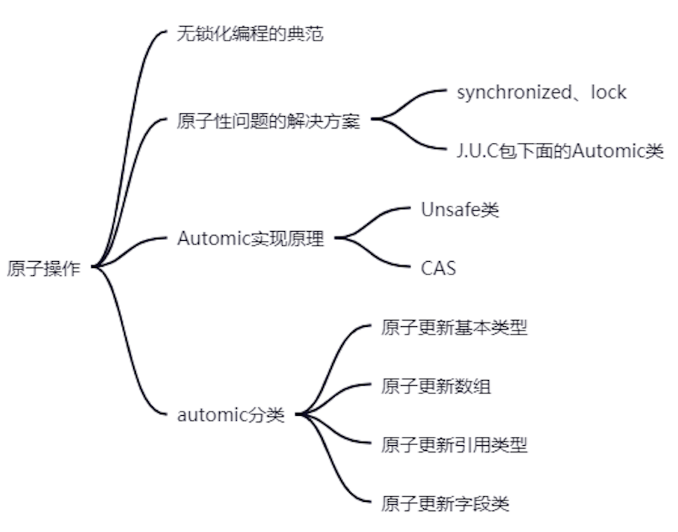

## ThreadLocal的使用原理

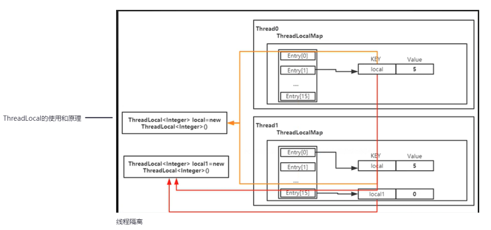

## 线程安全-锁

### JVM普通对象头32位Mark word解析

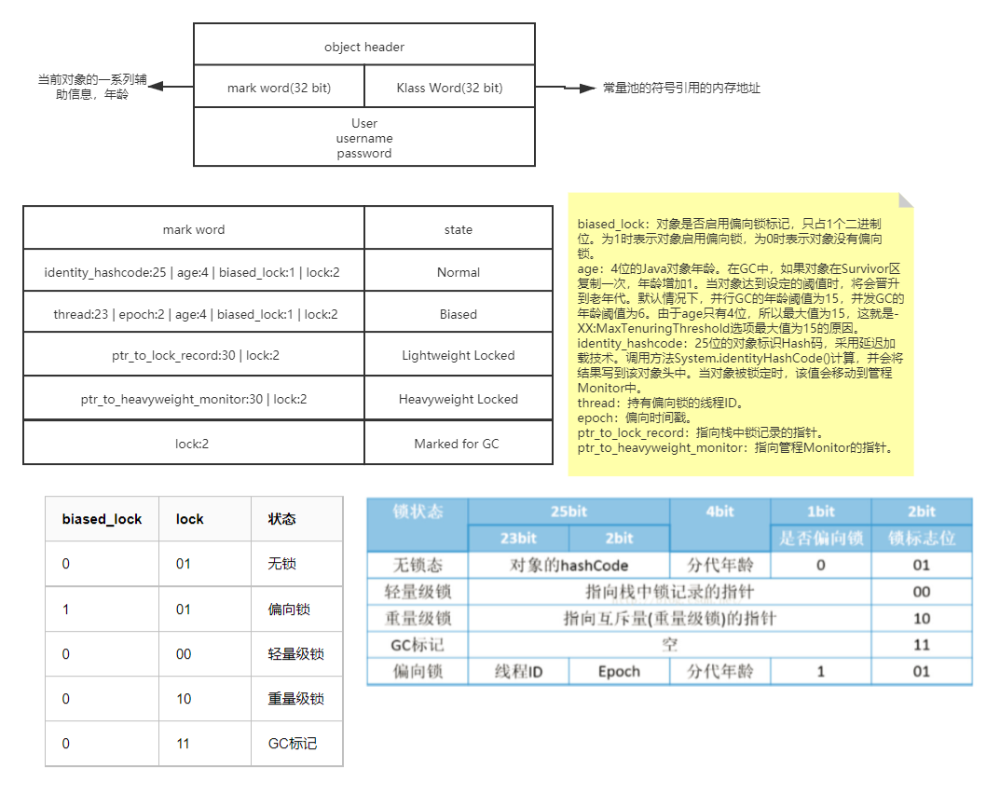

### 轻量级锁内存应用过程

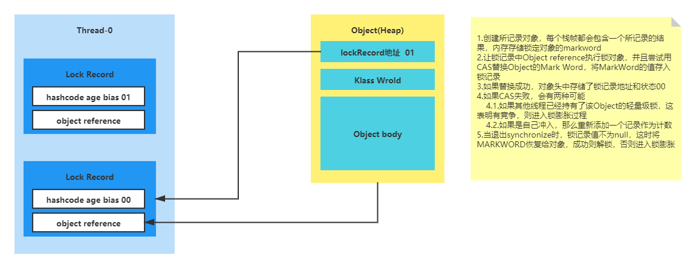

### 锁膨胀过程

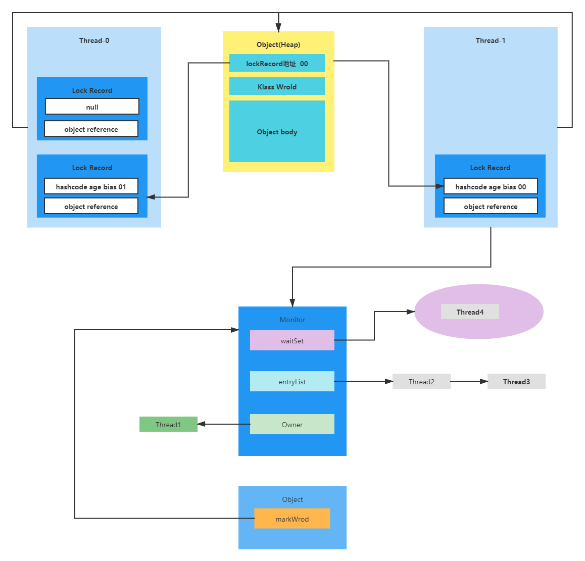

### synchronize与Monitor

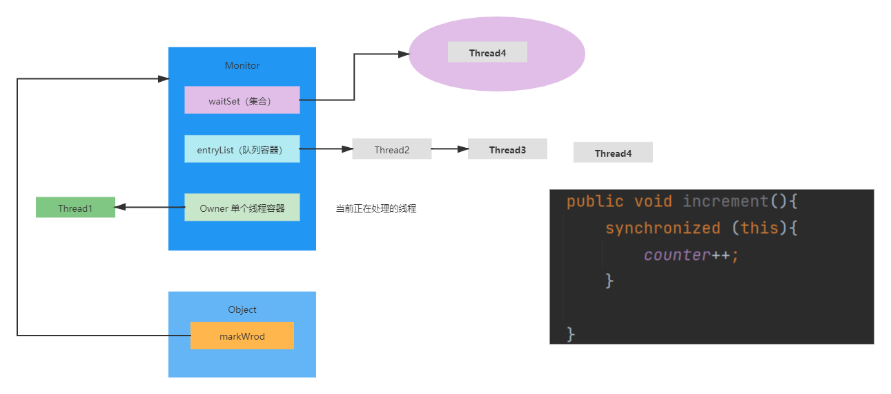

## 线程安全-CAS

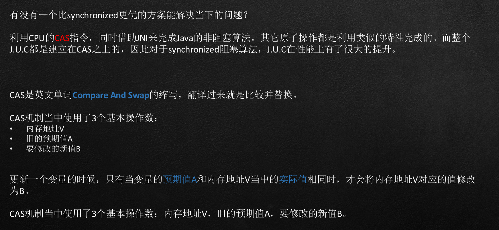