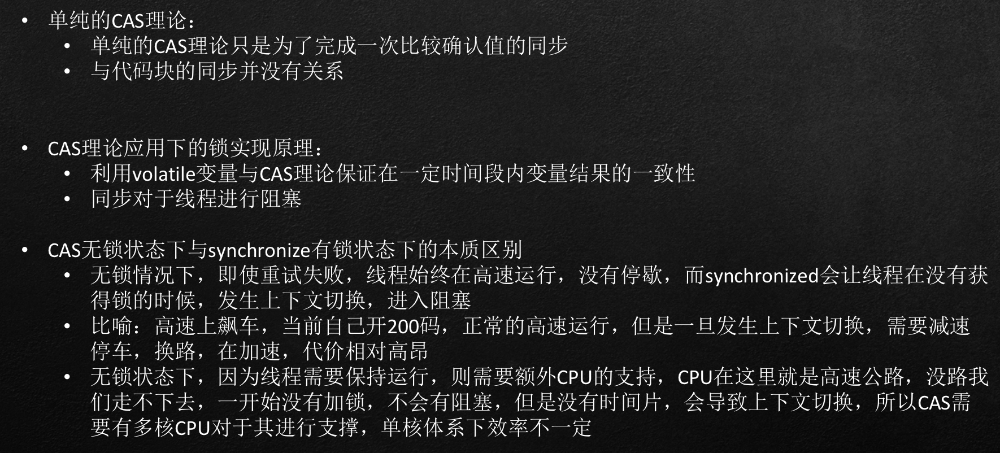
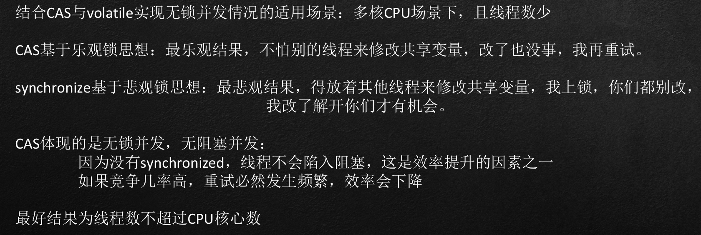
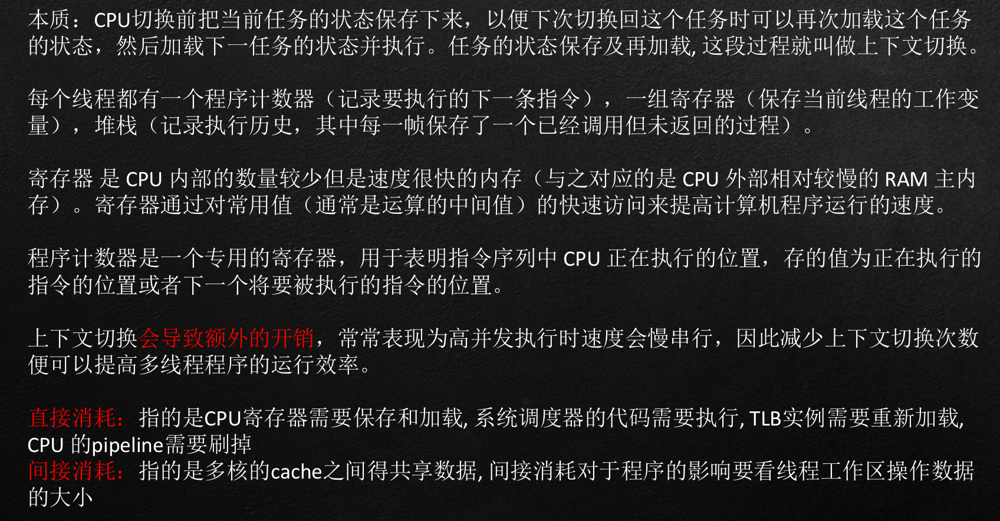
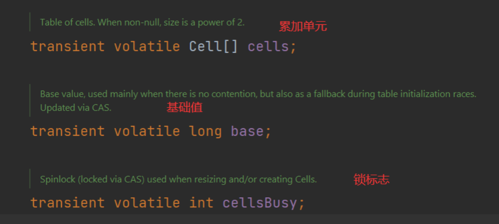

# CAS和原子变量

## JUC包含的内容

> 什么是 J.U.C：即 java.util.concurrent 的缩写

- Executor框架（线程池、 Callable 、Future）
- AbstractQueuedSynchronizer （AQS框架）
- Locks & Condition（锁和条件变量）
- Synchronizers（同步器）
- Atomic Variables（原子变量）
- BlockingQueue（阻塞队列）
- Concurrent Collections（并发容器）
- Fork/Join并行计算框架
- TimeUnit枚举

## CAS介绍

### 为什么无锁状态下的运行效率会高？

### CAS效率分析

### 线程的上下文切换

## 原子变量

### Atomic Variables（原子变量）

本质上是一组工具，位置在atomic包下。

实际上祖师爷已经帮我们把CAS的相关实现全部搞定，并且封装。

处理并发安全问题上：

1. 单个原子处理
2. 块处理

本质上分类两类：

1. 保证基本数据类型的原子性（AtomicInteger...）
2. 保证引用类型的原子性（AtomicReference）

### 原子引用与ABA问题

ABA问题：

​		在多线程对于原子变量操作时，会发生将数据变更回去的现象，CAS在判断时会造成概念上的认知错误，但是实际上对业务结果是不变的。

​		但是实际业务运用过程中可能会需要知道整个运行过程值是否改变

​		通过 AtomicStampedReference  追溯版本号

​		通过 AtomicMarkableReference 得到是否更改结果

### 不同场景下的原子变量操作方案

AtomicReference本质上是对于引用类型的地址

但是我们常规使用中，更多的业务是要判定内部数据是否一致

原子数组：
	保证数组内元素的线程安全

字段：
	字段更新器   AtomicReferenceFieldUpdater

累加业务：
	原子累加器

### LongAdder原理分析

性能提升的原因很简单，就是有竞争时，设置多个累加单元，然后最后结果汇总，他这样的累加操作不同的cell变量，因此减少了CAS重试失败，从而提高性能。

### LongAdder伪共享原理与缓存行

什么是伪共享？

​	CPU高度缓冲器的存储体系下，一个基本的缓存单位叫做缓存行，一个缓存行的大小为64byte,
​	数组是一块连续的空间，因为副本数据的原因，数组加载到缓存当中，数据超过64字节会占用多行,若小于64字节则占用一行

## 总结

对于并发处理，从业务角度我们看做为两块：

1. 原子变量操作

2. 业务代码块的并发

并发手段现在接触的是两种：

1. 加锁并发：synchronize（悲观体现）
2. 无锁并发：CAS应用实现（乐观体现）