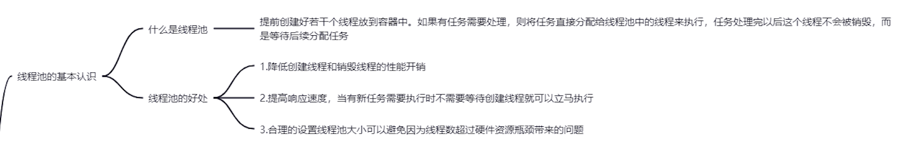
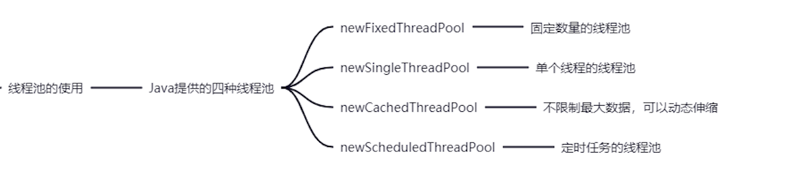
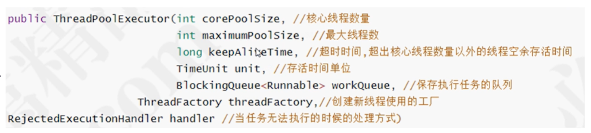
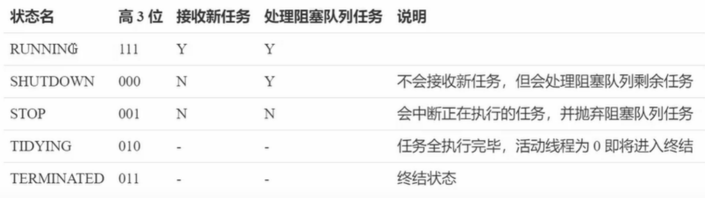
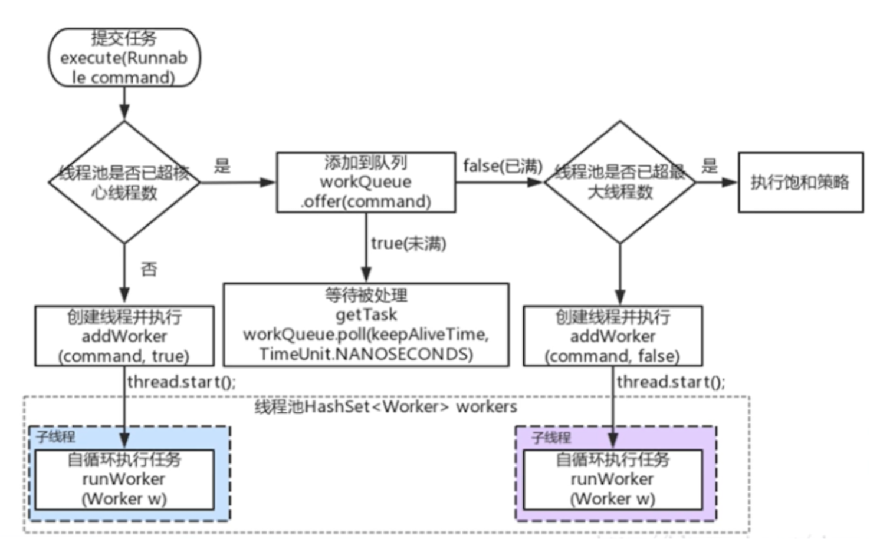

# JUC之线程池

## 线程池的基本认识

## 线程池的使用

## 构造方法

## 拒绝策略

ThreadPoolExecutor自己已经提供了四个拒绝策略，分别是：

- CallerRunsPolicy：在任务被拒绝添加后，会调用当前线程池的所在的线程去执行被拒绝的任务。这个策略的缺点就是可能会阻塞主线程。
- AbortPolicy：默认的拒绝策略就是AbortPolicy。直接抛出异常。抛出个RejectedExecutionException异常，也不执行这个任务了
- DiscardPolicy：这个东西什么都没干。
- DiscardOldestPolicy：当任务呗拒绝添加时，会抛弃任务队列中最旧的任务也就是最先加入队列的，再把这个新任务添加进去。

## 线程池状态

## 线程池的源码

## 线程池的监控

## 创建多少线程合适？

CPU密集型运算：
	通常采用CPU核数 + 1 能够实现最优的CPU利用率，+1是保证当线程由于页缺失故障（操作系统）或其他原因导致暂停时，额外的这个线程就能顶上去，保证CPU始终周期不被浪费

I/O密集型运算：
	CPU不总是处于繁忙状态，例如，当你执行业务计算时，这时候会使用CPU资源，但当你执行IO操作、或者远程的RPC调用时，包括进行数据库操作等，这个时候CPU会闲下来，你可以利用多线程提高他的利用率

经验公式如下：
线程数 = 核数 * 期望CPU利用率 * 总时间（CPU计算时间+等待时间） / CPU计算时间

例如：4核CPU，计算时间是50%，其他等待时间是50%，期望CPU被100%利用，套用公式
	4 * 100% * 100% / 50% = 8

## fork/join线程池

fork/join是JDK 1.7后加入的新的线程池实现，他主要体现是分治思想，适用于能够进行任务拆分的CPU密集型运算

他是为了处理大数据诞生的

所谓任务拆分，是将一个大任务拆分为算法上相同的小任务，直至不能拆分可以直接求解。跟递归相关的一些计算，如归并排序、斐波拉切数列，都可以进行分治完成

Fork/Join在分治的基础上加入了多线程，可以把每个任务的分解和合并交给不同的线程来完成，进一步提升运算效率

Fork/Join 默认会创建于CPU核心数大小相同的线程池

最常见业务，对于文件夹的操作