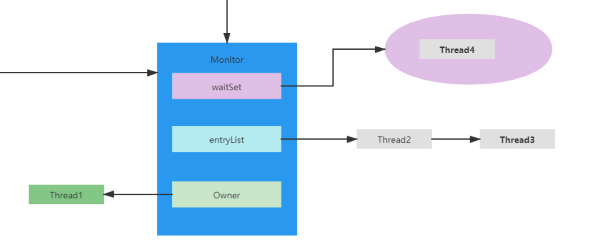
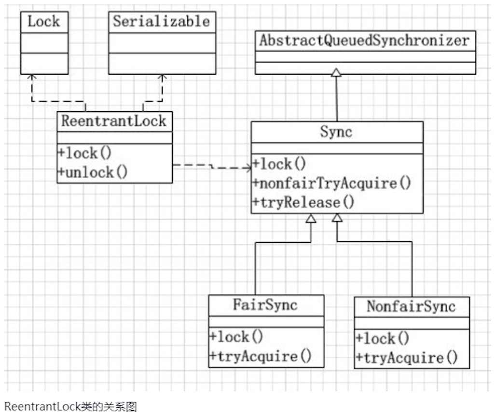
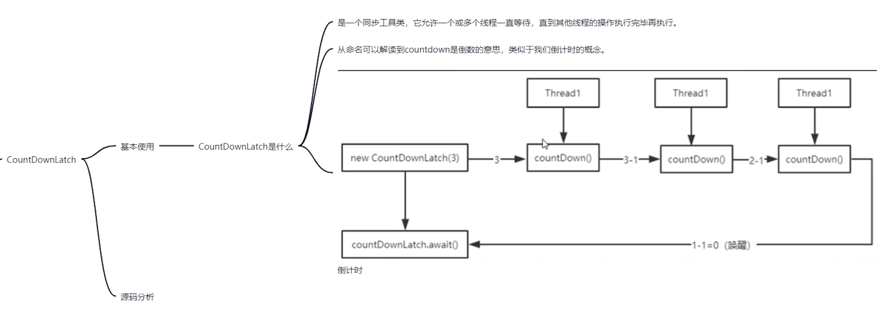
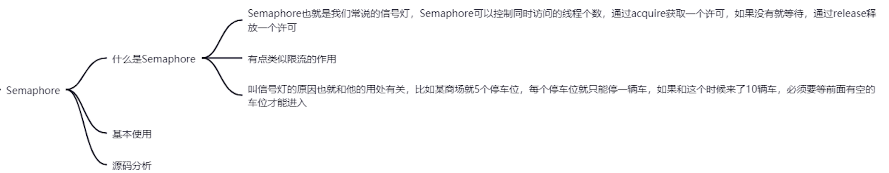

# JUC之AQS

## AQS是什么

AQS，全程AbstractQueuedSynchronizer，位于java.util.concurrent.locks包下。

是 JDK1.5 提供的一套用于实现阻塞锁和一系列依赖 FIFO 等待队列的同步器的框架实现。

synchronized锁机制底层是基于C++实现的，而AQS是基于java实现的。

我们常用的AQS有：ReentrantLock、Semaphore、CountDownLatch、CyclicBarrier

AQS在使用中可以分为两种：

- 独占锁：每次只能有一个线程持有锁。eg: ReentrantLock就是独占锁
- 共享锁：允许多个线程同时获得锁，并发访问共享资源。eg: ReentrantReadWriteLock中的读

**AQS是java模仿synchronized锁机制的Minitor监视器实现的：**

> 锁的关键在于Monitor，Owner是正在执行的线程，entryList是排队中的线程，waitSet是等待中的线程。

**AQS架构图：**

## CountDownLatch

CountDownLatch：一个或者多个线程，等待其他多个线程完成某件事情之后才能执行；

CountDownLatch：一个或者多个线程，等待其他多个线程完成某件事情之后才能执行；(具体业务场景：我们在玩LOL英雄联盟时会出现十个人不同加载状态，但是最后一个人由于各种原因始终加载不了100%，于是游戏系统自动等待所有玩家的状态都准备好，才展现游戏画面)

## Semaphore

## CyclicBarrier

CyclicBarrier：多个线程互相等待，直到到达同一个同步点，再继续一起执行。而且可以重用

## condition条件

## AQS使用方式

AQS设计是基于模板方法模式的，一般的使用方式是：使用者继承AbstractQueuedSynchronizer并重写指定的方法。

AQS定义的这些可重写的方法：

- protected boolean tryAcquire(int arg)：独占式获取同步状态，试着获取，成功返回true，反之为false
- protected boolean tryRelease(int arg)：独占式释放同步状态，等待中的其他线程此时将有机会获取到同步状态；
- protected int tryAcquireShared(int arg)：共享式获取同步状态，返回值大于等于0，代表获取成功；反之获取失败；
- protected boolean tryReleaseShared(int arg)：共享式释放同步状态，成功为true，失败为false
- protected boolean isHeldExclusively()：是否在独占模式下被线程占用。

## AQS的模板方法

独占锁：

- void acquire(int arg); // 独占式获取同步状态，如果获取失败则插入同步队列进行等待；
- void acquireInterruptibly(int arg); // 与acquire方法相同，但在同步队列中进行等待的时候可以检测中断；
- boolean tryAcquireNanos(int arg, long nanosTimeout); // 在acquireInterruptibly 基础上增加了超时等待功能，在超时时间内没有获得同步状态返回false;
- boolean release(int arg); // 释放同步状态，该方法会唤醒在同步队列中的下一个节点

共享锁：

- void acquireShared(int arg); // 共享式获取同步状态，与独占式的区别在于同一时刻有多个线程获取同步状态；
- void acquireSharedInterruptibly(int arg); // 在acquireShared 方法基础上增加了能响应中断的功能；
- boolean tryAcquireSharedNanos(int arg, long nanosTimeout); // 在 acquireSharedInterruptibly 基础上增加了超时等待的功能；
- boolean releaseShared(int arg); // 共享式释放同步状态

## 自定义AQS

​		首先，我们需要去继承AbstractQueuedSynchronizer这个类，然后我们根据我们的需求去重写相应的方法，比如要实现一个独占锁，那就去重写 tryAcquire，tryRelease方法，要实现共享锁，就去重写 tryAcquireShared，tryReleaseShared；

​		然后，在我们的组件中调用AQS中的模板方法就可以了，而这些模板方法是会调用到我们之前重写的那些方法的。也就是说，我们只需要很小的工作量就可以实现自己的同步组件，重写的那些方法，仅仅是一些简单的对于共享资源state的获取和释放操作，至于像是获取资源失败，线程需要阻塞之类的操作，自然是AQS帮我们完成了

## AQS源码分析

AQS的基本实现：

​		AQS维护一个共享资源state，通过内置的FIFO来完成获取资源线程的排队工作。（这个内置的同步队列称为"CLH"队列）。该队列由一个一个的Node结点组成，每个Node结点维护一个prev引用和next引用，分别指向自己的前驱和后继结点。AQS维护两个指针，分别指向队列头部head和尾部tail。

​		当线程获取资源失败（比如tryAcquire时试图设置state状态失败），会被构造成一个结点加入CLH队列中，同时当前线程会被阻塞在队列中（通过LockSupport.park实现，其实是等待态）。当持有同步状态的线程释放同步状态时，会唤醒后继结点，然后此结点线程继续加入到对同步状态的争夺中。

## 同步方案对比

- wait/notify：依托于synchronized，基于VM底层对于阻塞的实现，使用waitSet作为等待机制，set结构的问题，要么是随机一个（set的提取算法），要么是全部提出来唤醒。
- await/signal：依赖于ReentrantLock条件变量，已经用条件变量与AQS体系作为唤醒机制，本质上底层是park/unpark实现阻塞。
- park/unpark：以thread为操作对象，操作更精准，可以准确地唤醒某一个线程（notify随机唤醒一个线程，notifyAll唤醒所有等待的线程），增加了灵活性。
  - 其实park/unpark的设计原理核心是“许可”：park是等待一个许可，unpark是为某线程提供一个许可
  - 但是这个“许可”是不能叠加的，“许可”是一次性的。
  - 比如线程B连续调用了三次unpark函数，当线程A调用park函数就使用掉这个“许可”，如果线程A再次调用park，则进入等待状态。

## ReentrantLock原理

## ReentrantReadWriteLock读写锁

​		读写锁指一个资源能够被多个读线程访问，或者被一个写线程访问，但是不能同时存在读写线程
ReentrantReadWriteLock中有两个静态内部类：ReadLock读锁和WriteLock写锁，这两个锁实现了Lock接口ReentrantReadWriteLock支持可重入，同步功能依赖自定义同步器（AbstractQueuedSynchronizer）实现，读写状态就是其同步器的同步状态

**写锁的获取和释放：**
		写锁WriteLock是支持重进入的排他锁。如果当前线程已经获取了写锁，则增加写状态。如果当前线程在获取读锁时，读锁已经被获取或者该线程不是已获取写锁的线程，则当前线程进入等待状态。读写锁确保写锁的操作对读锁可见。写锁释放每次减少写状态，当前写状态为0时表示写锁已背释放。

**读锁的获取与释放：**
		读锁ReadLock是支持重进入的共享锁（共享锁为shared节点，对于shared节点会进行一连串的唤醒，知道遇到一个读节点），它能够被多个线程同时获取，在没有其他写线程访问（写状态为0）时，读锁总是能够被成功地获取，而所做的也只是增加读状态（线程安全）。如果当前线程已经获取了读锁，则增加读状态。如果当前线程在获取读锁时，写锁已经被获取，则进入等待状态。