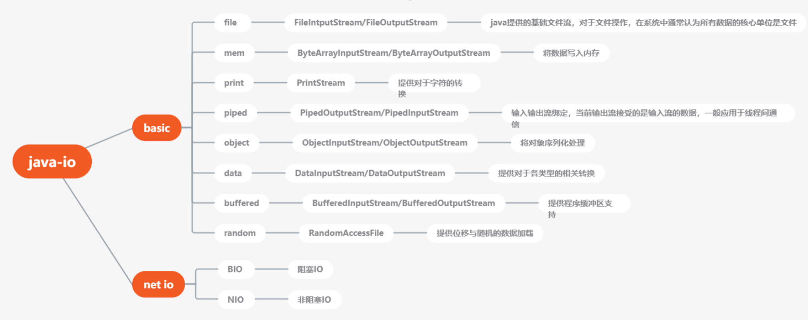
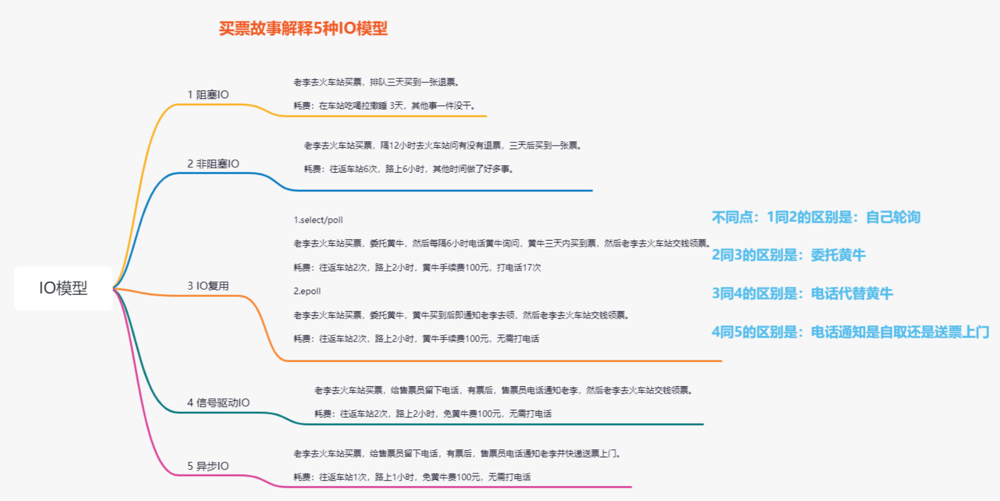

# 从Basic IO到NIO内核机制

## 基础概念

**缓存区的概念：**因为基础IO每一次写入都会调用内核的复制函数。而有了缓存区后，可以将数据缓存起来，当到达8k后再调用内核的复制函数。

**内核的五种IO模型：**

- 阻塞IO
- 非阻塞IO
- IO复用：window(select/poll)、linux(epoll)
- 信号驱动IO
- 异步IO

**Basic IO：**阻塞式IO，阻塞式内核函数的实现（阻塞IO）。

**NIO：**非阻塞式IO，非阻塞式内核函数的实现（非阻塞IO、复用IO、信号驱动IO、异步IO）。

**IO对系统的影响：**

- 使用率：是指磁盘处理io的时间百分比。过高的使用率(比如超过80%)，通常意味着磁盘io存在性能瓶颈。
- 饱和度：是指磁盘处理io的繁忙程度。过高的饱和度，意味着磁盘存在着严重的性能瓶颈。当饱和度为100%时，磁盘无法接受新的io请求。
- IOPS：是指每秒的io请求数，适用于大量小文件的情景
- 吞吐量：是指每秒的io请求大小，适用与大文件的情景响应时间：是指io请求从发出到收到响应的时间间隔

## java IO体系

**RandomAccessFile：**功能上提供了定位方法，可以在指定的位置写入。

**MapperByteBuffer：**App与内核共享缓冲区，属于NIO体系。

## 内核的五种IO解决方案

## OKIO对Java IO的优化

Okio是一个库，是对java.io和java.nio的补充。

OKio是将两个缓冲合并成一份，也就是Segment。

Buffer的数据结构是一个双向链，链表中的每个节点都是一个Segment。