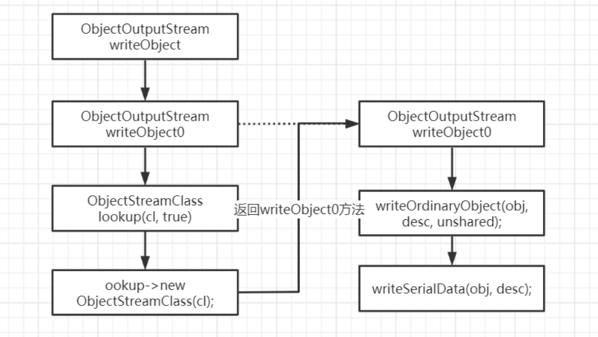
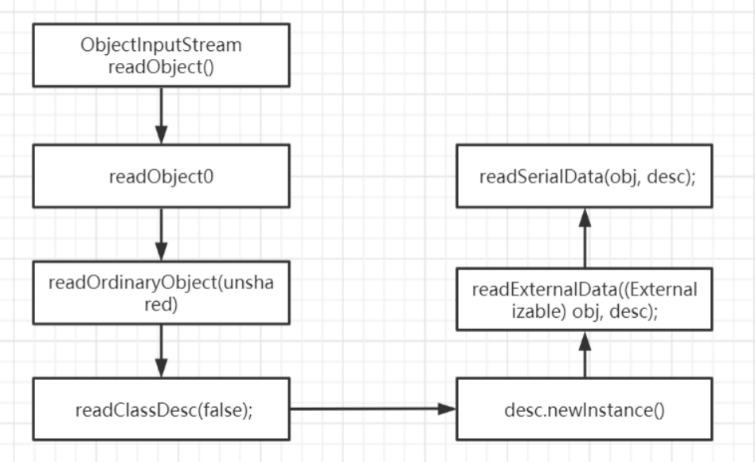
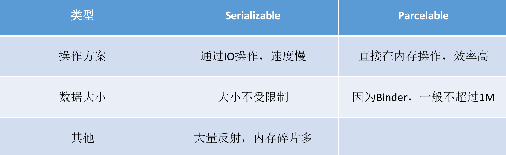
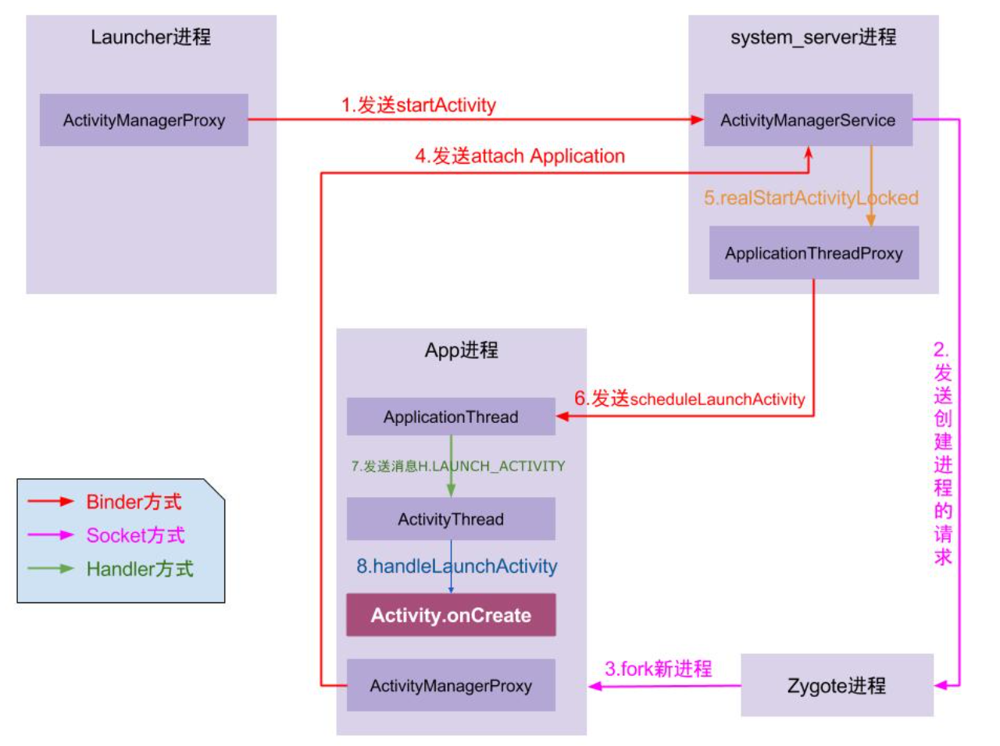

# 从底层看序列化原理

**几种常见的序列化和反序列化协议：**XML&SOAP、JSON、Protobuf

## 序列化方案

### Serializable

- serialVersionUID唯一标识了一个可序列化的类

- 用transient关键字标记的成员变量不参与序列化

- 静态成员变量属于类不属于对象，所以不会参与序列化

- 未实现 Serializable 的成员变量无法被序列化/反序列化

- Externalizable接口

  ```java
  public interface Externalizable extends Serializable {
      void writeExternal(ObjectOutput var1) throws IOException;
      void readExternal(ObjectInput var1) throws IOException, ClassNotFoundException;
  }
  ```

- Serializable 的序列化与反序列化分别通过 ObjectOutputStream 和 ObjectInputStream 进行

- Serializable是Java中的序列化接口，其使用起来简单但开销较大 (因为Serializable在序列化过程中使 用了反射机制，故而会产生大量的临时变量，从而导致频繁的GC)，并且在读写数据过程中，它是通 过IO流的形式将数据写入到硬盘或者传输到网络上。

反序列化原理，源码解析：





### Parcelable

- Parcel提供了一套机制，可以将序列化之后的数据写入到一个共享内存中，其他进程通过Parcel可以从这块共享内存中读出字节流，并反序列化成对象。
- Parcelable是以IBinder作为信息载体，在内存上开销比较小，因此在内存之间进行数据传递时，推荐使用Parcelable，而Parcelable对数据进行持久化或者网络传输时操作复杂，一般这个时候推荐使用 Serializable。

```java
public class Course implements Parcelable {
    private String name;
    private float score;

   /**
    * 描述当前 Parcelable 实例的对象类型
    * 比如说，如果对象中有文件描述符，这个方法就会返回上面的 CONTENTS_FILE_DESCRIPTOR
    * 其他情况会返回一个位掩码 
    */
    @Override
  	public int describeContents() {
      return 0;
    }
  
   /**
    * 将对象转换成一个 Parcel 对象
    * @param dest 表示要写入的 Parcel 对象 
    * @param flags 示这个对象将如何写入
    */
    @Override
    public void writeToParcel(Parcel dest, int flags) {
      dest.writeString(this.name);
      dest.writeFloat(this.score);
    }
  
    protected Course(Parcel in) {
      this.name = in.readString();
      this.score = in.readFloat();
    }
  
   /**
    * 实现类必须有一个 Creator 属性，用于反序列化，将 Parcel 对象转换为 Parcelable
    */
    public static final Parcelable.Creator<Course> CREATOR = new Parcelable.Creator<Course>() {
				//反序列化的方法，将Parcel还原成Java对象 @Override
        public Course createFromParcel(Parcel source) {
            return new Course(source);
				}
				
      	//提供给外部类反序列化这个数组使用。 @Override
		    public Course[] newArray(int size) {
            return new Course[size];
				} 
    };
}
```

### Parcelable与Serializable对比



## 序列化相关面试题

- Android里面为什么要设计出Bundle而不是直接用Map结构

  Bundle内部是由ArrayMap实现的，ArrayMap的内部实现是两个数组，一个int数组是存储对象数 据对应下标，一个对象数组保存key和value，内部使用二分法对key进行排序，所以在添加、删 除、查找数据的时候，都会使用二分法查找，只适合于小数据量操作，如果在数据量比较大的情况 下，那么它的性能将退化。

  而HashMap内部则是数组+链表结构，所以在数据量较少的时候，HashMap的Entry Array比ArrayMap占用更多的内存。

  因为使用Bundle的场景大多数为小数据 量，我没见过在两个Activity之间传递10个以上数据的场景，所以相比之下，在这种情况下使用 ArrayMap保存数据，在操作速度和内存占用上都具有优势，因此使用Bundle来传递数据，可以保证更快的速度和更少的内存占用。

  另外一个原因，则是在Android中如果使用Intent来携带数据的话，需要数据是基本类型或者是可序列化类型，HashMap使用Serializable进行序列化，而Bundle则是使用Parcelable进行序列化。 而在Android平台中，更推荐使用Parcelable实现序列化，虽然写法复杂，但是开销更小，所以为 了更加快速的进行数据的序列化和反序列化，系统封装了Bundle类，方便我们进行数据的传输。

- Android中Intent/Bundle的通信原理及大小限制

  Intent 中的 Bundle 是使用 Binder 机制进行数据传送的。能使用的 Binder 的缓冲区是有大小限制的(有些手机是 2 M)，而一个进程默认有 16 个 Binder 线程，所以一个线程能占用的缓冲区就更小了( 有人以前做过测试，大约一个线程可以占用 128 KB)。所以当你看到 The Binder transaction failed because it was too large 这类 TransactionTooLargeException 异常时，你应该知道怎么解决了。

- 为何Intent不能直接在组件间传递对象而要通过序列化机制?

  Intent在启动其他组件时，会离开当前应用程序进程，进入ActivityManagerService进程 (intent.prepareToLeaveProcess())，这也就意味着，Intent所携带的数据要能够在不同进程间 传输。首先我们知道，Android是基于Linux系统，不同进程之间的java对象是无法传输，所以我 们此处要对对象进行序列化，从而实现对象在 应用程序进程 和 ActivityManagerService进程 之间 传输。

  而Parcel或者Serializable都可以将对象序列化，其中，Serializable使用方便，但性能不如Parcel 容器，后者也是Android系统专门推出的用于进程间通信等的接口。

  

- 反序列化后的对象，需要调用构造函数重新构造吗？
- 序列前的对象与序列化后的对象是什么关系？==？equal?浅复制？深复制？
- SerialVersionID的作用是什么？
- Android中Intent/Bundle的通信原理及大小限制
- 为何Intent不能直接在组件间传递对象，而要通过序列化
- 序列化与持久化的关系和区别是什么？
