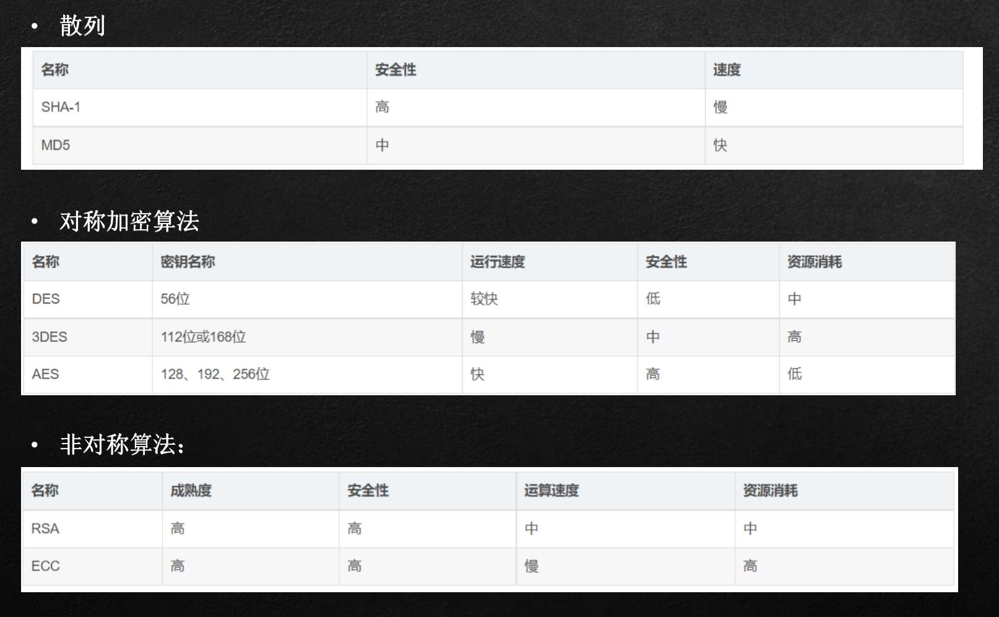
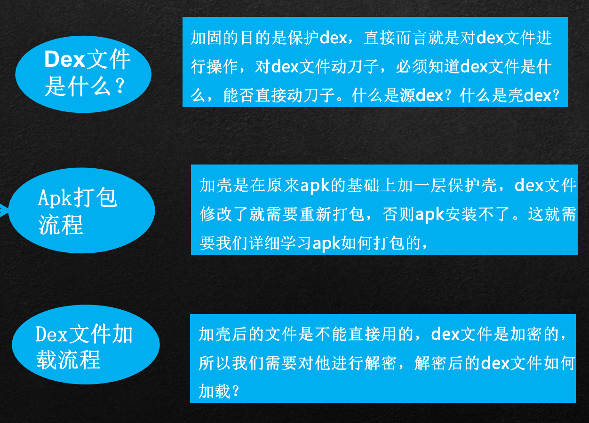

# IO加密核心与dex文件改造

IO及序列化学习完成后，我能用用他们做什么？

- 数据的加解密
- 文件的读写
- 网络数据的传输

## 加密算法

数字签名-哈希散列

- MD5 
  - 用的是 哈希函数。严格来说，MD5 不是一种 加密算法 而是 摘要算法。无论是多长的输入，MD5 都会输出长度为 128bits 的一个串 (通常用 16 进制 表示为 32 个字符)
- SHA1算法
  - HA1 是和 MD5 一样流行的 消息摘要算法，然而 SHA1 比 MD5 的 安全性更强。对于长度小于 2 ^ 64 位的消息，SHA1 会产生一个 160 位的 消息摘要。基于 MD5、SHA1 的信息摘要特性以及 不可逆 (一般而言)，可以被应用在检查 文件完整性 以及 数字签名等场景。

对称加密与非对称加密

- AES算法
  - AES 加密算法是密码学中的 高级加密标准，该加密算法采用 对称分组密码体制，密钥长度的最少支持为 128 位、 192 位、256 位，分组长度 128 位，算法应易于各种硬件和软件实现。这种加密算法是美国联邦政府采用的 区块加密标准。
- RSA算法
  - RSA 加密算法是目前最有影响力的 公钥加密算法，并且被普遍认为是目前 最优秀的公钥方案 之一。RSA 是第一个能同时用于 加密 和 数字签名 的算法，它能够 抵抗 到目前为止已知的 所有密码攻击，已被 ISO 推荐为公钥数据加密标准。
- ECC算法
  - ECC 也是一种 非对称加密算法，主要优势是在某些情况下，它比其他的方法使用 更小的密钥，比如 RSA 加密算法，提供 相当的或更高等级 的安全级别。不过一个缺点是 加密和解密操作 的实现比其他机制 时间长 (相比 RSA 算法，该算法对 CPU 消耗严重)

## dex文件改造

### 加固基本原理

### APK加载流程

### 加壳步骤

1、制作原始项目的apk，这里称作original.apk
2、制作一个壳项目（具体功能见ps），编译通过后得到它的classes.dex文件，这里称作shell.dex，而壳项目的apk称作shell.apk（需要签名）
3、制作一个加壳工具（java工程就可以），按照以下流程工作：
	1）读取original.apk的byte流，并加密
	2）读取shell.dex的byte流
	3）new一个新的byte数组，长度为1）和2）的长度之和+4，因为我们要在shell.dex中保存original.apk的长度
	4）在new byte数组中写入2），写入1），写入1）的长度
	5）根据dex文件的结构，修改checksum文件头、Signature文件头和file_size文件头，最终生成一个新的classes.dex
4、替换掉2中的shell.apk中的classes.dex，并使用工具重新签名
5、生成的新签名apk就是我们加壳过的apk了

### 脱壳流程

