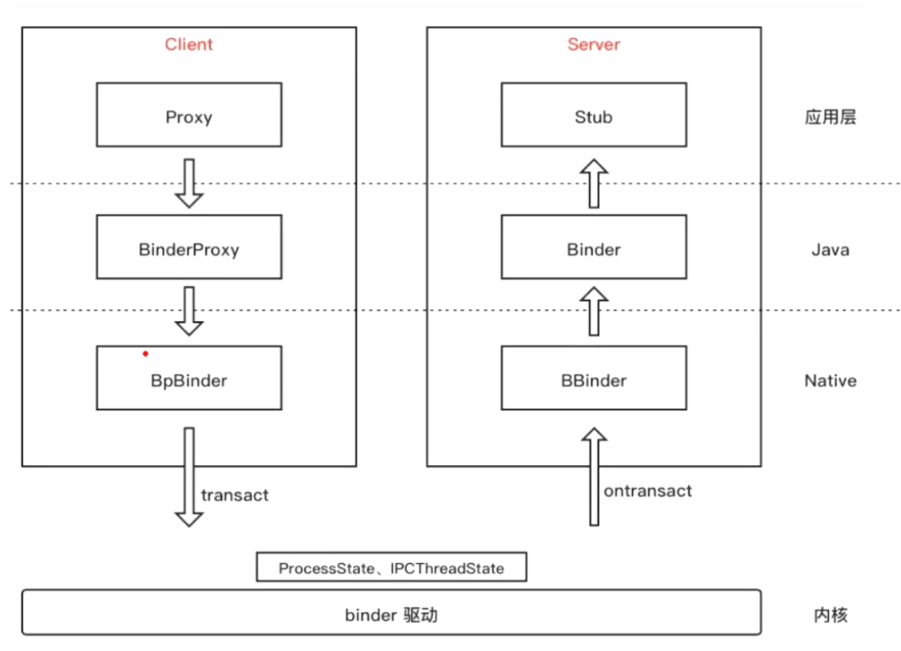
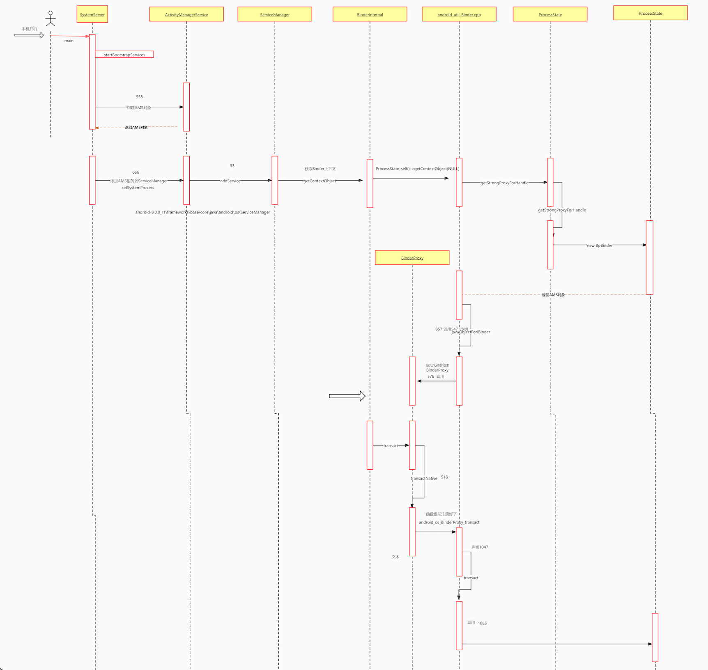
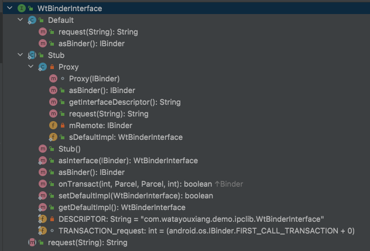

# servicemanager源码分析

> 源码在线查阅网站：http://aospxref.com/android-9.0.0_r61/xref/frameworks/
>

## ServiceManager源码位置


## servicemanager源码分析

> ServiceManager 用于管理 Binder IPC（服务注册、服务发现、服务调用）

### Binder IPC 架构图



### Binder4层源码链接

[Binder4层源码链接](002_Binder之linux内存基础.assets/Binder4层源码)

### binder源码时序图



### 源码分析Proxy

只要搞清楚 Stub的内部类Proxy的mRemote 是什么，就能了解Binder内部调用过程。

- mRemote 等价于 BinderProxy
  - BinderProxy 不是服务端Binder对象，只是服务端Binder对象的代理
  - BinderProxy 内部持有 BpBinder
    - BpBinder是C++里面构建的java对象，负责发送消息
    - BpBinder是在ProcessState中创建的

由上面分析可以得出：Proxy是消息发送者，Proxy内部持有BinderProxy，而BinderProxy内部持有BpBinder，真正发送消息的是BpBinder对象。

### 源码分析Stub

ServiceManagerNative.java 的内部类 ServiceManagerProxy 就是Stub

### Binder驱动的职责

- 维护进程队列
- 查找进程信息

### ServiceManager职责

Binder驱动相当于ServiceManager的一个工具，ServiceManager的作用是维护进程间通信（注册服务、发现服务、调用服务）。

## --- 阅读笔记 ---

### Binder如何使用

1、WtBinderInterface.aidl 文件

```java
interface WtBinderInterface {
    String request(String msg);
}
```

2、生成的 WtBinderInterface.java 文件



3、使用 WtBinderInterface.java

```java
public class WtServiceManager extends Service {
    @Nullable
    @Override
    public IBinder onBind(Intent intent) {
        return new WtBinderInterface.Stub() {
            @Override
            public String request(String request) throws RemoteException {
                return null;
            }
        };
    }
}
```

### Binder整体架构


- Binder 是 C/S 架构，分为服务端（发送端）和客户端（接收端）
  - 客户端通过 transact 方法发送消息，服务端通过 onTransact 接收消息

- 客户端
  - BpBinder 是 native 层对象；BinderProxy 是 native 层构造出的 java 对象，是BpBinder 的代理；
  - aidl 生成的java类 WtBinderInterface.java 中的 Stub.Proxy.mRemote 对象就是 BinderProxy。
- 服务端

### 阅读Binder源码

> - 验证 Stub.Proxy # mRemote 是 BinderProxy
> - BinderProxy 是 c++ 对象 BpBinder 的代理类

- [SystemServer.java](http://aospxref.com/android-9.0.0_r61/xref/frameworks/base/services/java/com/android/server/SystemServer.java)

  - ```
    664 // Set up the Application instance for the system process and get started.
    666 mActivityManagerService.setSystemProcess();
    ```

- [ActivityManagerService.java](http://aospxref.com/android-9.0.0_r61/xref/frameworks/base/services/core/java/com/android/server/am/ActivityManagerService.java)

  - ```
    2722 ServiceManager.addService(Context.ACTIVITY_SERVICE, this, /* allowIsolated= */ true, 
    2723     DUMP_FLAG_PRIORITY_CRITICAL | DUMP_FLAG_PRIORITY_NORMAL | DUMP_FLAG_PROTO);
    ```

- [ServiceManager.java](http://aospxref.com/android-9.0.0_r61/xref/frameworks/base/core/java/android/os/ServiceManager.java)

  - ```
    // getIServiceManager().addService(...)
    // 相当于：ServiceManagerNative.ServiceManagerProxy.addService(...)
    // 跟踪进去：mRemote.transact(...);
    // 相当于：Binder.BinderProxy.transact(...)
    // 跟踪进去：Binder.BinderProxy.transactNative(...);
    // 跟踪进去：android_util_Binder.cpp # android_os_BinderProxy_transact(...)
    
    184 getIServiceManager().addService(name, service, allowIsolated, dumpPriority);
    ```

  - ```
    // 最关键的代码
    // ServiceManagerNative.asInterface(Binder.allowBlocking(BinderInternal.getContextObject()))
    // 相当于：ServiceManagerNative.asInterface(Binder.allowBlocking(BinderProxy))
    // 相当于：ServiceManagerNative.asInterface(BinderProxy)
    // 相当于：ServiceManagerNative.ServiceManagerProxy
    //          ServiceManagerNative.ServiceManagerProxy 中的 mRemote 就是 BinderProxy
    
    106 // Find the service manager
    107 sServiceManager = ServiceManagerNative
    108      .asInterface(Binder.allowBlocking(BinderInternal.getContextObject()));
    ```

- [BinderInternal.java](http://aospxref.com/android-9.0.0_r61/xref/frameworks/base/core/java/com/android/internal/os/BinderInternal.java)

  - ```
    97 public static final native IBinder getContextObject();
    ```
  
- [android_util_Binder.cpp](http://aospxref.com/android-9.0.0_r61/xref/frameworks/base/core/jni/android_util_Binder.cpp)

  - ```
    1066 { "getContextObject", "()Landroid/os/IBinder;", (void*)android_os_BinderInternal_getContextObject },
    ```

  - ```
    // 这个就是 c++ 的 BpBinder
    979 sp<IBinder> b = ProcessState::self()->getContextObject(NULL);
    
    // 构建一个java的 BinderProxy，BinderProxy 是 BpBinder 的代理
    980 return javaObjectForIBinder(env, b);
    ```

- [ProcessState.cpp](http://aospxref.com/android-9.0.0_r61/xref/frameworks/native/libs/binder/ProcessState.cpp)

  - ```
    112 return getStrongProxyForHandle(0);
    ```
    
  - ```
    // 这里创建里 c++ 的BpBinder 对象
    285 b = BpBinder::create(handle);
    ```

