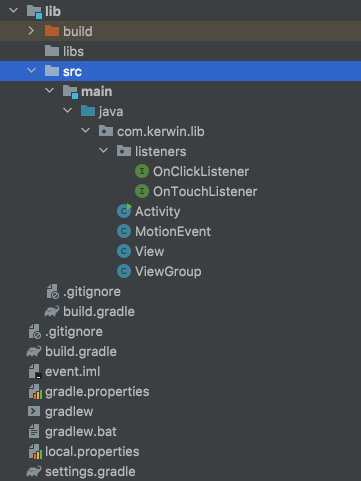

## class no-1

技术点：

1. 事件分发基本认知
2. android事件处理的三个流程
3. 事件采集流程
4. 内核到IMS过程
5. IMS如何推送数据给ViewRootImpl
6. WMS在事件采集中扮演的角色

预习资料-脑图笔记：

- https://www.processon.com/view/link/61b1ff83f346fb6a6f1a2cae

- 密码：P74w

课堂笔记：

- https://app.yinxiang.com/fx/8aab8fe8-08bd-4dc3-a714-a6e2a60f65c8

[](014_事件分发机制详解.assets/源码文件)

## class no-2

脑图资料：

- https://www.processon.com/view/link/61b1ff83f346fb6a6f1a2cae

- 密码：P74w

课堂笔记：

- https://app.yinxiang.com/fx/796d63ad-912d-43de-b179-8a1fd5dd8116

## 手写事件分发



### OnClickListener

```
package com.kerwin.lib.listeners;

import com.kerwin.lib.View;

public interface OnClickListener {
    void onClick(View v);
}
```

### OnTouchListener

```
package com.kerwin.lib.listeners;

import com.kerwin.lib.MotionEvent;
import com.kerwin.lib.View;

public interface OnTouchListener {
    boolean onTouch(View v, MotionEvent event);
}
```

### Activity

```java
package com.kerwin.lib;

import com.kerwin.lib.listeners.OnClickListener;
import com.kerwin.lib.listeners.OnTouchListener;

public class Activity {
    public static void main(String[] arg) {
        ViewGroup viewGroup = new ViewGroup(0, 0, 1080, 1920);
        viewGroup.setName("first container ");

        ViewGroup viewGroup1 = new ViewGroup(0, 0, 500, 500);
        viewGroup1.setName("second container");


        View view = new View(0, 0, 200, 200);
        viewGroup1.addView(view);
        viewGroup.addView(viewGroup1);
        viewGroup.setOnTouchListener(new OnTouchListener() {
            @Override
            public boolean onTouch(View v, MotionEvent event) {
                System.out.println("first container onTouch ");
                return false;
            }
        });
        viewGroup1.setOnTouchListener(new OnTouchListener() {
            @Override
            public boolean onTouch(View v, MotionEvent event) {
                System.out.println("second container onTouch");
                return false;
            }
        });
        view.setOnClickListener(new OnClickListener() {
            @Override
            public void onClick(View v) {
                System.out.println("view   onClick  ");
            }
        });
        view.setOnTouchListener(new OnTouchListener() {
            @Override
            public boolean onTouch(View v, MotionEvent event) {
                System.out.println("view   OnTouch ");
                return true;
            }
        });


        MotionEvent motionEvent = new MotionEvent(100, 100);
        motionEvent.setActionMasked(MotionEvent.ACTION_DOWN);

//        顶级容器分发
        viewGroup.dispatchTouchEvent(motionEvent);
    }
}
```

### MotionEvent

```java
package com.kerwin.lib;

public class MotionEvent{
    public static final int ACTION_DOWN             = 0;
    public static final int ACTION_UP               = 1;
    public static final int ACTION_MOVE             = 2;
    public static final int ACTION_CANCEL           = 3;
    private int actionMasked;
    private int x;
    private int y;
    public MotionEvent() {
    }

    public MotionEvent(int x, int y) {
        this.x = x;
        this.y = y;
    }

    public int getX() {
        return x;
    }

    public void setX(int x) {
        this.x = x;
    }

    public int getY() {
        return y;
    }

    public void setY(int y) {
        this.y = y;
    }

    public int getActionMasked() {
        return actionMasked;
    }

    public void setActionMasked(int actionMasked) {
        this.actionMasked = actionMasked;
    }
}
```

### View

```java
package com.kerwin.lib;

import com.kerwin.lib.listeners.OnClickListener;
import com.kerwin.lib.listeners.OnTouchListener;

public class View {
    private int left;
    private int top;
    private int right;
    private int bottom;

    private OnTouchListener mOnTouchListener;
    private OnClickListener onClickListener;

    public void setOnTouchListener(OnTouchListener mOnTouchListener) {
        this.mOnTouchListener = mOnTouchListener;
    }

    public void setOnClickListener(OnClickListener onClickListener) {
        this.onClickListener = onClickListener;
    }

    public View() {
    }

    public View(int left, int top, int right, int bottom) {
        this.left = left;
        this.top = top;
        this.right = right;
        this.bottom = bottom;
    }

    public boolean isContainer(int x, int y) {

        if (x >= left && x < right && y >= top && y < bottom) {
            return true;
        }
        return false;
    }

    //接受分发的代码
    public boolean dispatchTouchEvent(MotionEvent event) {
        System.out.println(" view  dispatchTouchEvent ");
        //消费
        boolean result = false;

        if (mOnTouchListener != null && mOnTouchListener.onTouch(this, event)) {
            result = true;
        }
        //mOnTouchListener   onClickListener.onClick
        if (!result && onTouchEvent(event)) {
            result = true;
        }

        return result;
    }

    private boolean onTouchEvent(MotionEvent event) {
        if (onClickListener != null) {
            onClickListener.onClick(this);
            return true;
        }
        return false;
    }
}

```

### ViewGroup

```java
package com.kerwin.lib;

import java.util.ArrayList;
import java.util.List;

public class ViewGroup extends View {
    public ViewGroup(int left, int top, int right, int bottom) {
        super(left, top, right, bottom);
    }

    List<View> childList = new ArrayList<>();
    private View[] mChildren = new View[0];

    public void addView(View view) {
        if (view == null) {
            return;
        }
        childList.add(view);
        mChildren = (View[]) childList.toArray(new View[childList.size()]);
    }

    private TouchTarget mFirstTouchTarget;

    // 事件分发的入口
    public boolean dispatchTouchEvent(MotionEvent event) {
        //
        System.out.println(name + " dispatchTouchEvent ");
        boolean handled = false;
        boolean intercepted = onInterceptTouchEvent(event);
        //TouchTarget模式 内存缓存   move up
        TouchTarget newTouchTarget = null;
        int actionMasked = event.getActionMasked();
        if (actionMasked != MotionEvent.ACTION_CANCEL && !intercepted) {
            //Down事件
            if (actionMasked == MotionEvent.ACTION_DOWN) {
                final View[] children = mChildren;
                //用数组，考虑效率问题
                //1.需要去对于VIEW进行排序
                //2.倒着来
                //循环去确定意味着，慢！ down
                //move--->滑动！  ---》设备采集速度事件多！
                //被调用频繁
                for (int i = children.length - 1; i >= 0; i--) {
                    View child = mChildren[i];
                    //View能够接收到事件,如果不在当前区域则结束这个View
                    if (!child.isContainer(event.getX(), event.getY())) {
                        continue;
                    }
                    //dispatchTransformedTouchEvent=true有人消费,false 不消费
                    if (dispatchTransformedTouchEvent(event, child)) {
                        // View[]  采取了 Message 的方式进行  链表结构
                        handled = true;
                        newTouchTarget = addTouchTarget(child);
                        break;
                    }
                }
            }
            // 当前的ViewGroup  dispatchTransformedTouchEvent
            if (mFirstTouchTarget == null) {
                handled = dispatchTransformedTouchEvent(event, null);
            } else {
                dispatchTransformedTouchEvent(event, mFirstTouchTarget.child);
            }
        }
        return handled;
    }

    private TouchTarget addTouchTarget(View child) {
        final TouchTarget target = TouchTarget.obtain(child);
        target.next = mFirstTouchTarget;
        mFirstTouchTarget = target;
        return target;
    }


    //    手写RecyClerView   回收池策略·
    private static final class TouchTarget {
        public View child;//当前缓存的View
        //回收池（一个对象）
        private static TouchTarget sRecycleBin;
        private static final Object sRecycleLock = new Object[0];
        public TouchTarget next;
        //size
        private static int sRecycledCount;

        //up事件
        public static TouchTarget obtain(View child) {
            TouchTarget target;
            synchronized (sRecycleLock) {
                if (sRecycleBin == null) {
                    target = new TouchTarget();
                } else {
                    target = sRecycleBin;
                }
                sRecycleBin = target.next;
                sRecycledCount--;
                target.next = null;
            }
            target.child = child;
            return target;
        }

        public void recycle() {

            if (child == null) {
                throw new IllegalStateException("已经被回收过了");
            }
            synchronized (sRecycleLock) {

                if (sRecycledCount < 32) {
                    next = sRecycleBin;
                    sRecycleBin = this;
                    sRecycledCount += 1;
                }
            }
        }
    }

    //分发处理 子控件  View
    private boolean dispatchTransformedTouchEvent(MotionEvent event, View child) {
        boolean handled = false;
        //当前View消费了
        if (child != null) {
            //结构上的设计ViewGroup= View
            handled = child.dispatchTouchEvent(event);
        } else {
            handled = super.dispatchTouchEvent(event);
        }

        return handled;
    }

    public boolean onInterceptTouchEvent(MotionEvent ev) {
        return false;
    }

    private String name;

    @Override
    public String toString() {
        return "" + name;
    }

    public void setName(String name) {
        this.name = name;
    }
}
```