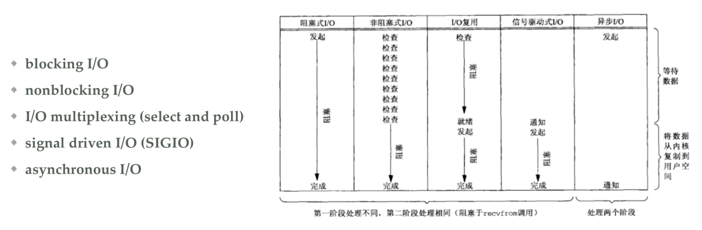
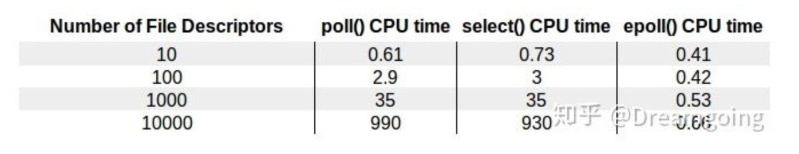
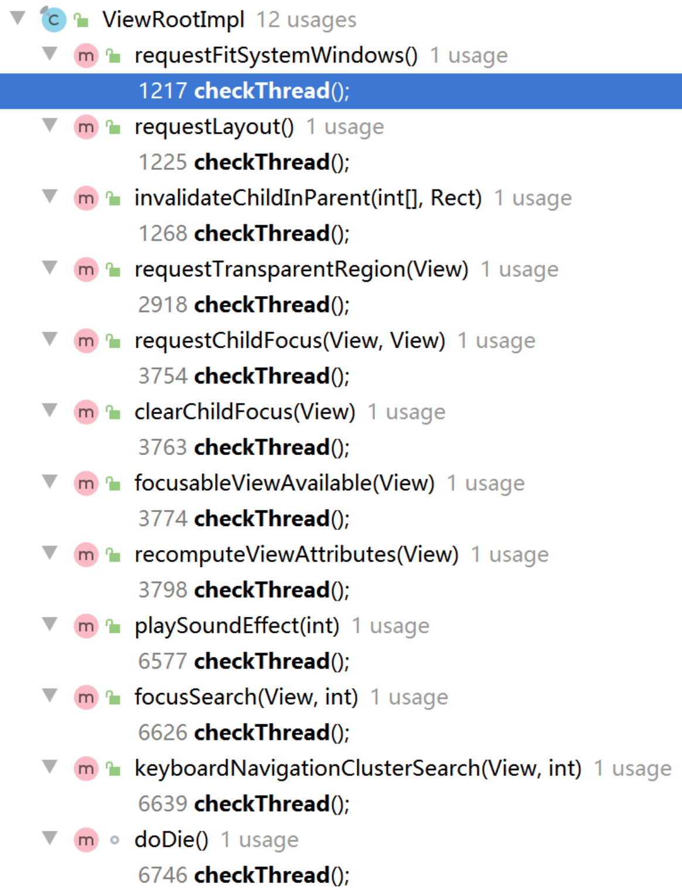

[TOC]

# Handler消息通讯详解

## Handler面试题

- Handler原理是什么，简单说下
  - 核心是解决线程切换。
  - Looper.prepare将Looper与Thread绑定，Looper.loop()开始死循环读取消息。
    - Looper中持有MessageQueue
    - Looper中持有ThreadLocal对象，用于实现一个线程只能有一个Looper对象，Thread中有ThreadLocalMap，当调用ThreadLocal.set方法时，将ThreadLocal作为key，Looper作为value存入Thread中的ThreadLocalMap。在当前Thread调用ThreadLocal.get方法时，就能拿到Looper对象
    - Looper调用Looper.loop()时，处理消息时通过msg.target.handleMessage(msg)方式
  - MessageQueue利用生产者消费者模式，实现批量存消息存储，一个个消息读取
  - Message持有Handler对象
  - Handler持有Looper对象，还有存取消息的方法enqueueMessage(msg), handleMessage(msg)
- 为什么不能在子线程更新UI？
- 一个线程有几个looper? 如何保证，又可以有几个Handler
  - 一个线程只有一个Looper，通过ThreadLocal来保证，可以有任意多个Handler
- 一个线程是怎么确保只有一个Looper的？
  - 通过ThreadLocal来保证，Thread中有ThreadLocalMap，当调用ThreadLocal.set方法时，将ThreadLocal作为key，Looper作为value存入Thread中的ThreadLocalMap。在当前Thread调用ThreadLocal.get方法时，就能拿到Looper对象。
- handler内存泄漏的原因，其他内部类为什么没有这个问题
  - handler内存泄漏的原因是短生命周期的对象持有长生命周期的对象造成的，并不是内部类持有外部类引用导致。
  - Thread -- Looper -- MessageQueue -- Message -- Handler -- Activity
- 为什么主线程可以new Handler  其他子线程可以吗  怎么做
- Message可以如何创建？哪种效果更好，为什么？
- Handler中的生产者-消费者设计模式你理解不？
- 子线程中维护Looper在消息队列无消息的时候处理方案是怎么样的
- 既然存在多个Handler往MessageQueue中添加数据（发消息时各个Handler处于不同线程），内部如何保证安全
- 我们使用Message是应该如何创建它
- Looper死循环为什么不会导致线程卡死
- 关于ThreadLocal，谈谈你的理解？
  - Looper中持有ThreadLocal对象，用于实现一个线程只能有一个Looper对象，Thread中有ThreadLocalMap，当调用ThreadLocal.set方法时，将ThreadLocal作为key，Looper作为value存入Thread中的ThreadLocalMap。在当前Thread调用ThreadLocal.get方法时，就能拿到Looper对象
- 使用Hanlder的postDealy()后消息队列会发生什么变化？
- 为什么不能在子线程更新UI？

## Android分层

- 应用层
- Framework
  - App内部通讯：Handler
  - App间通讯：Binder
- Android内核、虚拟机（art和dalvik）
- 驱动
  - binder
- Linux内核

## 手写Handler(体验架构演进)

> Handler核心是解决线程切换的问题，而Handler中的Message机制，顺带解决了线程通信的问题。
>
> 线程通信，其实就是数据共享。而申明全局变量也能实现线程通信，因此这不是关键。
>
> Handler机制就相当一台跑步机：
>
> - Handler：提供一个 “放货物” 和 “取货物” 的方法
>   - Handler.enqueueMessage() 放货物
>   - Handler.handleMessage() 取货物
> - Message：货物
> - MessageQueue：传送带
> - Looper：发电机

### 1）实现收发消息

> 1. 大量消息过来，容易阻塞 OOM
> 2. 不能做到线程通信 + 线程切换

```java
package com.watayouxiang.handlerdemo;

public class Handler {
    public void enqueueMessage(Message msg) {
        handleMessage(msg);
    }

    public void handleMessage(Message msg) {
    }
}

// ------------------------------------------------

package com.watayouxiang.handlerdemo;

public class Message {
    Object obj;

    public Message() {
    }

    public Message(String obj) {
        this.obj = obj;
    }
}

// ------------------------------------------------

package com.watayouxiang.handlerdemo;

public class ActivityThread {
    public static void main(String[] args) throws Exception {
        final Handler handler = new Handler() {
            @Override
            public void handleMessage(Message msg) {
                super.handleMessage(msg);
                Object obj = msg.obj;
            }
        };
        new Thread() {
            @Override
            public void run() {
                super.run();
                handler.enqueueMessage(new Message("hello"));
            }
        }.start();
    }
}
```

### 2）实现线程通信、能处理大量消息

> 阻塞队列：生产者消费者模式，将消息的存和取分开处理，避免大量消息过来时阻塞
>
> 死循环：开启死循环不断读取消息，读到的消息此时运行在开启死循环的线程中，从而实现线程通信

```java
package com.watayouxiang.handlerdemo;

public class Message {
    Object obj;

    public Message() {
    }

    public Message(String obj) {
        this.obj = obj;
    }
}

// --------------------------------------------------------------

package com.watayouxiang.handlerdemo;

import java.util.concurrent.ArrayBlockingQueue;
import java.util.concurrent.BlockingQueue;

public class MessageQueue {
    BlockingQueue<Message> queue = new ArrayBlockingQueue<Message>(100);
    public void enqueueMessage(Message msg){
        try {
            queue.put(msg);
        } catch (InterruptedException e) {
            e.printStackTrace();
        }
    }

    public Message next(){
        Message msg = null;
        try {
            msg = queue.take();
        } catch (InterruptedException e) {
            e.printStackTrace();
        }
        return msg;
    }
}

// --------------------------------------------------------------

package com.watayouxiang.handlerdemo;

public class Handler {
    MessageQueue messageQueue = new MessageQueue();

    public void looper() {
        for (; ; ) {
            Message msg = messageQueue.next();
            handleMessage(msg);
        }
    }

    public void enqueueMessage(Message msg) {
        messageQueue.enqueueMessage(msg);
    }

    public void handleMessage(Message msg) {
    }
}

// --------------------------------------------------------------

package com.watayouxiang.handlerdemo;

public class ActivityThread {
    // Thread-0 send nihao
    // main receive nihao
    public static void main(String[] args) throws Exception {
        final Handler handler = new Handler() {
            @Override
            public void handleMessage(Message msg) {
                super.handleMessage(msg);
                System.out.println(Thread.currentThread().getName() + " receive " + msg.obj.toString());
            }
        };

        new Thread() {
            @Override
            public void run() {
                Message msg = new Message("nihao");
                System.out.println(Thread.currentThread().getName() + " send " + msg.obj.toString());
                handler.enqueueMessage(msg);
                super.run();
            }
        }.start();

        handler.looper();
    }
}
```

### 3）一个线程只能有一个消息队列

> 1. 怎么让一个线程只有一个消息队列
>
> 2. ThreadLocal的使用和解析
>
>    得出结论：Thread -- Looper -- MessageQueue -- Message -- Handler -- Activity
>
>    后续问题：主线程调用Looper.loop() 为什么不会死循环？

```java
package com.watayouxiang.handlerdemo;

public class Handler {
    Looper mLooper;

    public Handler() {
        this.mLooper = Looper.myLooper();
    }

    public void enqueueMessage(Message msg) {
        msg.target = this;
        mLooper.messageQueue.enqueueMessage(msg);
    }

    public void handleMessage(Message msg) {
    }
}

// --------------------------------------------------------------

package com.watayouxiang.handlerdemo;

public class Looper {
    MessageQueue messageQueue;
    private static final ThreadLocal<Looper> sThreadLocal = new ThreadLocal<Looper>();

    private Looper() {
        messageQueue = new MessageQueue();
    }

    /**
     * 获取与该线程绑定的Looper
     */
    public static Looper myLooper(){
        return sThreadLocal.get();
    }

    /**
     * 将线程和Looper绑定
     * <p>
     * 为了确保一个线程只有一个消息队列：
     * 因为一个 Looper 对应一个消息队列，所以只要 Looper 唯一，那么消息队列也就是唯一，同时线程也是唯一。
     * 通过查看 Thread 源码可以知道，一个 Thread 对应一个 ThreadLocal.ThreadLocalMap。
     * ThreadLocal.ThreadLocalMap 的 key = ThreadLocal<Looper>，value = Looper。
     * 所以如果要取出 Looper，只要持有 ThreadLocal.ThreadLocalMap 的 key（ThreadLocal）就可以了。
     */
    public static void prepare() {
        if (sThreadLocal.get() != null) {
            throw new RuntimeException("Only one Looper may be created per thread");
        }
        sThreadLocal.set(new Looper());
    }

    /**
     * 开启死循环
     * <p>
     * 这里要调用 handleMessage() 方法，必须要要拿到 handler 对象。
     * 而在一个线程中 handler 是可以无数多个的，是无法管理的。
     * 所以只能妥协让 message 持有 handler 对象。
     */
    public static void looper() {
        Looper looper = sThreadLocal.get();
        MessageQueue messageQueue = looper.messageQueue;
        for (; ; ) {
            Message msg = messageQueue.next();
            msg.target.handleMessage(msg);
        }
    }
}

// --------------------------------------------------------------

package com.watayouxiang.handlerdemo;

public class Message {
    Handler target;
    Object obj;

    public Message() {
    }

    public Message(String obj) {
        this.obj = obj;
    }
}

// --------------------------------------------------------------

package com.watayouxiang.handlerdemo;

import java.util.concurrent.ArrayBlockingQueue;
import java.util.concurrent.BlockingQueue;

public class MessageQueue {
    BlockingQueue<Message> queue = new ArrayBlockingQueue<Message>(100);
  
    public void enqueueMessage(Message msg){
        try {
            queue.put(msg);
        } catch (InterruptedException e) {
            e.printStackTrace();
        }
    }

    public Message next(){
        Message msg = null;
        try {
            msg = queue.take();
        } catch (InterruptedException e) {
            e.printStackTrace();
        }
        return msg;
    }
}

// --------------------------------------------------------------

package com.watayouxiang.handlerdemo;

public class ActivityThread {
    public static void main(String[] args) throws Exception {
        Looper.prepare();

        final Handler handler = new Handler() {
            @Override
            public void handleMessage(Message msg) {
                super.handleMessage(msg);
                System.out.println(Thread.currentThread().getName() + " receive " + msg.obj.toString());
            }
        };

        new Thread() {
            @Override
            public void run() {
                super.run();
                Message msg = new Message("nihao");
                System.out.println(Thread.currentThread().getName() + " send " + msg.obj.toString());
                handler.enqueueMessage(msg);
            }
        }.start();

        Looper.looper();
    }
}
```

## Message消息回收池

Message源码：

```java
private static Message sPool;// 消息回收池（只需要记录第一条消息地址即可）
private static int sPoolSize = 0;// 消息回收池长度
private static final int MAX_POOL_SIZE = 50;// 消息回收池最大容量

// 获取 “消息回收池” 的消息（消息的复用机制）
public static Message obtain() {
    synchronized (sPoolSync) {
        if (sPool != null) {
            Message m = sPool;
            sPool = m.next;
            m.next = null;
            m.flags = 0; // clear in-use flag
            sPoolSize--;
            return m;
        }
    }
    return new Message();
}

/**
 * 注释可以看出：调用Handler移除消息的方法时，那些被移除的消息就会添加进“消息回收池”中，
 *  						比如 释放的触摸事件、取消的错误事件 时。
 * <p> 
 * Return a Message instance to the global pool.
 * <p>
 * You MUST NOT touch the Message after calling this function because it has
 * effectively been freed.  It is an error to recycle a message that is currently
 * enqueued or that is in the process of being delivered to a Handler.
 * </p>
 */
public void recycle() {
    if (isInUse()) {
        if (gCheckRecycle) {
            throw new IllegalStateException("This message cannot be recycled because it "
                    + "is still in use.");
        }
        return;
    }
    recycleUnchecked();
}

// 往 “消息回收池” 中添加消息（消息的复用机制）
// 当使用Handler删除某条消息的时候，会分别调用MessageQueue的如下三个方法：
// MessageQueue 的 removeMessages(Handler h, int what, Object object)
// MessageQueue 的 removeMessages(Handler h, Runnable r, Object object)
// MessageQueue 的 removeCallbacksAndMessages(Handler h, Object object)
// 从而实现往 “消息回收池” 中添加消息
void recycleUnchecked() {
    // Mark the message as in use while it remains in the recycled object pool.
    // Clear out all other details.
    flags = FLAG_IN_USE;
    what = 0;
    arg1 = 0;
    arg2 = 0;
    obj = null;
    replyTo = null;
    sendingUid = -1;
    when = 0;
    target = null;
    callback = null;
    data = null;

    synchronized (sPoolSync) {
        if (sPoolSize < MAX_POOL_SIZE) {
            next = sPool;
            sPool = this;
            sPoolSize++;
        }
    }
}

// 这是 MessageQueue 的 removeMessages(Handler h, int what, Object object)源码
void removeMessages(Handler h, Runnable r, Object object) {
    if (h == null || r == null) {
        return;
    }

    synchronized (this) {
        Message p = mMessages;

        // Remove all messages at front.
        while (p != null && p.target == h && p.callback == r
               && (object == null || p.obj == object)) {
            Message n = p.next;
            mMessages = n;
            p.recycleUnchecked();
            p = n;
        }

        // Remove all messages after front.
        while (p != null) {
            Message n = p.next;
            if (n != null) {
                if (n.target == h && n.callback == r
                    && (object == null || n.obj == object)) {
                    Message nn = n.next;
                    n.recycleUnchecked();
                    p.next = nn;
                    continue;
                }
            }
            p = n;
        }
    }
}
```

- 消息回收池是 “单向链表”
- Message.obtain()方式是复用消息回收池的消息
- 不推荐 new Message() 方式创建消息，推荐 Message.obtain() 方式获取消息回收池中的消息
- 当使用Handler删除某条消息的时候，会分别调用MessageQueue的如下三个方法。从而实现往消息回收池中添加消息
  - removeMessages(Handler h, int what, Object object)
  - removeCallbacksAndMessages(Handler h, Object object)
  - removeMessages(Handler h, Runnable r, Object object)
- 从源码中可知，被释放的触摸事件、被取消的错误事件 都会尝试进入“消息回收池”

## Handler定时发送消息

> ArrayBlockingQueue 可以实现消息按顺序发送，但不能实现定时发送消息
>
> ArrayBlockingQueue 是以锁的方式实现阻塞与唤醒，不满足开发需求

Handler源码：

```java
// 延迟发送
public final boolean sendMessageDelayed(Message msg, long delayMillis) {
    if (delayMillis < 0) {
        delayMillis = 0;
    }
    return sendMessageAtTime(msg, SystemClock.uptimeMillis() + delayMillis);
}

// 指定时间发送消息
public boolean sendMessageAtTime(Message msg, long uptimeMillis) {
    MessageQueue queue = mQueue;
    if (queue == null) {
        RuntimeException e = new RuntimeException(
                this + " sendMessageAtTime() called with no mQueue");
        Log.w("Looper", e.getMessage(), e);
        return false;
    }
    return enqueueMessage(queue, msg, uptimeMillis);
}
```

MessageQueue源码：

```java
// 这个就是消息链表（单向链表）
// 持有消息链表的第一条消息，就等于持有了整个消息链表
Message mMessages;

// “消息” 按时间顺序插入 “消息队列”
boolean enqueueMessage(Message msg, long when) {
    synchronized (this) {
        msg.markInUse();
        msg.when = when;
        Message p = mMessages;
        boolean needWake;
        if (p == null || when == 0 || when < p.when) {
            // 如果头消息为空，说明此时是第一条消息
            // New head, wake up the event queue if blocked.
            msg.next = p;
            mMessages = msg;
            needWake = mBlocked;
        } else {
            // Inserted within the middle of the queue.  Usually we don't have to wake
            // up the event queue unless there is a barrier at the head of the queue
            // and the message is the earliest asynchronous message in the queue.
            needWake = mBlocked && p.target == null && msg.isAsynchronous();
            // 遍历消息链表，寻找插入位置
            Message prev;
            for (;;) {
                prev = p;
                p = p.next;
                if (p == null || when < p.when) {
                    break;
                }
                if (needWake && p.isAsynchronous()) {
                    needWake = false;
                }
            }
            // 消息插入消息链表
            msg.next = p; // invariant: p == prev.next
            prev.next = msg;
        }

        // We can assume mPtr != 0 because mQuitting is false.
        if (needWake) {
            nativeWake(mPtr);
        }
    }
    return true;
}
```

## Handler获取消息

> Looper死循环是在UI线程，那为什么不会阻塞UI线程？

MessageQueue源码：

```java
Message next() {
    // Return here if the message loop has already quit and been disposed.
    // This can happen if the application tries to restart a looper after quit
    // which is not supported.
    final long ptr = mPtr;
    if (ptr == 0) {
        return null;
    }

    int pendingIdleHandlerCount = -1; // -1 only during first iteration
    int nextPollTimeoutMillis = 0;
    for (;;) {
        if (nextPollTimeoutMillis != 0) {
            Binder.flushPendingCommands();
        }

        nativePollOnce(ptr, nextPollTimeoutMillis);// 这里实现阻塞式功能（c语言的epoll机制）

        synchronized (this) {
            // Try to retrieve the next message.  Return if found.
            final long now = SystemClock.uptimeMillis();
            Message prevMsg = null;
            Message msg = mMessages;
            if (msg != null && msg.target == null) {
                // Stalled by a barrier.  Find the next asynchronous message in the queue.
                do {
                    prevMsg = msg;
                    msg = msg.next;
                } while (msg != null && !msg.isAsynchronous());
            }
            if (msg != null) {
                if (now < msg.when) {
                    // Next message is not ready.  Set a timeout to wake up when it is ready.
                    nextPollTimeoutMillis = (int) Math.min(msg.when - now, Integer.MAX_VALUE);
                } else {
                    // Got a message.
                    mBlocked = false;
                    if (prevMsg != null) {
                        prevMsg.next = msg.next;
                    } else {
                        mMessages = msg.next;
                    }
                    msg.next = null;
                    if (DEBUG) Log.v(TAG, "Returning message: " + msg);
                    msg.markInUse();
                    return msg;
                }
            } else {
                // No more messages.
                nextPollTimeoutMillis = -1;
            }

            // Process the quit message now that all pending messages have been handled.
            if (mQuitting) {
                dispose();
                return null;
            }

            // If first time idle, then get the number of idlers to run.
            // Idle handles only run if the queue is empty or if the first message
            // in the queue (possibly a barrier) is due to be handled in the future.
            if (pendingIdleHandlerCount < 0
                    && (mMessages == null || now < mMessages.when)) {
                pendingIdleHandlerCount = mIdleHandlers.size();
            }
            if (pendingIdleHandlerCount <= 0) {
                // No idle handlers to run.  Loop and wait some more.
                mBlocked = true;
                continue;
            }

            if (mPendingIdleHandlers == null) {
                mPendingIdleHandlers = new IdleHandler[Math.max(pendingIdleHandlerCount, 4)];
            }
            mPendingIdleHandlers = mIdleHandlers.toArray(mPendingIdleHandlers);
        }

        // Run the idle handlers.
        // We only ever reach this code block during the first iteration.
        for (int i = 0; i < pendingIdleHandlerCount; i++) {
            final IdleHandler idler = mPendingIdleHandlers[i];
            mPendingIdleHandlers[i] = null; // release the reference to the handler

            boolean keep = false;
            try {
                keep = idler.queueIdle();
            } catch (Throwable t) {
                Log.wtf(TAG, "IdleHandler threw exception", t);
            }

            if (!keep) {
                synchronized (this) {
                    mIdleHandlers.remove(idler);
                }
            }
        }

        // Reset the idle handler count to 0 so we do not run them again.
        pendingIdleHandlerCount = 0;

        // While calling an idle handler, a new message could have been delivered
        // so go back and look again for a pending message without waiting.
        nextPollTimeoutMillis = 0;
    }
}
```

- MessageQueue 的 next() 方法中的 nativePollOnce(ptr, nextPollTimeoutMillis); 实现了阻塞式功能。内部是利用了c语言的epoll机制实现的。

### linux epoll机制

- epoll机制属于 “内核的IO模型” 中的 “IO复用模型”：老李委托黄牛买火车票，黄牛抢到票后通知老李，老李再去火车站交钱领票。



Linux 有多个 IO 模型:

- 阻塞 IO
- 非阻塞 IO
- IO 复用：对应 `select` `poll` `epoll` 都属于基于 IO 复用模式的调用
- 信号驱动 IO
- 异步 IO

Epoll是linux2.6内核的一个新的系统调用，Epoll在设计之初，就是为了替代select，Epoll线性复杂度的模型，epoll的时间复杂度为O(1), 也就意味着，Epoll在高并发场景，随着文件描述符的增长，有良好的可扩展性。

- `select` 和 `poll` 监听文件描述符list，进行一个线性的查找 O(n)
- `epoll`: 使用了内核文件级别的回调机制O(1)

下图展示了文件描述符的量级和CPU耗时：



在linux 没有实现epoll事件驱动机制之前，我们一般选择用select或者poll等IO多路复用的方法来实现并发服务程序。在linux新的内核中，有了一种替换它的机制，就是epoll。

epoll的通俗解释是一种当文件描述符的内核缓冲区非空的时候，发出可读信号进行通知，当写缓冲区不满的时候，发出可写信号通知的机制。

### Handler为何使用管道?

我们可能会好奇，既然是同一个进程间的线程通信，为何需要管道呢？

我们知道线程之间内存共享，通过Handler通信，消息池的内容并不需要从一个线程拷贝到另一个线程，因为两线程可使用的内存时同一个区域，都有权直接访问，当然也存在线程私有区域ThreadLocal（这里不涉及）。即然不需要拷贝内存，那管道是何作用呢？

**Handler机制中管道作用**就是当一个线程A准备好Message，并放入消息池，这时需要通知另一个线程B去处理这个消息。线程A向管道的写端写入数据1（对于老的Android版本是写入字符`W`），管道有数据便会唤醒线程B去处理消息。管道主要工作是用于通知另一个线程的，这便是最核心的作用。

### Handler为何采用管道而非Binder？

handler不采用Binder，并非binder完成不了这个功能，而是太浪费CPU和内存资源了。因为Binder采用C/S架构，一般用于不同进程间的通信。

- 从内存角度：通信过程中Binder还涉及一次内存拷贝，handler机制中的Message根本不需要拷贝，本身就是在同一个内存。Handler需要的仅仅是告诉另一个线程数据有了。

- 从CPU角度，为了Binder通信底层驱动还需要维护一个binder线程池，每次通信涉及binder线程的创建和内存分配等比较浪费CPU资源。

从上面的角度分析可得，Binder用于进程间通信，而Handler消息机制用于同进程的线程间通信，Handler不宜采用Binder。

## “非UI线程更新UI” 问题探究

### UI线程的工作机制

主线程的工作机制可以概况为 **生产者 - 消费者 - 队列** 模型。

### 为什么UI线程不设计成线程安全的

总所周知，如果设计成线程安全的，那性能肯定是大打折扣的，而UI更新的要求有如下特性：

- UI是具有可变性的，甚至是高频可变。
- UI对响应时间很敏感，这就要求UI操作必须要高效。
- UI组件必须批量绘制来保证效率。

所以为了保证渲染性能，UI线程不能设计成线程安全的。Android设计了Handler机制来更新UI是避免多个子线程更新UI导致的UI错乱的问题，也避免了通过加锁机制设计成线程安全的，因为那样会导致性能下降的很厉害。

### 子线程能创建Handler吗？

能。但是需要先调用Looper.prepare()方法，否则会抛出运行时异常[Can't create handler inside thread that has not call Looper.prepared()]。

### 子线程的Looper和主线程的Looper有什么区别

子线程的Looper可以退出的，主线程的Looper时不能退出的。

### 非UI线程一定不能更新UI吗？

答：不一定。

说明：我们知道在Android提供的SurfaceView、GLSurfaceView里面是都能在非UI线程更新UI的。

并且在一些特定的场景下，子线程更新View也是能更新成功的。

例如，下面的代码在子线程中更新界面是可以成功的：

```java
import android.app.Activity;
import android.os.Bundle;
import android.widget.Button;
 
public class TestActivity extends Activity {
    Button btn = null;

    public void onCreate(Bundle savedInstanceState) {
       super.onCreate(savedInstanceState);
       setContentView(R.layout.main);
       btn = (Button) findViewById(R.id.Button01);
       new TestThread(btn).start();
    }

    class TestThread extends Thread {
       Button btn = null;
       public TestThread(Button btn) {
           this.btn = btn;
       }

       @Override
       public void run() {
           btn.setText("TestThread.run");
       }
    }
}
```

当我们深入分析其原理的时候，就可以知道，能否更新成功的关键点在于是否会触发checkThead()导致更新失败，抛出异常：

```java
void checkThread() {
    if (mThread != Thread.currentThread()) {
        throw new CalledFromWrongThreadException("Only the original thread that created a view hierarchy can touch its views.");
    }
}
```

而在ViewRootImpl中，会有这些方法调用到checkThread()方法：



经过分析，最终可以得到，在子线程中给TextView setText 不会抛出异常的两个场景：

- TextView 还没来得及加入到ViewTree中

- TextView已经被加入了ViewTree，但是被设置了固定宽高，且开启了硬件加速

子线程操作View 确实不一定导致Crash，那是因为刚好满足一定的条件并没有触发checkThread机制，但这并不代表我们在开发过程中可以这么写，其实我们还是应该遵循google的建议，更新UI始终在UI线程里去做。
