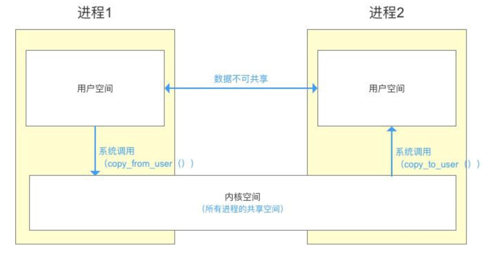
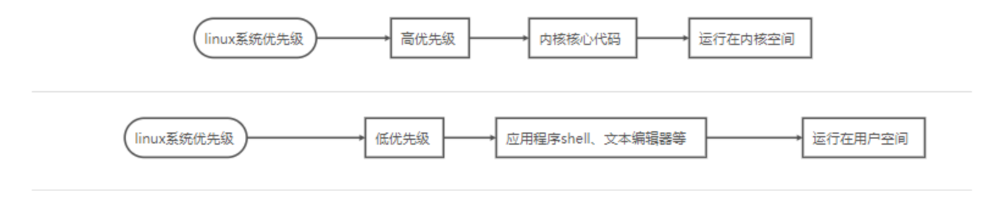
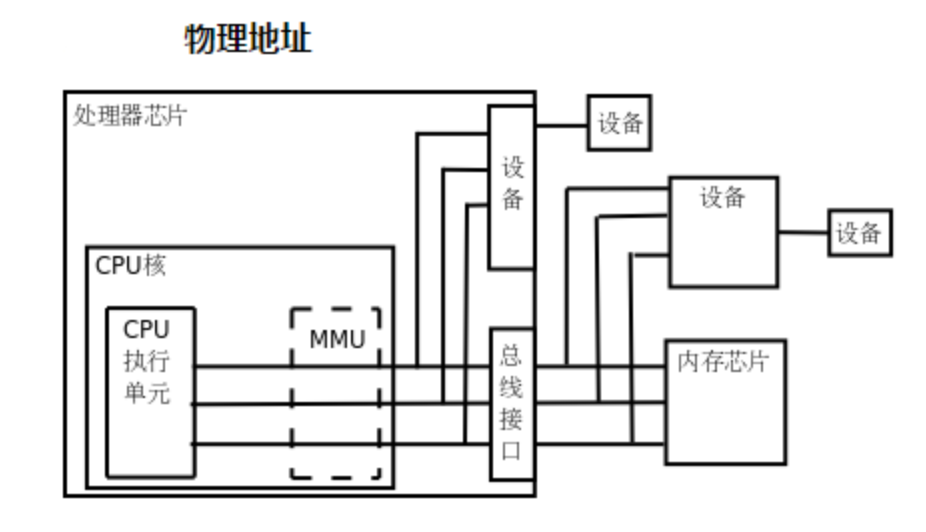
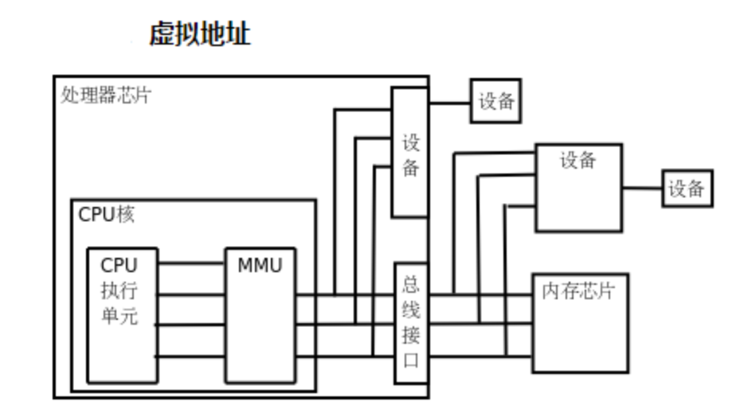
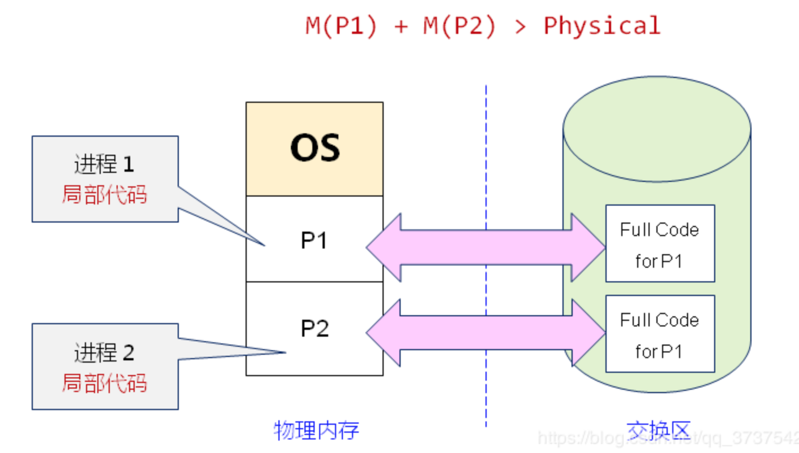
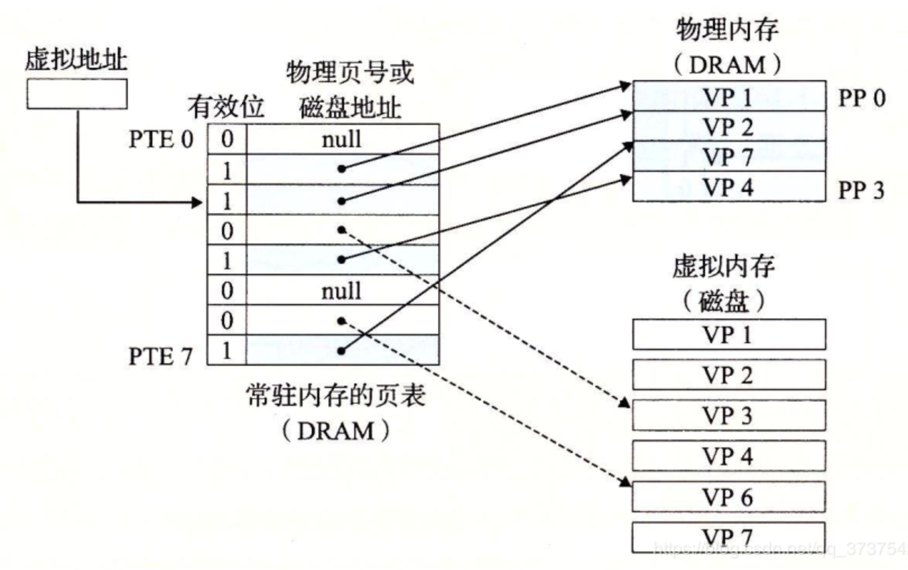

# linux内存基础

Linux已有进程通信（管道、共享内存、Socket、File）都不能满足安卓系统，所以才要会有Binder机制。

## Linux内存基础

- 用户空间：用户空间是用户所能访问的空间，App进程跑在用户空间中。
- 内核空间：内核空间是 “系统代码”、“驱动代码”、“内核代码”、“内核进程” 所在的空间。
- MMU
  - Memory Management Unit，内存管理单元，MMU负责的是虚拟地址和物理地址的转换。
  - 页表：虚拟地址和物理地址的映射表
  - 页的概念：为了CPU的高效执行以及方便的内存管理，每次需要拿一页的代码。这个页，指的是一段连续的存储空间（常见的是4K），也叫做块。
- 程序的局部性原则：进程的代码只有局部在物理内存中运行。这是因为程序具有局部性原则，所以在某一小段时间段内，只有很少一部分代码会被CPU执行。
- 磁盘高速缓存区：磁盘高速缓存区在磁盘中，一般大小在8M～16M，磁盘高速缓存区的速度和内存条相当。
- Binder
  - Binder的优势：减少物理内存的拷贝次数
  - Binder一次最多能拷贝多大数据：1M-8K，ProcessState.cpp中定义了BINDER_VM_SIZE为 (1M-8K)
  - Binder的调用：App1 用copy_from_user() 将数据从用户空间拷贝到内核空间。内核空间内有 “内核缓存区” 和 “数据接收缓存区”，它们间存在一对一映射关系，而 “数据接收缓存区” 又与 App2 的用户空间存在映射关系，因此 App2 可以直接拿到 “数据接收缓存区” 中的数据（也就是 App1 的数据）。
  - Binder少拷贝一次发生在客户端还是服务端：服务端
- mmap函数
  - 1、物理内存中开辟4096字节内存
  - 2、将物理内存与磁盘进行对应
  - 3、MMU将mmap开辟的物理地址转换成虚拟地址

## 普通linux进程通信的方式

进程间，用户空间的数据不可共享，所以用户空间相当于私有空间

进程间，内核空间的数据可共享，所以内核空间 相当于公共空间

进程间如果需要做到通信，需要通过共享空间对数据转换。转换过程需要调用系统的api，这个过程称为**系统调用**

## linux为什么要分内核空间和用户空间

linux系统在高优先级模式中运行系统**内核代码**以及与**硬件密切**相关的代码。**低优先级**运行**应用程序**与硬件无关部分。

这样做的好处有：

- 应用程序崩溃**不会造成内核崩溃**，拿windows举例来说，**QQ崩溃掉不会造成程序死机**。
- 每个应用程序或者进程都会有自己特定的地址、私有数据空间，**程序之间一般不会相互影响**。例如QQ崩溃不会造成微信的崩溃。空间的隔离极大地提高了系统运行的稳定性。

## 什么是MMU

- MMU (Memory Management Unit) 内存管理单元：主要用来管理 虚拟存储器、物理存储器 的控制线路，同时也负责虚拟地址映射为物理地址，以及提供硬件机制的内存访问授权、多任务多进程操作系统。
- 虚拟存储器的基本思想是：**程序、数据、堆栈的总大小可以超过内存空间的大小，**操作系统将当前运行的部分保存在内存中，未使用的部分保存在磁盘中。
  - 比如一个**16MB的程序**和一个**内存只有4MB**的机器，操作系统通过选择可以决定哪部分4MB的程序内容保存在内存中，并在需要时，在内存与磁盘中交换程序代码，这样16MB的代码就可以运行在4MB的机器中了。

## 地址范围、虚拟地址与物理地址

- **地址范围**：指处理器能够产生的地址集合，如一个32bit的处理器，其能产生的地址集合是**0x0000 0000 ~ 0xffff ffff** (4G)，这个地址范围也称为**虚拟地址空间**，其中对应的地址为**虚拟地址**。
- **虚拟地址与物理地址**：与虚拟地址空间和虚拟地址相对应的是物理地址空间和物理地址；物理地址空间只是虚拟地址空间的一个**子集**。如一台内存为256MB的32bit主机，其虚拟地址空间是0 ~ 0xffffffff(4GB)，**物理地址空间**范围是0 ~ 0x0fff ffff(256M)。

## 分页机制 (页、页帧、页表)

如果处理器没有MMU，或者有MMU但没有启用，CPU执行单元发出的内存地址将直接传到芯片引脚上，被内存芯片（以下称为物理内存，以便与虚拟内存区分）接收，这称为物理地址（**Physical Address**，以下简称**PA**），如下图所示：

如果处理器启用了MMU，CPU执行单元发出的内存地址将被MMU截获，从CPU到MMU的地址称为虚拟，而MMU将这个地址翻译成另一个地址发到CPU芯片的外部地址引脚上，也就是将VA映射成PA，如下图：

- linux使用MMU的机器都采用**分页机制**。虚拟地址空间以**页**为单位进行划分，而相应的物理地址空间也被划分，其使用的单位称为**页帧**，页帧和页必须保持相同，因为**内存与外部存储器之间的传输是以页为单位进行传输的**。

- 虚拟内存的哪个**页**面映射到物理内存的哪个**页帧**是通过**页表（Page Table）**来描述的，页表保存在**物理内存中**，**MMU会查找页表来确定一个VA应该映射到什么PA。**

## 交换区

实际上就是一块磁盘空间（硬盘空间）。虚拟内存与物理内存映射的时候，是将虚拟内存的代码放到交换区中，以后在CPU想要执行相关的指令或者数据时，如果内存中没有，先去交换区将需要的指令与数据映射到物理内存，然后CPU再执行。

虚拟内存与交换取的这种概念，实现了大内存需求量的（多个）进程，能够（同时）运行在较小的物理内存中。如下图所示：

上图中，说的是进程的局部代码在物理内存中运行。是因为程序具有局部性原则，所以在某一段很小的时间段内，只有很少一部分代码会被CPU执行。

## 虚拟页、物理页

- 从交换区获取程序的代码，将它拿到物理内存执行。**那么一次拿多少代码过来呢？这是一个问题！**

- 为了CPU的高效执行以及方便的内存管理，每次需要拿一个**页的代码**。这个页，指的是一段连续的存储空间（常见的是4Kb），也叫作块。

- 假设页的大小为P。在虚拟内存中，叫做**虚拟页（VP）**。从虚拟内存拿了一个页的代码要放到物理内存，那么自然物理内存也得有一个刚好一般大小的页才能存放虚拟页的代码。物理内存中的页叫做**物理页（PP）**
- 在任何时刻，虚拟页都是以下三种状态中的一种：
  - 未分配的：VM系统还未分配的页（或者未创建）。未分配的页还没有任何数据与代码与他们相关联，因此也就不占用任何磁盘。
  - 缓存的： 当前已缓存在物理内存中的已分配页
  - 未缓存的：未缓存在物理内存中的已分配页

## 页命中

当CPU得到一个地址vaddr想要访问它（这个addr就是上面想要访问的某一个字节的地址）：

- 通过MMU，将虚拟地址addr作为索引定位到页表的PTE条目中的PTE2（这里假设是PTE2）
- 从内存中去读到PTE2的有效位为1，说明该虚拟页面已经被缓存了，所以CPU使用该PTE2条目中的物理内存地址（这个物理内存地址是PP1中的起始地址）构造出vaddr的物理地址paddr（这个地址是PP1页面起始地址或后面的某一个地址）。
- 然后CPU就会去paddr这个物理内存地址去取数据。这种情况，就是也命中。
