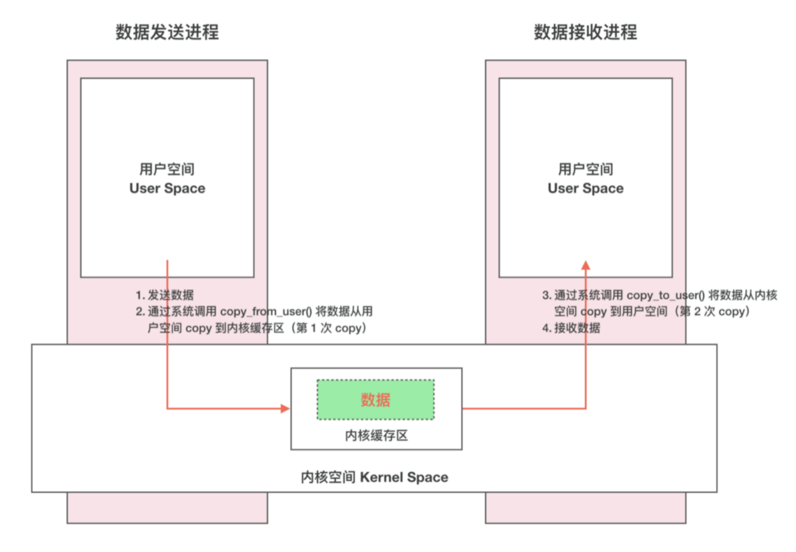
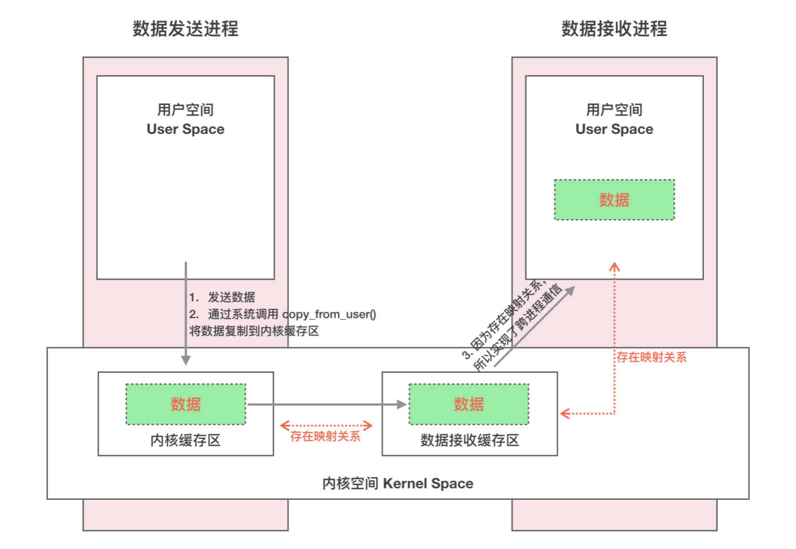
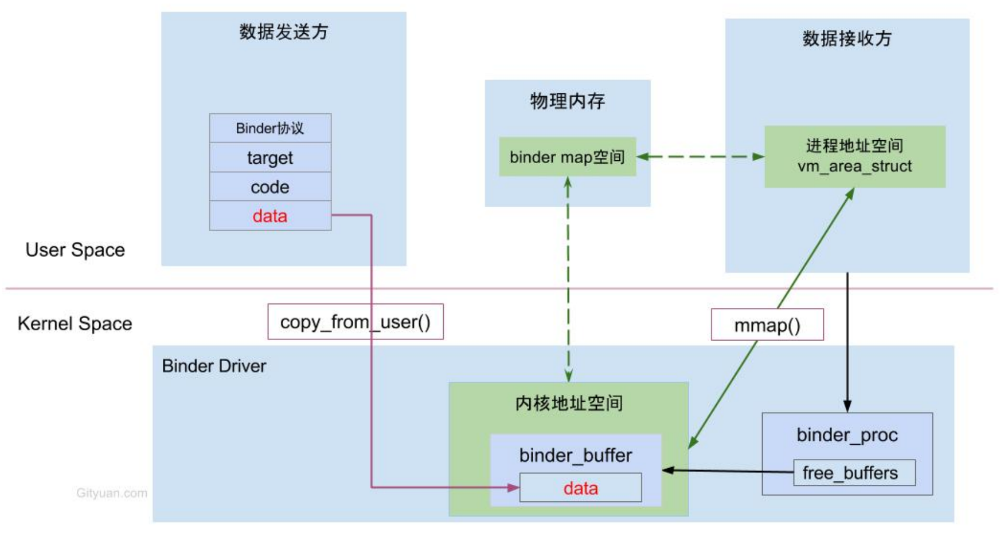
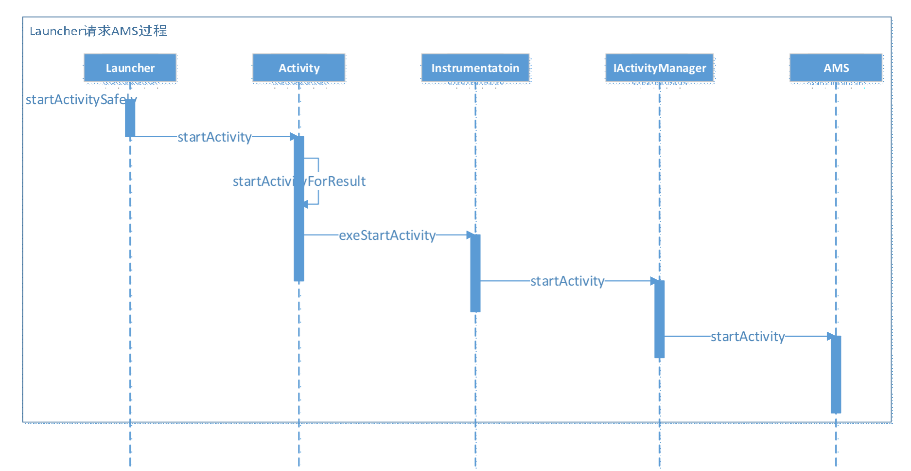
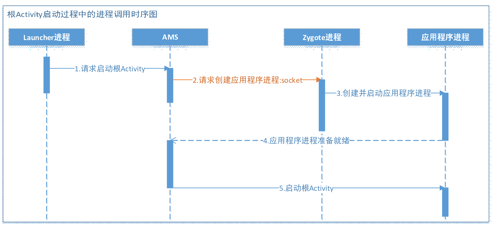
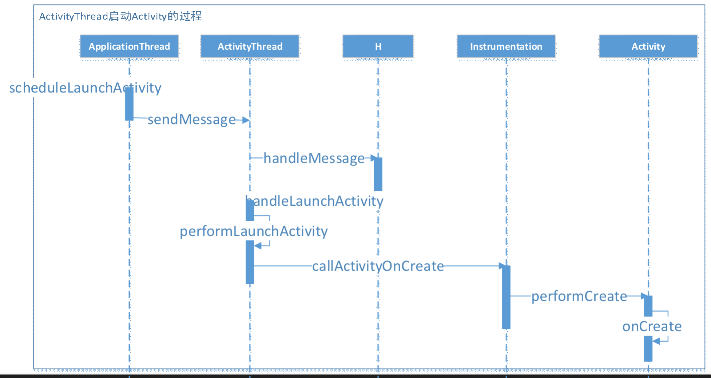
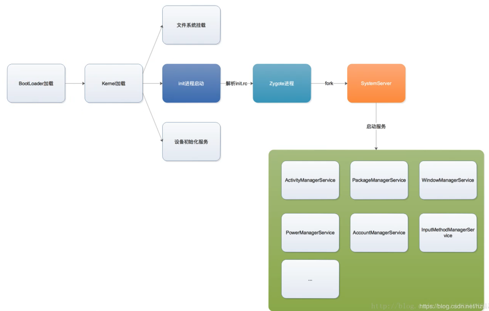

# Binder源码分析

## 手写Binder IPC

> - 采用Linux的共享内存方式实现
> - 使用了mmap函数

ManiuBinder.java

```java
package com.maniu.bindermaniu;

public class ManiuBinder {
    static {
        System.loadLibrary("native-lib");
    }
    public native void write();
    public native String read();
}
```

native-lib.cpp

```cpp
#include <jni.h>
#include <string>

#include <jni.h>
#include <string>
#include <fcntl.h>
#include <unistd.h>
#include <sys/stat.h>
#include <sys/mman.h>
#include <android/log.h>

extern "C"
JNIEXPORT void JNICALL
Java_com_maniu_bindermaniu_ManiuBinder_write(JNIEnv *env, jobject thiz) {
    std::string file = "/sdcard/binder";
    int m_fd = open(file.c_str(), O_RDWR | O_CREAT, S_IRWXU);
    ftruncate(m_fd, 4096);
    int8_t *m_ptr = static_cast<int8_t *>(mmap(0, 4096,
            PROT_READ | PROT_WRITE, MAP_SHARED, m_fd,0));
    std::string data("码牛 用代码成就你成为大牛的梦想");
    memcpy(m_ptr, data.data(), data.size());
}

extern "C"
JNIEXPORT jstring JNICALL
Java_com_maniu_bindermaniu_ManiuBinder_read(JNIEnv *env, jobject thiz) {
    std::string file = "/sdcard/binder";
    int m_fd = open(file.c_str(), O_RDWR | O_CREAT, S_IRWXU);
    ftruncate(m_fd, 4096);
    int8_t *m_ptr = static_cast<int8_t *>(mmap(0, 4096,
            PROT_READ | PROT_WRITE, MAP_SHARED, m_fd,0));

    char *buf = static_cast<char *>(malloc(100));
    memcpy(buf, m_ptr, 100);
    std::string result(buf);
    __android_log_print(ANDROID_LOG_ERROR, "david", "读取数据:%s", result.c_str());
    munmap(m_ptr, 4096);
    close(m_fd);
    return env->NewStringUTF(result.c_str());
}
```

## Binder进城通信

### linux已有的IPC进程通信

- 管道
- 共享内存
- Socket
- File

### 传统内存调用




### Binder调用



- Binder 分 S端 和 C端，S端获取数据不需要拷贝，因为 S端 存在 1M-8K 虚拟地址和内核空间的虚拟地址存在映射关系。
- copy_from_user函数调用了2次
  - 数据包的拷贝
  - 数据头的拷贝

### Binder传输数据



## 安卓进程相关

### 安卓进程介绍

- 系统进程

  - “init进程“ 创建了 “service_manager进程” 和 ”zygote进程“

  - ”zygote进程“ fork出 “system_server进程”

  - system_server进程是系统进程：它启动了很多系统服务，例如ActivityManagerService、PackageManagerService、WindowManagerService等。但是这些系统服务的管理，实际上是由service_manager进程负责的，因此system_server进程与service_manager进程之间就需要用到Binder进行进程间通信。
    - ActivityManagerServices（AMS）：是一个服务端对象，负责所有的Activity的生命周期，AMS通过Binder与Activity通信，而AMS与Zygote之间是通过Socket通信

- app进程：app进程的由zygote进程fork创建，但是并不是通过Binder方式，而是Socket方式，因为Binder方式效率太高，会影响系统稳定。

  - ActivityThread：UI线程/主线程，它的main()方法是APP的真正入口

  - ApplicationThread：一个实现了IBinder接口的ActivityThread内部类，用于ActivityThread和AMS的所在进程间通信

  - Instrumentation：可以理解为ActivityThread的一个工具类，在ActivityThread中初始化，一个进程只存在一个Instrumentation对象，在每个Activity初始化时，会通过Activity的Attach方法，将该引用传递给Activity。Activity所有生命周期的方法都由该类来执行。

### Binder打开流程


### Activity启动的流程





### App启动过程


### ActivityThread启动Activity(App进程)



### Android启动流程

