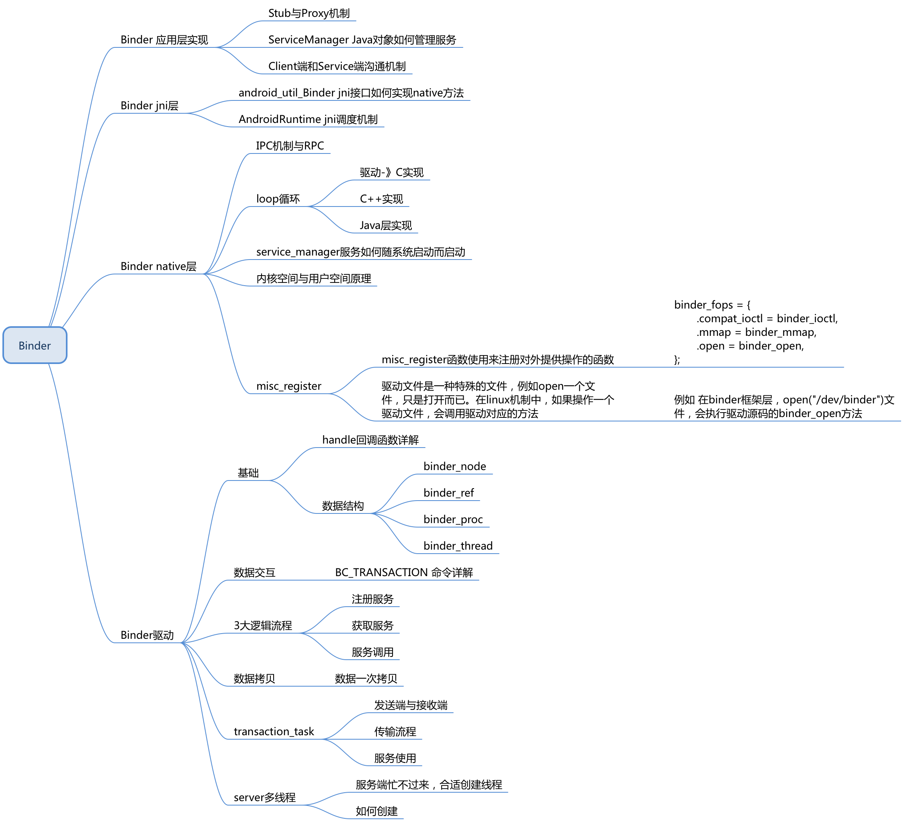
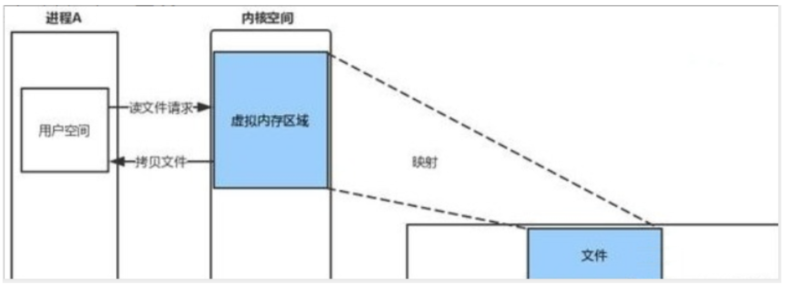
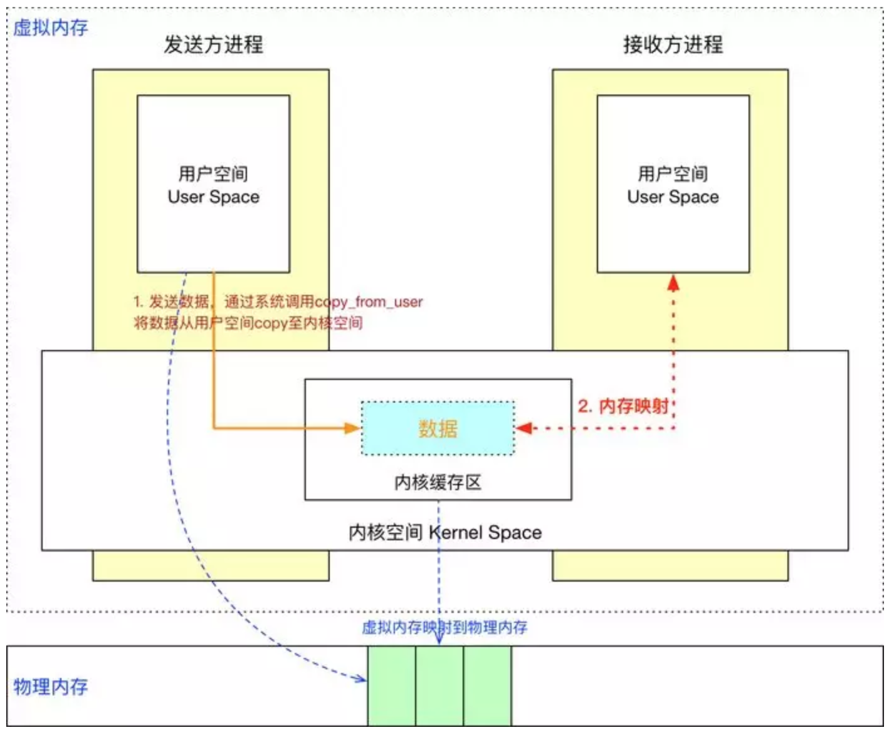
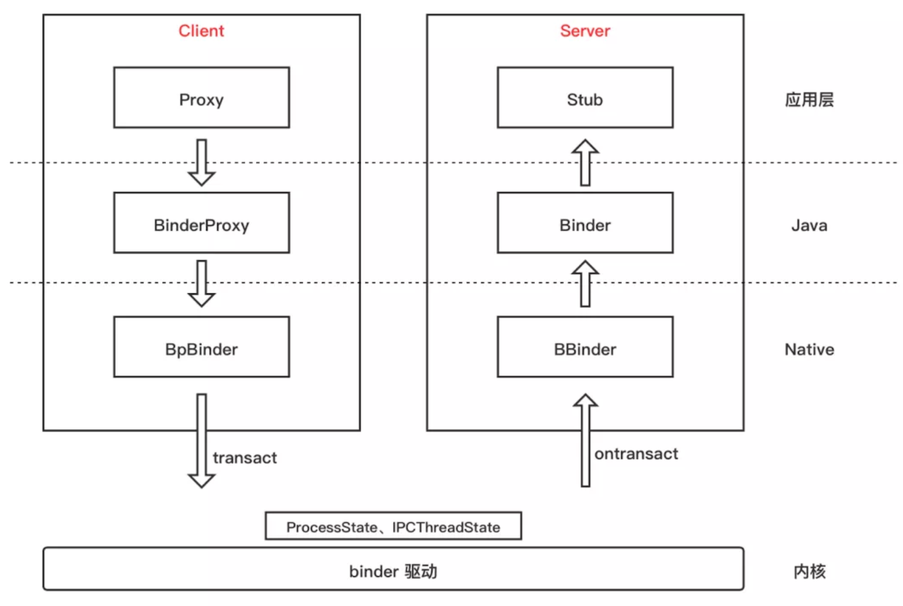

# binder简介

Linux已有进程通信（管道、共享内存、Socket、File）都不能满足安卓系统，所以才要会有Binder机制。

## Binder四层源码

>  Binder源码有四层：driver、framework、jni、native
>
>  Binder4层源码链接：[Binder4层源码](002_Binder之linux内存基础.assets/Binder4层源码)

## mmap函数和binder驱动

- 所有的应用都与内核空间的内存发生频繁的调用，在Binder中传递数据本质上是通过文件读取来实现的。

- Linux是文件操作系统，都是基于文件展开的，File也能实现进程通信。

- Binder机制中，在内存与文件中设计了一层映射关系。映射指的是内存与文件的映射，映射是通过mmap函数，而mmap函数需要依赖一个文件，这个文件叫做 “binder”。该文件没有后缀名，他实际上就是一个文件，但是人们习惯性的把它称为**binder驱动**。
- 服务端Service 也通过mmap函数监听文件的变化

## mmap是如何实现一次拷贝的

- 基于 mmap 又是如何实现一次拷贝的？

  - Client 与 Server 处于不同进程有着不同的虚拟地址规则，所以无法直接通信。而一个页框可以映射给多个页，那么就可以将一块物理内存分别与 Client 和 Server 的虚拟内存块进行映射。

  - 如图， Client 就只需 copy_from_user 进行一次数据拷贝，Server 进程就能读取到数据了。另外映射的虚拟内存块大小将近 1M (1M-8K)，所以 IPC 通信传输的数据量也被限制为此值。

- 怎么理解页框和页？
  - 页框是指一块实际的物理内存，页是指程序的一块内存数据单元。内存数据一定是存储在实际的物理内存上，即页必然对应于一个页框，页数据实际是存储在页框上的。
  - 页框和页一样大，都是内核对内存的分块单位。一个页框可以映射给多个页，也就是说一块实际的物理存储空间可以映射给多个进程的多个虚拟内存空间，这也是 mmap 机制依赖的基础规则。

## Binder的整体架构

- Client 通过 ServiceManager 或 AMS 获取到的远程 binder 实体，一般会用 **Proxy** 做一层封装，比如 ServiceManagerProxy、 AIDL 生成的 Proxy 类。而被封装的远程 binder 实体是一个 **BinderProxy**。
- **BpBinder** 和 BinderProxy 其实是一个东西，都是远程 binder 实体。只不过BpBinder在 Native 层、BinderProxy在 Java 层。BpBinder 内部持有了一个 binder 句柄值 handle。
- **ProcessState** 是进程单例，负责打开 Binder 驱动设备及 mmap；**IPCThreadState** 为线程单例，负责与 binder 驱动进行具体的命令通信。
- 由 Proxy 发起 transact() 调用，会将数据打包到 Parcel 中，层层向下调用到 BpBinder ，在 BpBinder 中调用 IPCThreadState 的 transact() 方法并传入 handle 句柄值，IPCThreadState 再去执行具体的 binder 命令。
- 由 binder 驱动到 Server 的大概流程就是：Server 通过 IPCThreadState 接收到 Client 的请求后，层层向上，最后回调到 **Stub** 的 onTransact() 方法。
- 当然这不代表所有的 IPC 流程，比如 Service Manager 作为一个 Server 时，便没有上层的封装，也没有借助 IPCThreadState，而是初始化后通过 binder_loop() 方法直接与 binder 驱动通信的。

## Binder面试题

### 为什么Android需要采用Binder

- Linux已有进程通信（管道、共享内存、Socket、File）。从效率、安全、模型三个维度进行对比。
- 安卓中需要的是 c/s 模型，管道是 1v1 模型，所以不适用
- 共享内存安全不满足要求，但效率最高
- Socket 效率太低
- File 磁盘读写也不安全
- Binder为每个App分配UID，同时支持实名和匿名，所以安全性最高。

### Binder传输数据的大小限制是多少

- 1M-8K

### 谈谈你对binder的理解

binder 是 Android 中主要的跨进程通信方式，binder 驱动和 service manager 分别相当于网络协议中的路由器和 DNS，并基于 mmap 实现了 IPC 传输数据时只需一次拷贝。

binder 包括 BinderProxy、BpBinder 等各种 Binder 实体，以及对 binder 驱动操作的 ProcessState、IPCThreadState 封装，再加上 binder 驱动内部的结构体、命令处理，整体贯穿 Java、Native 层，涉及用户态、内核态，往上可以说到 Service、AIDL 等，往下可以说到 mmap、binder 驱动设备，是相当庞大、繁琐的一个机制。

