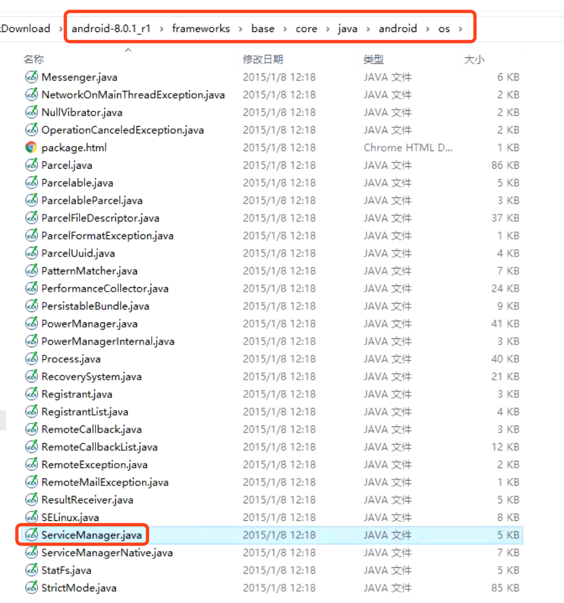

# servicemanager源码分析

## [Binder4层源码链接](002_Binder之linux内存基础.assets/Binder4层源码)

## Binder IPC 架构图

## ServiceManager源码

## servicemanager源码分析

> ServiceManager 用于管理 Binder IPC（服务注册、服务发现、服务调用）

- 只要搞清楚 Stub的内部类Proxy的mRemote 是什么，就能了解Binder内部调用过程。
- BpBinder负责发送消息
- BBinder负责接收消息

如下是binder源码分析的时序图：

