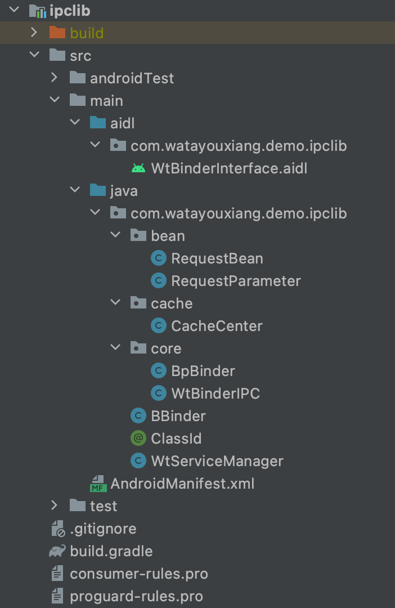
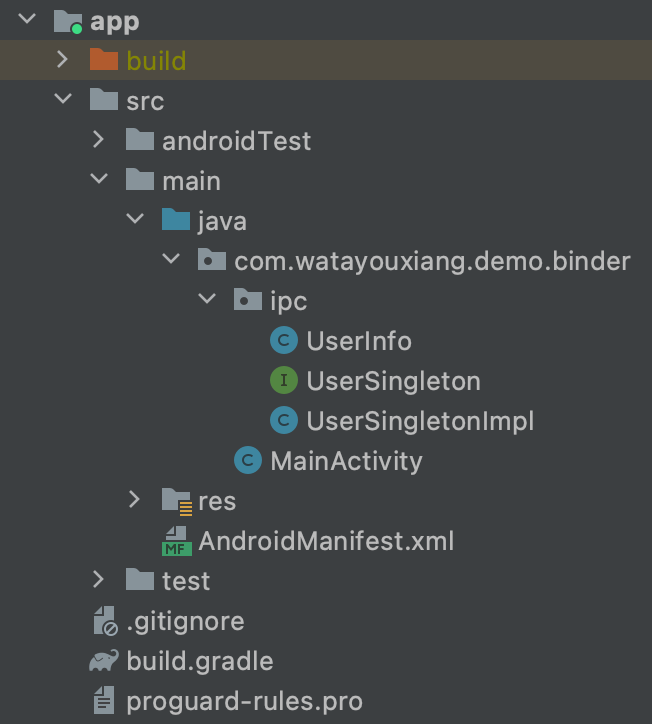
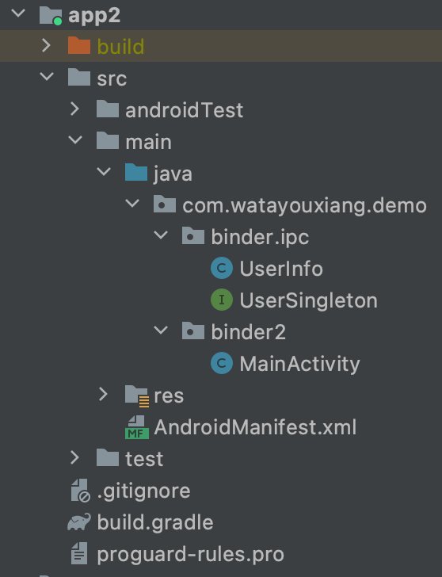

# 手写IPC进程通信

> 在Binder源码中，实现跨进程通信（也就是实现IPC通信）不是难点。
>
> 真正的难点是Binder的架构，也就是ServiceManager的实现。
>
> ServiceManager主要功能有三个：
>
> - 服务注册
> - 服务发现
> - 服务调用

## Binder IPC 架构图


- 发消息：BpBinder / Proxy
- 收消息：BBinder / Stub

## 仿写Binder IPC进程通信

> 仿Binder IPC，实现三个内容：服务注册、服务发现、服务调用

### 使用方式演示

- 现有两个进程：`com.watayouxiang.demo.binder` 和 `com.watayouxiang.demo.binder2`
- 此时进程 `com.watayouxiang.demo.binder2`  要调用进程  `com.watayouxiang.demo.binder` 的服务
- 调用方式如下：

```java
// 进程：com.watayouxiang.demo.binder
public class MainActivity extends AppCompatActivity {
    @Override
    protected void onCreate(Bundle savedInstanceState) {
        super.onCreate(savedInstanceState);
        setContentView(R.layout.activity_main);
        // 开启服务
        WtBinderIPC.getDefault().open(this);
    }

    public void registerService(View view) {
        // 注册服务
        WtBinderIPC.getDefault().register(UserSingletonImpl.class);
        UserSingletonImpl.getInstance().setUserInfo(new UserInfo("123", "watayouxiang"));
    }
}

// 进程：com.watayouxiang.demo.binder2
public class MainActivity extends AppCompatActivity {
    private UserSingleton userSingleton;

    @Override
    protected void onCreate(Bundle savedInstanceState) {
        super.onCreate(savedInstanceState);
        setContentView(R.layout.activity_main);
        // 开启服务
        WtBinderIPC.getDefault().open(this, "com.watayouxiang.demo.binder");
    }

    public void findService(View view) {
        // 发现服务
        userSingleton = WtBinderIPC.getDefault().getInstance(UserSingleton.class);
    }

    public void callService(View view) {
        // 调用服务
        UserInfo userInfo = userSingleton.getUserInfo();
        Toast.makeText(this, userInfo.toString(), Toast.LENGTH_SHORT).show();
    }
}
```

### 编写ipclib库



```
targetSdkVersion 28

implementation 'com.google.code.gson:gson:2.5'
```

```xml
<?xml version="1.0" encoding="utf-8"?>
<manifest xmlns:android="http://schemas.android.com/apk/res/android"
    package="com.watayouxiang.demo.ipclib">

    <application>
        <service
            android:name="com.watayouxiang.demo.ipclib.WtServiceManager"
            android:exported="true" >
            <intent-filter>
                <action android:name="com.watayouxiang.demo.ipclib.WtServiceManager"/>
            </intent-filter>
        </service>
    </application>
</manifest>
```

#### RequestBean

```java
package com.watayouxiang.demo.ipclib.bean;

/**
 * <pre>
 *     author : TaoWang
 *     e-mail : watayouxiang@qq.com
 *     time   : 2021/12/3
 *     desc   : 请求模型
 * </pre>
 */
public class RequestBean {
    // 类名
    private String className;
    // 方法名
    private String methodName;
    // 参数集合
    private RequestParameter[] requestParameters;
    // 1服务获取；2服务调用
    private int type;

    public RequestBean() {
    }

    public RequestBean(int type, String className, String methodName, RequestParameter[] requestParameters) {
        this.type = type;
        this.className = className;
        this.methodName = methodName;
        this.requestParameters = requestParameters;
    }

    public int getType() {
        return type;
    }

    public void setType(int type) {
        this.type = type;
    }

    public String getClassName() {
        return className;
    }

    public void setClassName(String className) {
        this.className = className;
    }

    public String getMethodName() {
        return methodName;
    }

    public void setMethodName(String methodName) {
        this.methodName = methodName;
    }

    public RequestParameter[] getRequestParameters() {
        return requestParameters;
    }

    public void setRequestParameters(RequestParameter[] requestParameters) {
        this.requestParameters = requestParameters;
    }
}
```

#### RequestParameter

```java
package com.watayouxiang.demo.ipclib.bean;

/**
 * <pre>
 *     author : TaoWang
 *     e-mail : watayouxiang@qq.com
 *     time   : 2021/12/3
 *     desc   : 请求参数模型
 * </pre>
 */
public class RequestParameter {
    // 参数类名
    private String parameterClassName;
    // 参数的值
    private String parameterValue;

    public RequestParameter() {
    }

    public RequestParameter(String parameterClassName, String parameterValue) {
        this.parameterClassName = parameterClassName;
        this.parameterValue = parameterValue;
    }

    public String getParameterClassName() {
        return parameterClassName;
    }

    public void setParameterClassName(String parameterClassName) {
        this.parameterClassName = parameterClassName;
    }

    public String getParameterValue() {
        return parameterValue;
    }

    public void setParameterValue(String parameterValue) {
        this.parameterValue = parameterValue;
    }

}
```

#### CacheCenter

```java
package com.watayouxiang.demo.ipclib.cache;

import com.watayouxiang.demo.ipclib.bean.RequestBean;
import com.watayouxiang.demo.ipclib.bean.RequestParameter;

import java.lang.reflect.Method;
import java.util.concurrent.ConcurrentHashMap;

/**
 * <pre>
 *     author : TaoWang
 *     e-mail : watayouxiang@qq.com
 *     time   : 2021/12/03
 *     desc   :
 * </pre>
 */
public class CacheCenter {
    // key = className; value = class
    private final ConcurrentHashMap<String, Class<?>> mClassMap;
    // key = className; value = [方法签名 : method]
    private final ConcurrentHashMap<String, ConcurrentHashMap<String, Method>> mAllMethodMap;
    // key = 类名; value = 实例化对象
    private final ConcurrentHashMap<String, Object> mInstanceObjectMap;

    // ====================================================================================
    // 单例
    // ====================================================================================

    private static final CacheCenter ourInstance = new CacheCenter();

    public static CacheCenter getInstance() {
        return ourInstance;
    }

    private CacheCenter() {
        mClassMap = new ConcurrentHashMap<>();
        mAllMethodMap = new ConcurrentHashMap<>();
        mInstanceObjectMap = new ConcurrentHashMap<>();
    }

    // ====================================================================================
    // 实例化对象的存取
    // ====================================================================================

    public void putObject(String className, Object instance) {
        mInstanceObjectMap.put(className, instance);
    }

    public Object getObject(String className) {
        return mInstanceObjectMap.get(className);
    }

    // ====================================================================================
    // 注册
    // ====================================================================================

    public void register(Class<?> clazz) {
        registerClass(clazz);
        registerMethod(clazz);
    }

    private void registerClass(Class<?> clazz) {
        String className = clazz.getName();
        mClassMap.put(className, clazz);
    }

    private void registerMethod(Class<?> clazz) {
        Method[] methods = clazz.getDeclaredMethods();
        for (Method method : methods) {
            ConcurrentHashMap<String, Method> map = mAllMethodMap.get(clazz.getName());
            if (map == null) {
                map = new ConcurrentHashMap<>();
                mAllMethodMap.put(clazz.getName(), map);
            }
            String key = getMethodParameters(method);
            map.put(key, method);
        }
    }

    /**
     * 获取方法签名
     * <p>
     * ex: 方法名-参数1类型-参数2类型
     */
    private String getMethodParameters(Method method) {
        // 方法名-参数1类型-参数2类型
        StringBuilder builder = new StringBuilder();
        builder.append(method.getName());
        Class<?>[] classes = method.getParameterTypes();
        int length = classes.length;
        if (length == 0) {
            return builder.toString();
        }
        for (int i = 0; i < length; ++i) {
            builder.append("-").append(classes[i].getName());
        }
        return builder.toString();
    }

    // ====================================================================================
    // 查找方法
    // ====================================================================================

    public Method getMethod(RequestBean requestBean) {
        ConcurrentHashMap<String, Method> map = mAllMethodMap.get(requestBean.getClassName());
        if (map != null) {
            String key = getMethodParameters(requestBean);
            return map.get(key);
        }
        return null;
    }

    /**
     * 获取方法签名
     * <p>
     * ex: 方法名-参数1类型-参数2类型
     */
    private String getMethodParameters(RequestBean requestBean) {
        StringBuilder result = new StringBuilder();
        result.append(requestBean.getMethodName());
        RequestParameter[] requestParameters = requestBean.getRequestParameters();
        if (requestParameters == null || requestParameters.length == 0) {
            return result.toString();
        }
        for (int i = 0; i < requestParameters.length; ++i) {
            result.append("-").append(requestParameters[i].getParameterClassName());
        }
        return result.toString();
    }

    // ====================================================================================
    // 根据类全名 反射出 类对象
    // ====================================================================================

    public Class<?> getClassType(String parameterClassName) {
        try {
            return Class.forName(parameterClassName);
        } catch (ClassNotFoundException e) {
            e.printStackTrace();
        }
        return null;
    }
}
```

#### BpBinder

```java
package com.watayouxiang.demo.ipclib.core;

import android.text.TextUtils;
import android.util.Log;

import com.google.gson.Gson;
import com.watayouxiang.demo.ipclib.WtServiceManager;

import java.lang.reflect.InvocationHandler;
import java.lang.reflect.Method;

/**
 * <pre>
 *     author : TaoWang
 *     e-mail : watayouxiang@qq.com
 *     time   : 2021/12/03
 *     desc   : 服务代理
 * </pre>
 */
public class BpBinder implements InvocationHandler {
    private static final Gson GSON = new Gson();
    private final Class<?> clazz;

    public BpBinder(Class<?> clazz) {
        this.clazz = clazz;
    }

    @Override
    public Object invoke(Object proxy, Method method, Object[] args) throws Throwable {
        Log.i("wtBinderIPC", "invoke: " + method.getName());
        // 服务调用
        String data = WtBinderIPC.getDefault().sendRequest(clazz, method, args, WtServiceManager.TYPE_INVOKE);
        if (!TextUtils.isEmpty(data)) {
            return GSON.fromJson(data, method.getReturnType());
        }
        return null;
    }
}
```

#### WtBinderIPC

```java
package com.watayouxiang.demo.ipclib.core;

import android.content.ComponentName;
import android.content.Context;
import android.content.Intent;
import android.content.ServiceConnection;
import android.os.IBinder;
import android.os.RemoteException;
import android.text.TextUtils;

import com.google.gson.Gson;
import com.watayouxiang.demo.ipclib.ClassId;
import com.watayouxiang.demo.ipclib.WtBinderInterface;
import com.watayouxiang.demo.ipclib.WtServiceManager;
import com.watayouxiang.demo.ipclib.bean.RequestBean;
import com.watayouxiang.demo.ipclib.bean.RequestParameter;
import com.watayouxiang.demo.ipclib.cache.CacheCenter;

import java.lang.reflect.Method;
import java.lang.reflect.Proxy;

/**
 * <pre>
 *     author : TaoWang
 *     e-mail : watayouxiang@qq.com
 *     time   : 2021/12/03
 *     desc   : 1、服务注册
 *              2、服务发现
 *              3、服务调用
 * </pre>
 */
public class WtBinderIPC {

    private Context sContext;
    private WtBinderInterface wtBinderInterface;
    private CacheCenter cacheCenter = CacheCenter.getInstance();
    private static final Gson GSON = new Gson();

    // ====================================================================================
    // 单例
    // ====================================================================================

    private static final WtBinderIPC ourInstance = new WtBinderIPC();

    public static WtBinderIPC getDefault() {
        return ourInstance;
    }

    // ====================================================================================
    // 开启服务
    // ====================================================================================

    public void open(Context context) {
        open(context, null);
    }

    public void open(Context context, String packageName) {
        init(context);
        bind(context.getApplicationContext(), packageName, WtServiceManager.class);
    }

    private void init(Context context) {
        sContext = context.getApplicationContext();
    }

    private void bind(Context context, String packageName, Class<? extends WtServiceManager> service) {
        Intent intent;
        if (TextUtils.isEmpty(packageName)) {
            intent = new Intent(context, service);
        } else {
            intent = new Intent();
            // 设置component
            String serviceName = service.getName();
            ComponentName component = new ComponentName(packageName, serviceName);
            intent.setComponent(component);
            // 设置action
            intent.setAction(serviceName);
        }
        WtServiceConnection wtServiceConnection = new WtServiceConnection();
        context.bindService(intent, wtServiceConnection, Context.BIND_AUTO_CREATE);
    }

    private class WtServiceConnection implements ServiceConnection {
        @Override
        public void onServiceConnected(ComponentName name, IBinder service) {
            wtBinderInterface = WtBinderInterface.Stub.asInterface(service);
        }

        @Override
        public void onServiceDisconnected(ComponentName name) {

        }
    }

    // ====================================================================================
    // 服务注册
    // ====================================================================================

    public void register(Class<?> clazz) {
        cacheCenter.register(clazz);
    }

    // ====================================================================================
    // 服务发现 / 服务调用
    // ====================================================================================

    public <T> T getInstance(Class<T> clazz, Object... parameters) {
        // 服务获取
        sendRequest(clazz, null, parameters, WtServiceManager.TYPE_GET);
        return getProxy(clazz);
    }

    private <T> T getProxy(Class<T> clazz) {
        ClassLoader classLoader = sContext.getClassLoader();
        return (T) Proxy.newProxyInstance(classLoader, new Class[]{clazz}, new BpBinder(clazz));
    }

    /**
     * 服务获取 / 服务调用
     *
     * @param clazz      类名
     * @param method     方法
     * @param parameters 方法参数
     * @param type       类型（1服务获取；2服务调用）
     */
    public <T> String sendRequest(Class<T> clazz, Method method, Object[] parameters, int type) {
        // 类名
        String className = clazz.getAnnotation(ClassId.class).value();
        // 方法名
        String methodName = method == null ? "getInstance" : method.getName();

        // 封装请求参数
        RequestParameter[] requestParameters = null;
        if (parameters != null && parameters.length > 0) {
            requestParameters = new RequestParameter[parameters.length];
            for (int i = 0; i < parameters.length; i++) {
                Object parameter = parameters[i];
                String parameterClassName = parameter.getClass().getName();
                String parameterValue = GSON.toJson(parameter);
                RequestParameter requestParameter = new RequestParameter(parameterClassName, parameterValue);
                requestParameters[i] = requestParameter;
            }
        }

        // 请求模型
        RequestBean requestBean = new RequestBean(type, className, methodName, requestParameters);
        String msg = GSON.toJson(requestBean);

        // 做真正的请求
        String resp = null;
        try {
            resp = wtBinderInterface.request(msg);
        } catch (RemoteException e) {
            e.printStackTrace();
        }
        return resp;
    }

}
```

#### BBinder

```java
package com.watayouxiang.demo.ipclib;

import java.lang.reflect.InvocationTargetException;
import java.lang.reflect.Method;

/**
 * <pre>
 *     author : TaoWang
 *     e-mail : watayouxiang@qq.com
 *     time   : 2021/12/07
 *     desc   :
 * </pre>
 */
public class BBinder {
    public Object onTransact(Object obj, Method method, Object[] parameters) {
        Object object = null;
        try {
            object = method.invoke(obj, parameters);
        } catch (IllegalAccessException e) {
            e.printStackTrace();
        } catch (InvocationTargetException e) {
            e.printStackTrace();
        }
        return object;
    }
}
```

#### ClassId

```java
package com.watayouxiang.demo.ipclib;

import java.lang.annotation.ElementType;
import java.lang.annotation.Retention;
import java.lang.annotation.RetentionPolicy;
import java.lang.annotation.Target;

@Target(ElementType.TYPE)
@Retention(RetentionPolicy.RUNTIME)
public @interface ClassId {
    String value();
}
```

#### WtServiceManager

```java
package com.watayouxiang.demo.ipclib;

import android.app.Service;
import android.content.Intent;
import android.os.IBinder;
import android.os.RemoteException;

import androidx.annotation.Nullable;

import com.google.gson.Gson;
import com.watayouxiang.demo.ipclib.bean.RequestBean;
import com.watayouxiang.demo.ipclib.bean.RequestParameter;
import com.watayouxiang.demo.ipclib.cache.CacheCenter;

import java.lang.reflect.Method;

/**
 * <pre>
 *     author : TaoWang
 *     e-mail : watayouxiang@qq.com
 *     time   : 2021/12/03
 *     desc   :
 * </pre>
 */
public class WtServiceManager extends Service {
    // 服务获取（实例化对象）
    public static final int TYPE_GET = 1;
    // 服务调用
    public static final int TYPE_INVOKE = 2;

    private static final Gson gson = new Gson();
    private static final CacheCenter cacheCenter = CacheCenter.getInstance();
    private static final BBinder bBinder = new BBinder();

    @Nullable
    @Override
    public IBinder onBind(Intent intent) {
        return new WtBinderInterface.Stub() {
            @Override
            public String request(String request) throws RemoteException {
                RequestBean requestBean = gson.fromJson(request, RequestBean.class);
                int type = requestBean.getType();
                switch (type) {
                    case TYPE_GET:
                        Method method = cacheCenter.getMethod(requestBean);
                        if (method != null) {
                            Object[] parameters = makeParameterObject(requestBean);
                            Object object = bBinder.onTransact(null, method, parameters);
                            if (object != null) {
                                cacheCenter.putObject(requestBean.getClassName(), object);
                            }
                        }
                        break;
                    case TYPE_INVOKE:
                        Method method1 = cacheCenter.getMethod(requestBean);
                        if (method1 != null) {
                            Object instance = cacheCenter.getObject(requestBean.getClassName());
                            Object[] parameters1 = makeParameterObject(requestBean);
                            Object result = bBinder.onTransact(instance, method1, parameters1);
                            return gson.toJson(result);
                        }
                        break;
                }
                return null;
            }
        };
    }

    // 构造方法参数数组
    private Object[] makeParameterObject(RequestBean requestBean) {
        Object[] parameters;
        RequestParameter[] requestParameters = requestBean.getRequestParameters();
        if (requestParameters != null && requestParameters.length > 0) {
            parameters = new Object[requestParameters.length];
            for (int i = 0; i < requestParameters.length; i++) {
                RequestParameter requestParameter = requestParameters[i];
                Class<?> clazz = cacheCenter.getClassType(requestParameter.getParameterClassName());
                parameters[i] = gson.fromJson(requestParameter.getParameterValue(), clazz);
            }
        } else {
            parameters = new Object[0];
        }
        return parameters;
    }

}
```

#### WtBinderInterface

```java
// WtBinderInterface.aidl
package com.watayouxiang.demo.ipclib;

// Declare any non-default types here with import statements

interface WtBinderInterface {
    String request(String msg);
}
```

### 编写app



```
targetSdkVersion 28

implementation project(path: ':ipclib')
```

```xml
<?xml version="1.0" encoding="utf-8"?>
<manifest xmlns:android="http://schemas.android.com/apk/res/android"
    package="com.watayouxiang.demo.binder">

    <application
        android:allowBackup="true"
        android:icon="@mipmap/ic_launcher"
        android:label="@string/app_name"
        android:roundIcon="@mipmap/ic_launcher_round"
        android:testOnly="false"
        android:supportsRtl="true"
        android:theme="@style/Theme.BinderDemoAndroid">
        <activity
            android:name=".MainActivity"
            android:exported="true">
            <intent-filter>
                <action android:name="android.intent.action.MAIN" />

                <category android:name="android.intent.category.LAUNCHER" />
            </intent-filter>
        </activity>
    </application>

</manifest>
```

#### UserInfo

```java
package com.watayouxiang.demo.binder.ipc;

public class UserInfo {
    private String password;
    private String name;
    public UserInfo( ) {
    }

    public UserInfo(String password, String name) {
        this.password = password;
        this.name = name;
    }

    public String getPassword() {
        return password;
    }

    public void setPassword(String password) {
        this.password = password;
    }

    public String getName() {
        return name;
    }

    public void setName(String name) {
        this.name = name;
    }

    @Override
    public String toString() {
        return "UserInfo{" +
                "password='" + password + '\'' +
                ", name='" + name + '\'' +
                '}';
    }
}
```

#### UserSingleton

```java
package com.watayouxiang.demo.binder.ipc;

import com.watayouxiang.demo.ipclib.ClassId;

// 实现类
@ClassId("com.watayouxiang.demo.binder.ipc.UserSingletonImpl")
public interface UserSingleton {
    UserInfo getUserInfo();
}
```

#### UserSingletonImpl

```java
package com.watayouxiang.demo.binder.ipc;

/**
 * <pre>
 *     author : TaoWang
 *     e-mail : watayouxiang@qq.com
 *     time   : 2021/12/06
 *     desc   :
 * </pre>
 */
public class UserSingletonImpl implements UserSingleton {
    private static UserSingletonImpl sInstance = null;
    private UserSingletonImpl() {
    }
    public static synchronized UserSingletonImpl getInstance() {
        if (sInstance == null) {
            sInstance = new UserSingletonImpl();
        }
        return sInstance;
    }

    UserInfo userInfo;

    @Override
    public UserInfo getUserInfo() {
        return userInfo;
    }

    public void setUserInfo(UserInfo userInfo) {
        this.userInfo = userInfo;
    }
}
```

#### MainActivity

```java
package com.watayouxiang.demo.binder;

import android.os.Bundle;
import android.view.View;

import androidx.appcompat.app.AppCompatActivity;

import com.watayouxiang.demo.binder.ipc.UserInfo;
import com.watayouxiang.demo.binder.ipc.UserSingletonImpl;
import com.watayouxiang.demo.ipclib.core.WtBinderIPC;

public class MainActivity extends AppCompatActivity {

    @Override
    protected void onCreate(Bundle savedInstanceState) {
        super.onCreate(savedInstanceState);
        setContentView(R.layout.activity_main);
        // 开启服务
        WtBinderIPC.getDefault().open(this);
    }

    public void registerService(View view) {
        // 注册服务
        WtBinderIPC.getDefault().register(UserSingletonImpl.class);
        UserSingletonImpl.getInstance().setUserInfo(new UserInfo("123", "watayouxiang"));
    }
}
```

### 编写app2



```
targetSdkVersion 28

implementation project(path: ':ipclib')
```

```xml
<?xml version="1.0" encoding="utf-8"?>
<manifest xmlns:android="http://schemas.android.com/apk/res/android"
    package="com.watayouxiang.demo.binder2">

    <application
        android:allowBackup="true"
        android:icon="@mipmap/ic_launcher"
        android:label="@string/app_name"
        android:roundIcon="@mipmap/ic_launcher_round"
        android:supportsRtl="true"
        android:testOnly="false"
        android:theme="@style/Theme.BinderDemoAndroid">
        <activity
            android:name=".MainActivity"
            android:exported="true">
            <intent-filter>
                <action android:name="android.intent.action.MAIN" />

                <category android:name="android.intent.category.LAUNCHER" />
            </intent-filter>
        </activity>
    </application>

</manifest>
```

#### UserInfo

```java
package com.watayouxiang.demo.binder.ipc;

public class UserInfo {
    private String password;
    private String name;
    public UserInfo( ) {
    }

    public UserInfo(String password, String name) {
        this.password = password;
        this.name = name;
    }

    public String getPassword() {
        return password;
    }

    public void setPassword(String password) {
        this.password = password;
    }

    public String getName() {
        return name;
    }

    public void setName(String name) {
        this.name = name;
    }

    @Override
    public String toString() {
        return "UserInfo{" +
                "password='" + password + '\'' +
                ", name='" + name + '\'' +
                '}';
    }
}
```

#### UserSingleton

```java
package com.watayouxiang.demo.binder.ipc;

import com.watayouxiang.demo.ipclib.ClassId;

// 实现类
@ClassId("com.watayouxiang.demo.binder.ipc.UserSingletonImpl")
public interface UserSingleton {
    UserInfo getUserInfo();
}
```

#### MainActivity

```java
package com.watayouxiang.demo.binder2;

import androidx.appcompat.app.AppCompatActivity;

import android.os.Bundle;
import android.view.View;
import android.widget.Toast;

import com.watayouxiang.demo.binder.ipc.UserInfo;
import com.watayouxiang.demo.binder.ipc.UserSingleton;
import com.watayouxiang.demo.ipclib.core.WtBinderIPC;

public class MainActivity extends AppCompatActivity {

    private UserSingleton userSingleton;

    @Override
    protected void onCreate(Bundle savedInstanceState) {
        super.onCreate(savedInstanceState);
        setContentView(R.layout.activity_main);
        // 开启服务
        WtBinderIPC.getDefault().open(this, "com.watayouxiang.demo.binder");
    }

    public void findService(View view) {
        // 发现服务
        userSingleton = WtBinderIPC.getDefault().getInstance(UserSingleton.class);
    }

    public void callService(View view) {
        // 调用服务
        UserInfo userInfo = userSingleton.getUserInfo();
        Toast.makeText(this, userInfo.toString(), Toast.LENGTH_SHORT).show();
    }
}
```

## --- 读后笔记 ---

- ServiceManager

  - CacheCenter 缓存 “对象、类、类名、方法、方法参数” 信息

  - BBinder 服务端对象，接收来自客户端的消息，并缓存到 CacheCenter

- BinderIPC

  - 注册服务
    - 将 App1 接口的实现类（类、类名、方法、方法参数）缓存进 CacheCenter

  - 发现服务
    - 先构造出 App1 的接口实现类，存入 CacheCenter
  - 调用服务
    - BpBinder 从 CacheCenter 中取 App1 的接口实现类，并调用
      - 通过动态代理方式返回 BpBinder 的动态代理 BinderProxy 给 App2
      - App2 调用 BinderProxy，相当于调用 BpBinder
      - BpBinder 内部持有 App1 的接口实现类，从而 App2 实现对 App1 的调用
