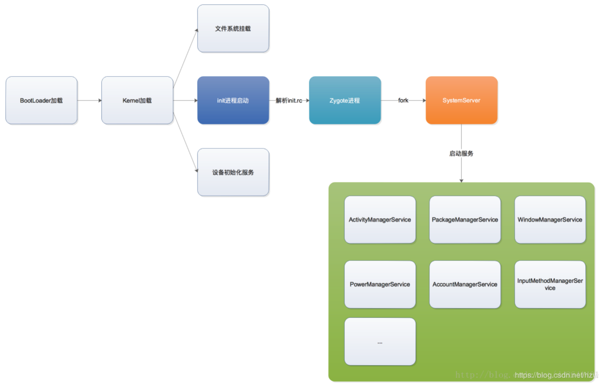
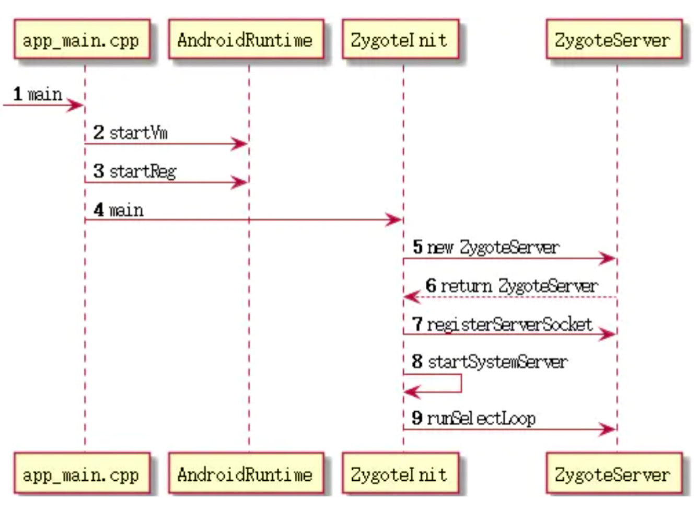

## 安卓进程介绍

- 系统进程

  - “init进程“ 创建了 “service_manager进程” 和 ”zygote进程“

  - ”zygote进程“ fork出 “system_server进程”

  - system_server进程是系统进程：它启动了很多系统服务，例如ActivityManagerService、PackageManagerService、WindowManagerService等。但是这些系统服务的管理，实际上是由service_manager进程负责的，因此system_server进程与service_manager进程之间就需要用到Binder进行进程间通信。
    - ActivityManagerServices（AMS）：是一个服务端对象，负责所有的Activity的生命周期，AMS通过Binder与Activity通信，而AMS与Zygote之间是通过Socket通信
- app进程：app进程的由zygote进程fork创建，但是并不是通过Binder方式，而是Socket方式，因为Binder方式效率太高，会影响系统稳定。

  - ActivityThread：UI线程/主线程，它的main()方法是APP的真正入口
  - ApplicationThread：一个实现了IBinder接口的ActivityThread内部类，用于ActivityThread和AMS的所在进程间通信
  - Instrumentation：可以理解为ActivityThread的一个工具类，在ActivityThread中初始化，一个进程只存在一个Instrumentation对象，在每个Activity初始化时，会通过Activity的Attach方法，将该引用传递给Activity。Activity所有生命周期的方法都由该类来执行。

## init进程内部流程

- 由init进程启动的进程都属于关键进程，关键进程不能被杀死
- init进程会解析 “init.rc” 清单文件，逐个加载清单文件中的进程
  - 小米、华为的厂商进程就是写在这个 init.rc 文件中
  - init.rc 文件被删除了会重新创建，由此可见 init.rc 是由其他服务创建的
- Zygote 孵化进程是由 init 进程启动的关键进程
  - Zygote 用于创建用于进程间通信的socket服务
  - Zygote 用于加载app进程公用的资源，如Class和Assert等资源

## Zygote进程内部流程

- Zygote进程与app进程通信属于进程间通信，因为符合C/S架构，所以可以使用Binder机制或者Socket机制。
  - 由于Binder效率太高，如果瞬间创建多个app进程，会造成内存暴涨，所以Socket更适合Zygote。
- Zygote进程除了用于与app进程的通信，还负责初始化公共资源的任务，如加载Class和assert资源等。
  - 因为假如加载Class和assert资源的任务放在app进程中进行，那么每个app进程都需要加载一次，会造成性能和空间上的浪费。

## Zygote面试问题

- init进程作用是什么
  - init进程的PID=1，是最早启动的进程
  - 通过BootLoader加载 -> Kernel加载 -> init进程启动 -> 解析init.rc脚本 -> Zygote进程
  - fastboot 启动 Linux 内核，然后再启动 init 进程
  - init的进程作用是
    - 启动系统关键的服务（父进程是PID=1的进程都是关键服务）
    - 守护关键服务，守护不了时重启手机
- init程序 和 init.rc 是什么关系
  - init程序读取 init.rc 中的脚本内容，并一条条执行
- 小米 华为 这种系统服务怎么做
  - 在init进程中启动（也就是将要启动的服务写进init.rc脚本中）
- Zygote进程最原始的进程是什么进程 (或者Zygote进程由来)
  - zygote进程由init进程创建而来的
- Zygote为什么需要用到Socket通信而不是Binder
  - 因为Binder效率太高，假如突然开辟100个进程，内存突然爆满。其次是因为Socket相较于Binder更安全。
- Zygote进程的作用
  - 1、开启一个ServiceSocket实现和别的进程通讯
  - 2、提前加载 系统类、系统资源（so类库，图片资源等）
    - 需要加载的系统类：清单文件路径 /system/etc/preloaded-classes
    - 需要加在的系统资源：preloadResources(), preloadOpenGL(), preloadSharedLibraries(), preloadTextResources() 等
  - 3、启动 system_server 进程
    - 启动了 ActivityManagerService(AMS)、PackageManagerService(PMS)、WindowManagerService(WMS)、PowerManagerService、AccountManagerService、InputMethodManagerService 等等......
    - system_server是java进程，Zygote进程是native进程
    - AMS、PMS 并不是一个单独的进程，而是在system_server所在的进程
- 每个App都会将系统的资源，系统的类都加载一遍吗
  - java的类加载机制，加载一个类之前，会先加载这个类的父类。(也就是说MainActivity加载前会先加载AppCompatActivity、FragmentActivity等)。所以“系统的资源，系统的类的加载”并不在App进程中进行，而是在App进程的父进程中进行的(也就是Zygote进程中进行)。
- 为什么一个Activity需要声明在AndroidManifest.xml中
  - 假如没有AndroidManifest.xml，那么打开一个App就需要如下操作：
    - 1、遍历 /data/app 文件夹 
    - 2、解压APK文件
    - 3、dom解析Android.xml，找到action.MAIN的入口Activity
    - 4、定位到这个入口activity
    - 5、加载到内存中去
    - 6、实例化对象，并展示
    - AMS主要的作用就是1～3，PMS的作用就是4～6。

- PMS 是干什么的，你是怎么理解PMS
  - 作用是：
    - 1、遍历 /data/app 的文件夹
    - 2、解压APK文件
      - PackageParser.java解析四大组件，解析出组件存放在 ArrayMap<String, PackageParser.Package> mPackage 中
    - 3、dom解析Android.xml
  - scanDirLI 函数是最耗时的。androd7.0 和 android10 的 PMS 代码最大的区别就是，android10 开启线程池来处理 scanDirLI 函数，而 android7.0 是单线程处理。
- 为什么会有AMS，AMS的作用
- AMS如何管理Activity，探探AMS的执行原理