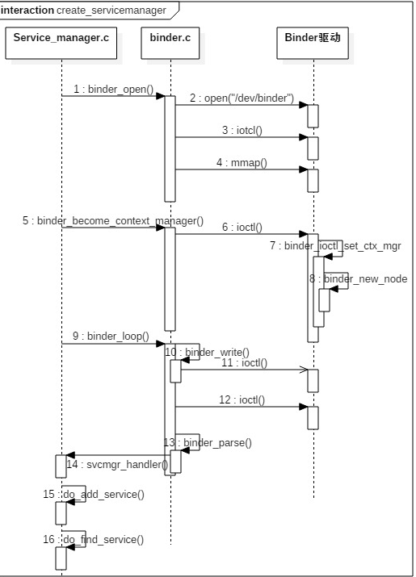
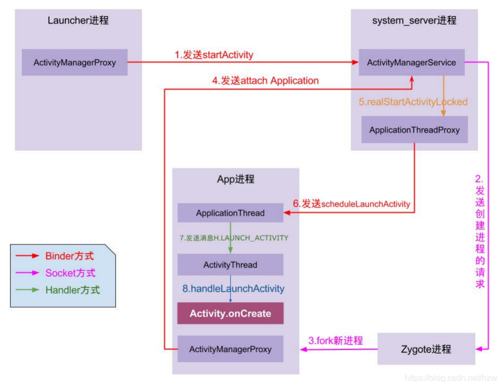
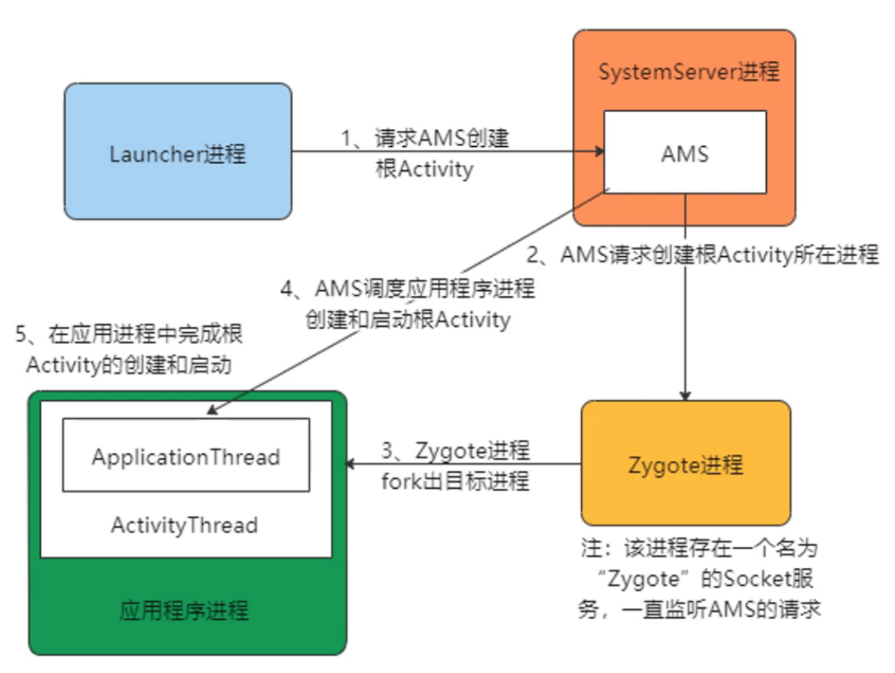

# Android进程简介

## 安卓进程介绍

- 系统进程

  - “init进程“ 创建了 “service_manager进程” 和 ”zygote进程“

  - ”zygote进程“ fork出 “system_server进程”

  - system_server进程是系统进程：它启动了很多系统服务，例如ActivityManagerService、PackageManagerService、WindowManagerService等。但是这些系统服务的管理，实际上是由service_manager进程负责的，因此system_server进程与service_manager进程之间就需要用到Binder进行进程间通信。
    - ActivityManagerServices（AMS）：是一个服务端对象，负责所有的Activity的生命周期，AMS通过Binder与Activity通信，而AMS与Zygote之间是通过Socket通信

- app进程：app进程的由zygote进程fork创建，但是并不是通过Binder方式，而是Socket方式，因为Binder方式效率太高，会影响系统稳定。

  - ActivityThread：UI线程/主线程，它的main()方法是APP的真正入口

  - ApplicationThread：一个实现了IBinder接口的ActivityThread内部类，用于ActivityThread和AMS的所在进程间通信

  - Instrumentation：可以理解为ActivityThread的一个工具类，在ActivityThread中初始化，一个进程只存在一个Instrumentation对象，在每个Activity初始化时，会通过Activity的Attach方法，将该引用传递给Activity。Activity所有生命周期的方法都由该类来执行。

## Binder打开流程

## Activity启动的流程

## App启动过程

## ActivityThread启动Activity(App进程)

## Android启动流程

# --- 读后笔记 ---

## Framework层关键进程和线程

- (init)
  - (service_manager)
  - (zygote)
    - (system_server)
      - AMS
        - (launcher)
      - PMS
      - WMS
    - (app)
      - ActivityThread
      - ApplicationThread
      - Instrumentation

## app启动过程

完整版

1. launcher.ActivityManagerProxy ----> system_server.AMS (binder)
2. system_server.AMS ----> zygote (socket)
3. zygote ----> app (socket)
4. app ----> system_server.AMS (binder)
5. system_server.AMS ----> system_server.ApplicationThreadProxy
6. system_server.ApplicationThreadProxy ----> app.ApplicationThread (binder)
7. app.ApplicationThread ----> app.ActivityThread (handler)
8. app.ActivityThread ----> Activity

精简版

1. launcher ----> system_server (binder)
2. system_server ----> zygote (socket)
3. zygote ----> app (socket)
4. app ----> system_server (binder)
5. system_server ----> app (binder)