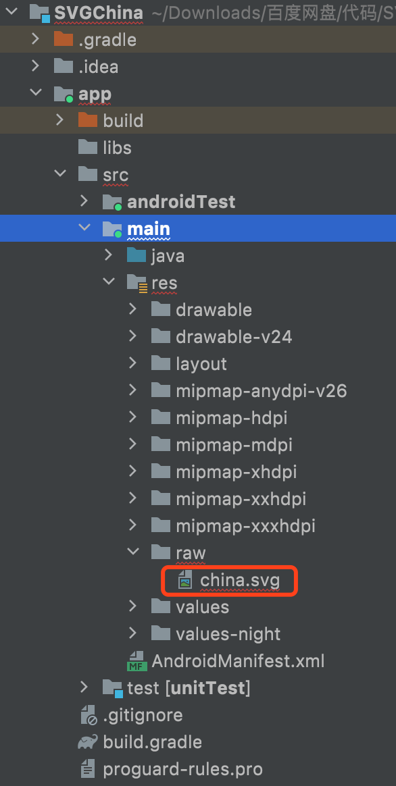

## SVG相关资源

- 在线编辑 SVG
  - http://editor.method.ac/
  - https://www.zhangxinxu.com/sp/svg/
- SVG 语法教程：https://www.w3school.com.cn/svg/index.asp
- 下载 SVG 地图：https://www.amcharts.com/download/
- 工具类PathParese.java：android-6.0.0_r1\frameworks\base\core\java\android\util

## path支持的指令

```
M = moveto(M X,Y) : 将画笔移动到指定的坐标位置
L = lineto(L X,Y) : 画直线到指定的坐标位置
H = horizontal lineto(H X) : 画水平线到指定的X坐标位置
V = vertical lineto(V Y) : 画垂直线到指定的Y坐标位置
C = curveto(C X1,Y1,X2,Y2,ENDX,ENDY) : 三次贝赛曲线
S = smooth curveto(S X2,Y2,ENDX,ENDY)
Q = quadratic Belzier curve(Q X,Y,ENDX,ENDY) : 二次贝赛曲线 
T = smooth quadratic Belzier curveto(T ENDX,ENDY) : 映射
A = elliptical Arc(A RX,RY,XROTATION,FLAG1,FLAG2,X,Y) : 弧线 
Z = closepath() : 关闭路径
```

## 世界地图demo

### 环境配置

```
// proj
classpath "com.android.tools.build:gradle:4.1.3"
distributionUrl=https\://services.gradle.org/distributions/gradle-6.5-all.zip

// app
compileSdkVersion 31
minSdkVersion 21
targetSdkVersion 31
```

### ProvinceItem

```java
package com.maniu.svgchina;

import android.graphics.Canvas;
import android.graphics.Color;
import android.graphics.Paint;
import android.graphics.Path;
import android.graphics.RectF;
import android.graphics.Region;

public class ProvinceItem {
    private Path path;
    private int drawColor;

    public ProvinceItem(Path path) {
        this.path = path;
    }

    void drawItem(Canvas canvas, Paint paint, boolean isSelect) {
        if (isSelect) {
            // 选中时，绘制描边效果
            paint.clearShadowLayer();
            paint.setStrokeWidth(1);
            paint.setStyle(Paint.Style.FILL);
            paint.setColor(drawColor);
            canvas.drawPath(path, paint);
            paint.setStyle(Paint.Style.STROKE);
            int strokeColor = 0xFFD0E8F4;
            paint.setColor(strokeColor);
            canvas.drawPath(path, paint);
        } else {
            // 设置边界
            paint.setStrokeWidth(2);
            paint.setColor(Color.BLACK);
            paint.setStyle(Paint.Style.FILL);
            paint.setShadowLayer(8, 0, 0, 0xffffff);
            canvas.drawPath(path, paint);
            // 后面是填充
            paint.clearShadowLayer();
            paint.setColor(drawColor);
            paint.setStyle(Paint.Style.FILL);
            paint.setStrokeWidth(2);
            canvas.drawPath(path, paint);
        }
    }

    public void setDrawColor(int drawColor) {
        this.drawColor = drawColor;
    }

    // 坐标丢给   true  false
    public boolean isTouch(float x, float y) {
        RectF rectF = new RectF();
        path.computeBounds(rectF, true);
        // 区域 怎么得到
        Region region = new Region();
        region.setPath(path, new Region((int) rectF.left, (int) rectF.top, (int) rectF.right, (int) rectF.bottom));
        return region.contains((int) x, (int) y);
    }
}
```

### MapView

```java
package com.maniu.svgchina;

import android.content.Context;
import android.graphics.Canvas;
import android.graphics.Color;
import android.graphics.Paint;
import android.graphics.Path;
import android.graphics.RectF;
import android.os.Handler;
import android.os.Looper;
import android.os.Message;
import android.util.AttributeSet;
import android.view.MotionEvent;
import android.view.View;

import androidx.annotation.Nullable;
import androidx.core.graphics.PathParser;

import org.w3c.dom.Document;
import org.w3c.dom.Element;
import org.w3c.dom.NodeList;

import java.io.InputStream;
import java.util.ArrayList;
import java.util.List;

import javax.xml.parsers.DocumentBuilder;
import javax.xml.parsers.DocumentBuilderFactory;

public class MapView extends View {
    private Context context;
    private List<ProvinceItem> itemList;
    private Paint paint;
    private RectF totalRect;
    private float scale = 1.0f;
    private ProvinceItem select;
    private int[] colorArray = new int[]{0xFF239BD7, 0xFF30A9E5, 0xFF80CBF1, 0xFFFFFFFF};

    public MapView(Context context) {
        super(context);
    }

    public MapView(Context context, @Nullable AttributeSet attrs) {
        super(context, attrs);
        init(context);
    }

    private void init(Context context) {
        this.context = context;
        paint = new Paint();
        paint.setAntiAlias(true);
        loadThread.start();
    }

    @Override
    protected void onMeasure(int widthMeasureSpec, int heightMeasureSpec) {
        super.onMeasure(widthMeasureSpec, heightMeasureSpec);
        int width = MeasureSpec.getSize(widthMeasureSpec);
        int height = MeasureSpec.getSize(heightMeasureSpec);

        if (totalRect != null) {
            double mapWidth = totalRect.width();
            scale = (float) (width / mapWidth);
        }
        setMeasuredDimension(MeasureSpec.makeMeasureSpec(width, MeasureSpec.EXACTLY),
                MeasureSpec.makeMeasureSpec(height, MeasureSpec.EXACTLY));
    }

    @Override
    public boolean onTouchEvent(MotionEvent event) {
        handleTouch(event.getX(), event.getY());
        return super.onTouchEvent(event);
    }

    private void handleTouch(float x, float y) {
        if (itemList == null) {
            return;
        }
        ProvinceItem selectItem = null;
        for (ProvinceItem proviceItem : itemList) {

            if (proviceItem.isTouch(x / scale, y / scale)) {
                selectItem = proviceItem;
            }
        }
        if (selectItem != null) {
            select = selectItem;
            postInvalidate();
        }
    }

    @Override
    protected void onDraw(Canvas canvas) {
        if (itemList != null) {
            canvas.save();
            canvas.scale(scale, scale);
            for (ProvinceItem proviceItem : itemList) {
                proviceItem.drawItem(canvas, paint, false);
            }
            if (select != null) {
                select.drawItem(canvas, paint, true);
            }
        }
    }

    Handler handler = new Handler(Looper.getMainLooper()) {
        @Override
        public void handleMessage(Message msg) {
            if (itemList == null) {
                return;
            }
            int totalNumber = itemList.size();
            for (int i = 0; i < totalNumber; i++) {
                int color = Color.WHITE;
                int flag = i % 4;
                switch (flag) {
                    case 1:
                        color = colorArray[0];
                        break;
                    case 2:
                        color = colorArray[1];
                        break;
                    case 3:
                        color = colorArray[2];
                        break;
                    default:
                        color = Color.CYAN;
                        break;
                }
                itemList.get(i).setDrawColor(color);
            }
            postInvalidate();
        }
    };

    private Thread loadThread = new Thread() {
        @Override
        public void run() {
            InputStream inputStream = context.getResources().openRawResource(R.raw.china);
            List<ProvinceItem> list = new ArrayList<>();
            try {
                DocumentBuilderFactory factory = DocumentBuilderFactory.newInstance();  //取得DocumentBuilderFactory实例
                DocumentBuilder builder = null; //从factory获取DocumentBuilder实例
                builder = factory.newDocumentBuilder();
                Document doc = builder.parse(inputStream);   //解析输入流 得到Document实例
                Element rootElement = doc.getDocumentElement();
                NodeList items = rootElement.getElementsByTagName("path");
                float left = -1;
                float right = -1;
                float top = -1;
                float bottom = -1;
                for (int i = 0; i < items.getLength(); i++) {
                    Element element = (Element) items.item(i);
                    String pathData = element.getAttribute("android:pathData");
                    Path path = PathParser.createPathFromPathData(pathData);
                    ProvinceItem provinceItem = new ProvinceItem(path);
                    list.add(provinceItem);
                    RectF rect = new RectF();
                    path.computeBounds(rect, true);
                    left = left == -1 ? rect.left : Math.min(left, rect.left);
                    right = right == -1 ? rect.right : Math.max(right, rect.right);
                    top = top == -1 ? rect.top : Math.min(top, rect.top);
                    bottom = bottom == -1 ? rect.bottom : Math.max(bottom, rect.bottom);
                    totalRect = new RectF(left, top, right, bottom);
                }
            } catch (Exception e) {
            }
            itemList = list;
            handler.sendEmptyMessage(1);
        }
    };
}
```

### MainActivity

```java
package com.maniu.svgchina;

import androidx.appcompat.app.AppCompatActivity;

import android.os.Bundle;

public class MainActivity extends AppCompatActivity {
    @Override
    protected void onCreate(Bundle savedInstanceState) {
        super.onCreate(savedInstanceState);
        setContentView(R.layout.activity_main);
    }
}
```

```xml
<?xml version="1.0" encoding="utf-8"?>
<RelativeLayout xmlns:android="http://schemas.android.com/apk/res/android"
    xmlns:app="http://schemas.android.com/apk/res-auto"
    xmlns:tools="http://schemas.android.com/tools"
    android:layout_width="match_parent"
    android:layout_height="match_parent"
    tools:context=".MainActivity">

    <com.maniu.svgchina.MapView
        android:layout_width="550dp"
        android:layout_height="550dp" />

</RelativeLayout>
```

### svg地图资源

[016_SVG自定义控件.assets/china.svg](016_SVG自定义控件.assets/china.svg)

