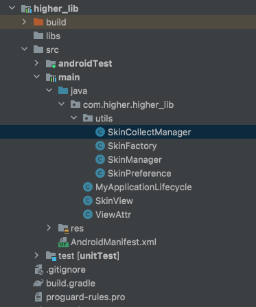
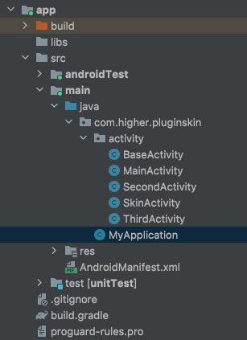

# LayoutInflater源码解析与换肤原理

> 源码在线查阅网站：http://aospxref.com/android-9.0.0_r61/xref/frameworks/

1、Activity解析XML流程及LayoutInfater源码分析

2、AppCompatActivity与Activity区别

3、XML的三种解析方式

4、AssetManager与Resource之间的关系

5、PP实现动态换肤框架的原理

6、如何制作、使用和加载皮肤资源包

7、从零开始打造动态主题换肤框架

## 源码阅读

- AppCompatActivity # setContentView(@LayoutRes int layoutResID)
- LayoutInflater # public View inflate(XmlPullParser parser, @Nullable ViewGroup root, boolean attachToRoot) {
- final View temp = createViewFromTag(root, name, inflaterContext, attrs);
- View createViewFromTag(View parent, String name, Context context, AttributeSet attrs,

## 网易换肤实现

### lib -----------------



### SkinCollectManager

```java
package com.higher.higher_lib.utils;

import android.content.Context;
import android.content.res.TypedArray;
import android.util.AttributeSet;
import android.view.View;

import com.higher.higher_lib.R;
import com.higher.higher_lib.SkinView;
import com.higher.higher_lib.ViewAttr;

import java.util.ArrayList;
import java.util.List;

public class SkinCollectManager {
    private List<SkinView> skinViews = new ArrayList<>();

    public void collectView(Context context, View currentView, AttributeSet attr) {
        List<ViewAttr> viewAttrList = new ArrayList<>();
        TypedArray typedArray = context.obtainStyledAttributes(attr, R.styleable.skin);
        boolean isChange = typedArray.getBoolean(R.styleable.skin_changeSkin, false);
        typedArray.recycle();
        if (!isChange)
            return;
        for (int i = 0; i < attr.getAttributeCount(); i++) {
            String attributeName = attr.getAttributeName(i);
            if (SkinFactory.mAttrName.contains(attributeName)) {
                String attributeValue = attr.getAttributeValue(i);
                if (attributeValue.startsWith("#")) {
                    continue;
                }
                int resId = Integer.parseInt(attributeValue.substring(1));
                //可以获取resourceName，resourceType
                String resourceName = context.getResources().getResourceEntryName(resId);

                ViewAttr viewAttr = new ViewAttr(attributeName, resId);
                viewAttrList.add(viewAttr);
            }
        }
        if (viewAttrList.size() > 0) {
            SkinView skinView = new SkinView(viewAttrList, currentView);
            skinViews.add(skinView);
        }
    }

}
```

### SkinFactory

```java
package com.higher.higher_lib.utils;

import android.content.Context;
import android.content.res.TypedArray;
import android.util.AttributeSet;
import android.view.LayoutInflater;
import android.view.View;

import androidx.annotation.NonNull;
import androidx.annotation.Nullable;

import com.higher.higher_lib.R;
import com.higher.higher_lib.SkinView;
import com.higher.higher_lib.ViewAttr;

import java.lang.reflect.Constructor;
import java.util.ArrayList;
import java.util.HashMap;
import java.util.List;
import java.util.Map;

public class SkinFactory implements LayoutInflater.Factory2 {

    public static final List<String> mAttrName = new ArrayList<>();

    private List<SkinView> skinViews = new ArrayList<>();

    static {
        mAttrName.add("background");
        mAttrName.add("src");
        mAttrName.add("textColor");
        mAttrName.add("drawableLeft");
        mAttrName.add("drawableTop");
        mAttrName.add("drawableRight");
        mAttrName.add("drawableBottom");
    }

    private static final String[] mClassPrefixList = {
            "android.widget.",
            "android.webkit.",
            "android.app.",
            "android.view."
    };

    private static final Map<String, Constructor<? extends View>> mConstructorMap
            = new HashMap<>();

    private static final Class<?>[] mConstructorSignature = new Class[]{
            Context.class, AttributeSet.class};

    @Nullable
    @Override
    public View onCreateView(@Nullable View parent, @NonNull String name, @NonNull Context context, @NonNull AttributeSet attrs) {
        View view;
        if (-1 == name.indexOf('.')) {
            view = createSDKView(name, context, attrs);
        } else {
            view = onCreateView(name, context, attrs);
        }
        collectView(context, view, attrs);
        return view;
    }

    private View createSDKView(String name, Context context, AttributeSet
            attrs) {
        for (String androidName : mClassPrefixList) {
            return onCreateView(androidName +
                    name, context, attrs);
        }
        return null;
    }

    private Constructor<? extends View> findConstructor(Context context, String name) {
        Constructor<? extends View> constructor = mConstructorMap.get(name);
        if (constructor == null) {
            try {
                Class<? extends View> clazz = context.getClassLoader().loadClass
                        (name).asSubclass(View.class);
                constructor = clazz.getConstructor(mConstructorSignature);
                mConstructorMap.put(name, constructor);
            } catch (Exception e) {
            }
        }
        return constructor;
    }


    @Nullable
    @Override
    public View onCreateView(@NonNull String name, @NonNull Context context, @NonNull AttributeSet attrs) {
        Constructor<? extends View> constructor = findConstructor(context, name);
        try {
            return constructor.newInstance(context, attrs);
        } catch (Exception e) {
        }
        return null;
    }

    public void collectView(Context context, View currentView, AttributeSet attr) {
        List<ViewAttr> viewAttrList = new ArrayList<>();
        TypedArray typedArray = context.obtainStyledAttributes(attr, R.styleable.skin);
        boolean isChange = typedArray.getBoolean(R.styleable.skin_changeSkin, false);
        typedArray.recycle();
        if (!isChange)
            return;
        for (int i = 0; i < attr.getAttributeCount(); i++) {
            String attributeName = attr.getAttributeName(i);
            if (mAttrName.contains(attributeName)) {
                String attributeValue = attr.getAttributeValue(i);
                if (attributeValue.startsWith("#")) {
                    continue;
                }

                int resId = Integer.parseInt(attributeValue.substring(1));
                //这里可不可以直接存储BG
                String resourceName = context.getResources().getResourceEntryName(resId);
                String typeName = context.getResources().getResourceTypeName(resId);
                //这一块的母的，
                ViewAttr viewAttr = new ViewAttr(attributeName, resId);
                viewAttrList.add(viewAttr);
            }
        }
        if (viewAttrList.size() > 0) {
            SkinView skinView = new SkinView(viewAttrList, currentView);
            skinViews.add(skinView);
        }
    }

    public void apply() {
        for (int i = 0; i < skinViews.size(); i++) {
            SkinView skinView = skinViews.get(i);
            skinView.apply();
        }
    }
}
```

### SkinManager

```java
package com.higher.higher_lib.utils;

import android.content.Context;
import android.content.pm.PackageInfo;
import android.content.pm.PackageManager;
import android.content.res.AssetManager;
import android.content.res.ColorStateList;
import android.content.res.Resources;
import android.graphics.drawable.Drawable;
import android.text.TextUtils;

import com.higher.higher_lib.SkinView;

import java.lang.reflect.Method;
import java.util.ArrayList;

public class SkinManager {
    private static SkinManager skinManager = new SkinManager();

    public Resources mSkinResources;

    public Resources mAppResources;

    private Context mContext;

    public boolean isDefaultSkin;

    public String mSkinPkgName;

    public static SkinManager getInstance() {
        return skinManager;
    }

    public void init(Context context) {
        mContext = context;
        SkinPreference.init(context);
        String skin = SkinPreference.getInstance().getSkin();
        SkinManager.getInstance().loadSkinApk(skin);
    }

    public void loadSkinApk(String path) {
        try {
            isDefaultSkin = TextUtils.isEmpty(path);
            mAppResources = mContext.getResources();
            AssetManager assetManager = AssetManager.class.newInstance();
            Method addAssetPath = assetManager.getClass().getMethod("addAssetPath",
                    String.class);
            addAssetPath.invoke(assetManager, path);

            //mSkinResources 是我们的插件化目标APKresources
            mSkinResources = new Resources(assetManager, mAppResources.getDisplayMetrics
                    (), mAppResources.getConfiguration());
            PackageManager mPm = mContext.getPackageManager();
            PackageInfo info = mPm.getPackageArchiveInfo(path, PackageManager
                    .GET_ACTIVITIES);
            mSkinPkgName = info.packageName;
            SkinPreference.getInstance().setSkin(path);
        } catch (Exception e) {

        }
    }


    /**
     * @param resId
     * @return
     */
    public int getIdentifier(int resId) {
        if (isDefaultSkin) {
            return resId;
        }
        //bg
        String resName = mAppResources.getResourceEntryName(resId);
        //
        String resType = mAppResources.getResourceTypeName(resId);
        //再通过bg 去找目标apk的bg
        int skinId = mSkinResources.getIdentifier(resName, resType, mSkinPkgName);
        return skinId;
    }

    public int getColor(int resId) {
        if (isDefaultSkin) {
            return mAppResources.getColor(resId);
        }
        int skinId = getIdentifier(resId);
        if (skinId == 0) {
            return mAppResources.getColor(resId);
        }
        return mSkinResources.getColor(skinId);
    }

    public ColorStateList getColorStateList(int resId) {
        if (isDefaultSkin) {
            return mAppResources.getColorStateList(resId);
        }
        int skinId = getIdentifier(resId);
        if (skinId == 0) {
            return mAppResources.getColorStateList(resId);
        }
        return mSkinResources.getColorStateList(skinId);
    }

    public Drawable getDrawable(int resId) {
        if (isDefaultSkin) {
            return mAppResources.getDrawable(resId);
        }
        //通过 app的resource 获取id 对应的 资源名 与 资源类型
        //找到 皮肤包 匹配 的 资源名资源类型 的 皮肤包的 资源 ID
        int skinId = getIdentifier(resId);
        if (skinId == 0) {
            return mAppResources.getDrawable(resId);
        }
        return mSkinResources.getDrawable(skinId);
    }


    /**
     * 可能是Color 也可能是drawable
     *
     * @return
     */
    public Object getBackground(int resId) {
        String resourceTypeName = mAppResources.getResourceTypeName(resId);
        if ("color".equals(resourceTypeName)) {
            return getColor(resId);
        } else {
            // drawable
            return getDrawable(resId);
        }
    }

}
```

### SkinPreference

```java
package com.higher.higher_lib.utils;

import android.content.Context;
import android.content.SharedPreferences;

public class SkinPreference {
    private static final String SKIN_SHARED = "skins";

    private static final String KEY_SKIN_PATH = "skin-path";
    private volatile static SkinPreference instance;
    private final SharedPreferences mPref;

    public static void init(Context context) {
        if (instance == null) {
            synchronized (SkinPreference.class) {
                if (instance == null) {
                    instance = new SkinPreference(context.getApplicationContext());
                }
            }
        }
    }

    public static SkinPreference getInstance() {
        return instance;
    }

    private SkinPreference(Context context) {
        mPref = context.getSharedPreferences(SKIN_SHARED, Context.MODE_PRIVATE);
    }

    public void setSkin(String skinPath) {
        mPref.edit().putString(KEY_SKIN_PATH, skinPath).apply();
    }

    public void reset() {
        mPref.edit().remove(KEY_SKIN_PATH).apply();
    }

    public String getSkin() {
        return mPref.getString(KEY_SKIN_PATH, null);
    }

}
```

### MyApplicationLifecycle

```java
package com.higher.higher_lib;

import android.annotation.SuppressLint;
import android.app.Activity;
import android.app.Application;
import android.os.Bundle;
import android.util.Log;
import android.view.LayoutInflater;
import android.view.View;
import android.view.ViewGroup;

import androidx.annotation.NonNull;
import androidx.annotation.Nullable;

import com.higher.higher_lib.utils.SkinCollectManager;
import com.higher.higher_lib.utils.SkinFactory;

import java.lang.reflect.Field;
import java.util.HashMap;
import java.util.Map;

public class MyApplicationLifecycle implements Application.ActivityLifecycleCallbacks {
    @Override
    public void onActivityCreated(@NonNull Activity activity, @Nullable Bundle savedInstanceState) {
        setFactory(activity);
//        Log.e("Maniu", activity.getClass().getName());
    }

    public static Map<Activity, SkinFactory> activitySkinFactoryMap = new HashMap<>();

    @SuppressLint("SoonBlockedPrivateApi")
    private void setFactory(Activity activity) {
        SkinFactory skinLayoutInflaterFactory = new SkinFactory();
        try {
            Field mFactorySet = LayoutInflater.class.getDeclaredField("mFactorySet");
            mFactorySet.setAccessible(true);
            mFactorySet.setBoolean(activity.getLayoutInflater(), false);
            activity.getLayoutInflater().setFactory2(skinLayoutInflaterFactory);
            activitySkinFactoryMap.put(activity, skinLayoutInflaterFactory);
        } catch (Exception e) {
            e.printStackTrace();
        }
    }

    @Override
    public void onActivityStarted(@NonNull Activity activity) {

    }

    @Override
    public void onActivityResumed(@NonNull Activity activity) {
//        apply();
    }

    @Override
    public void onActivityPaused(@NonNull Activity activity) {

    }

    @Override
    public void onActivityStopped(@NonNull Activity activity) {

    }

    @Override
    public void onActivitySaveInstanceState(@NonNull Activity activity, @NonNull Bundle outState) {

    }

    public void apply() {
        for (Map.Entry<Activity, SkinFactory> entry : activitySkinFactoryMap.entrySet()) {
            entry.getValue().apply();
        }
    }

    @Override
    public void onActivityDestroyed(@NonNull Activity activity) {
        activitySkinFactoryMap.remove(activity);
    }
}
```

### SkinView

```java
package com.higher.higher_lib;

import android.graphics.drawable.ColorDrawable;
import android.graphics.drawable.Drawable;
import android.view.View;
import android.widget.ImageView;
import android.widget.TextView;

import androidx.core.view.ViewCompat;

import com.higher.higher_lib.utils.SkinManager;

import java.util.List;

public class SkinView {

    //多组属性
    private List<ViewAttr> viewAttrs;

    private View view;

    public SkinView(List<ViewAttr> viewAttrs, View view) {
        this.viewAttrs = viewAttrs;
        this.view = view;
    }

    public List<ViewAttr> getSkinItems() {
        return viewAttrs;
    }

    public void setSkinItems(List<ViewAttr> viewAttrs) {
        this.viewAttrs = viewAttrs;
    }

    public View getView() {
        return view;
    }

    public void setView(View view) {
        this.view = view;
    }

    public void apply() {
        for (ViewAttr viewAttr : viewAttrs) {
            Drawable left = null, top = null, right = null, bottom = null;
            switch (viewAttr.attributeName) {
                case "background":
                    Object background = SkinManager.getInstance().getBackground(viewAttr
                            .resId);
                    //背景可能是 @color 也可能是 @drawable
                    if (background instanceof Integer) {
                        view.setBackgroundColor((int) background);
                    } else {
                        ViewCompat.setBackground(view, (Drawable) background);
                    }
                    break;
                case "src":
                    background = SkinManager.getInstance().getBackground(viewAttr
                            .resId);
                    if (background instanceof Integer) {
                        ((ImageView) view).setImageDrawable(new ColorDrawable((Integer)
                                background));
                    } else {
                        ((ImageView) view).setImageDrawable((Drawable) background);
                    }
                    break;
                case "textColor":
                    ((TextView) view).setTextColor(SkinManager.getInstance().getColorStateList
                            (viewAttr.resId));
                    break;
                case "drawableLeft":
                    left = SkinManager.getInstance().getDrawable(viewAttr.resId);
                    break;
                case "drawableTop":
                    top = SkinManager.getInstance().getDrawable(viewAttr.resId);
                    break;
                case "drawableRight":
                    right = SkinManager.getInstance().getDrawable(viewAttr.resId);
                    break;
                case "drawableBottom":
                    bottom = SkinManager.getInstance().getDrawable(viewAttr.resId);
                    break;
                default:
                    break;
            }
            if (null != left || null != right || null != top || null != bottom) {
                ((TextView) view).setCompoundDrawablesWithIntrinsicBounds(left, top, right,
                        bottom);
            }
        }
    }
}
```

### ViewAttr

```java
package com.higher.higher_lib;

public class ViewAttr {
    //属性名
    String attributeName;
    //对应的资源id
    int resId;

    public ViewAttr(String attributeName, int resId) {
        this.attributeName = attributeName;
        this.resId = resId;
    }
}
```

### app -----------------



### BaseActivity

```java
package com.higher.pluginskin.activity;

import android.annotation.SuppressLint;
import android.os.Bundle;
import android.view.LayoutInflater;

import androidx.annotation.Nullable;
import androidx.appcompat.app.AppCompatActivity;

import com.higher.higher_lib.utils.SkinFactory;

import java.lang.reflect.Field;

public class BaseActivity extends AppCompatActivity {
    protected SkinFactory skinLayoutInflaterFactory;

    @Override
    protected void onCreate(@Nullable Bundle savedInstanceState) {
        super.onCreate(savedInstanceState);
        setFactory();
    }

    @Override
    protected void onResume() {
        super.onResume();
        skinLayoutInflaterFactory.apply();
    }

    @SuppressLint("SoonBlockedPrivateApi")
    private void setFactory() {
        skinLayoutInflaterFactory = new SkinFactory();
        LayoutInflater layoutInflater = getLayoutInflater();
        try {
            Field mFactorySet = LayoutInflater.class.getDeclaredField("mFactorySet");
            mFactorySet.setAccessible(true);
            mFactorySet.setBoolean(layoutInflater, false);
            layoutInflater.setFactory2(skinLayoutInflaterFactory);
        } catch (Exception e) {
            e.printStackTrace();
        }
    }
}
```

### MyApplication

```java
package com.higher.pluginskin;

import android.app.Application;

import com.higher.higher_lib.MyApplicationLifecycle;
import com.higher.higher_lib.utils.SkinManager;

public class MyApplication extends Application {

    private MyApplicationLifecycle myApplicationLifecycle;

    private static MyApplication myApplication = null;

    public static MyApplication getApplication() {
        return myApplication;
    }

    @Override
    public void onCreate() {
        super.onCreate();
        myApplication = this;
        SkinManager.getInstance().init(this);
        myApplicationLifecycle = new MyApplicationLifecycle();
//        registerActivityLifecycleCallbacks(myApplicationLifecycle);
    }

    public MyApplicationLifecycle getMyApplicationLifecycle() {
        return myApplicationLifecycle;
    }
}
```

### MainActivity

```java
package com.higher.pluginskin.activity;

import android.content.Intent;
import android.os.Bundle;
import android.view.View;

import com.higher.pluginskin.R;

public class MainActivity extends BaseActivity {

    @Override
    protected void onCreate(Bundle savedInstanceState) {
        super.onCreate(savedInstanceState);
        setContentView(R.layout.activity_main);
        findViewById(R.id.skinSelect).setOnClickListener(new View.OnClickListener() {
            @Override
            public void onClick(View v) {
                Intent intent = new Intent(MainActivity.this, SkinActivity.class);
                MainActivity.this.startActivity(intent);
            }
        });
    }

    @Override
    protected void onDestroy() {
        super.onDestroy();
    }
}


/////////////////////////////////////////////

<?xml version="1.0" encoding="utf-8"?>
<LinearLayout xmlns:android="http://schemas.android.com/apk/res/android"
    xmlns:app="http://schemas.android.com/apk/res-auto"
    android:id="@+id/test"
    android:layout_width="match_parent"
    android:layout_height="match_parent"
    android:orientation="vertical">

    <Button
        android:id="@+id/skinSelect"
        android:layout_width="match_parent"
        android:layout_height="wrap_content"
        android:text="选择皮肤" />

    <ImageView
        android:layout_width="match_parent"
        android:layout_height="match_parent"
        android:src="@mipmap/bg"
        app:changeSkin="true" />

</LinearLayout>
```

### SecondActivity

```java
package com.higher.pluginskin.activity;

import android.os.Bundle;
import android.util.Log;
import android.view.View;
import android.view.ViewGroup;

import androidx.annotation.Nullable;
import androidx.appcompat.app.AppCompatActivity;

import com.higher.pluginskin.R;

import java.util.Map;

public class SecondActivity extends AppCompatActivity {
    @Override
    protected void onCreate(@Nullable Bundle savedInstanceState) {
        super.onCreate(savedInstanceState);
        setContentView(R.layout.activity_second);
        ViewGroup decorView = (ViewGroup) getWindow().getDecorView();
        getChildView(decorView);
    }

    //他的缺点。
    //使用factory2的时候，在生成view的时候我们进行收集
    //效率更加低，而且我们很难通过View去获取他的属性attr
    private void getChildView(ViewGroup decorView) {
        for (int i = 0; i < decorView.getChildCount(); i++) {
            Log.e("Maniu", decorView.getChildAt(i).getClass().getName());
            if (decorView.getChildAt(i) instanceof ViewGroup){
                getChildView((ViewGroup) decorView.getChildAt(i));
            }
        }
    }
}

////////////////////////////////////////////////

<?xml version="1.0" encoding="utf-8"?>
<FrameLayout xmlns:android="http://schemas.android.com/apk/res/android"
    android:layout_width="match_parent"
    android:layout_height="match_parent">

    <LinearLayout
        android:layout_width="match_parent"
        android:layout_height="100dp"
        android:orientation="vertical">

        <Button
            android:id="@+id/btn1"
            android:layout_width="match_parent"
            android:layout_height="wrap_content"
            android:text="Button" />

        <Button
            android:id="@+id/btn2"
            android:layout_width="match_parent"
            android:layout_height="wrap_content"
            android:text="Button" />
    </LinearLayout>
</FrameLayout>
```

### SkinActivity

```java
package com.higher.pluginskin.activity;

import android.os.Bundle;
import android.view.View;

import androidx.annotation.Nullable;
import androidx.appcompat.app.AppCompatActivity;

import com.higher.higher_lib.utils.SkinManager;
import com.higher.higher_lib.utils.SkinPreference;
import com.higher.pluginskin.MyApplication;
import com.higher.pluginskin.R;


public class SkinActivity extends BaseActivity {
    @Override
    protected void onCreate(@Nullable Bundle savedInstanceState) {
        super.onCreate(savedInstanceState);
        setContentView(R.layout.activity_skin);

    }

    public void change(View view) {
        String path = getFilesDir() + "/skin.apk";
        SkinManager.getInstance().loadSkinApk(path);
        skinLayoutInflaterFactory.apply();
        SkinPreference.getInstance().setSkin(path);
//        MyApplication.getApplication().getMyApplicationLifecycle().apply();
    }

    public void reset(View view) {
        SkinManager.getInstance().loadSkinApk(null);
        SkinPreference.getInstance().reset();
        MyApplication.getApplication().getMyApplicationLifecycle().apply();
//        skinLayoutInflaterFactory.apply();
    }

}

////////////////////////////////////////////////////

<?xml version="1.0" encoding="utf-8"?>
<LinearLayout xmlns:android="http://schemas.android.com/apk/res/android"
    xmlns:app="http://schemas.android.com/apk/res-auto"
    android:layout_width="match_parent"
    android:layout_height="match_parent"
    android:orientation="vertical">

    <LinearLayout
        android:layout_width="match_parent"
        android:layout_height="wrap_content"
        android:orientation="horizontal">

        <Button
            android:layout_width="0dp"
            android:layout_height="wrap_content"
            android:layout_weight="1"
            android:background="@color/btn_bg"
            android:onClick="change"
            android:text="换肤" />

        <Button
            android:layout_width="0dp"
            android:layout_height="wrap_content"
            android:layout_weight="1"
            android:onClick="reset"
            android:text="还原"
            android:textColor="#00ffff" />
    </LinearLayout>

    <ImageView
        android:id="@+id/activity_skin_iv"
        android:layout_width="match_parent"
        android:layout_height="match_parent"
        android:src="@mipmap/bg"
        app:changeSkin="true" />
</LinearLayout>
```