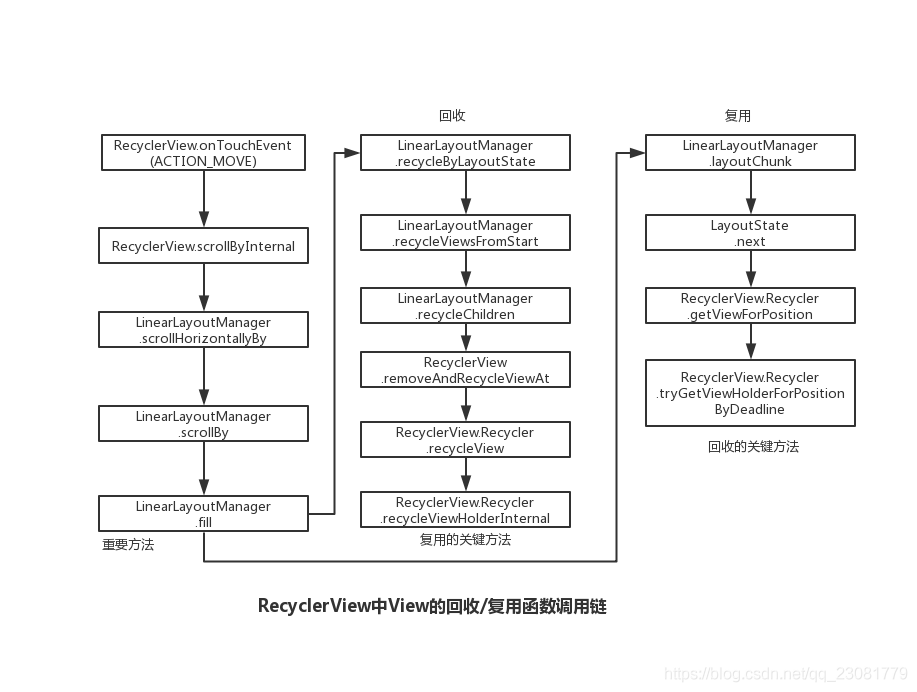
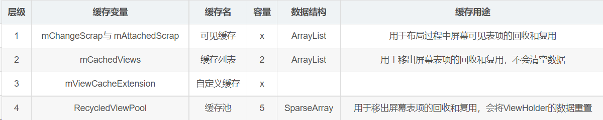
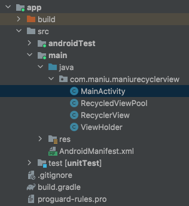

众所周知，RecyclerView在android中实现列表是性能非常好的，那么性能好的原因在哪里呢？关键还是在它在处理view时的回收和复用。列表在滑动的时候，会进行itemView的回收和复用，那么我们就从滑动回调即onTouchEvent来入手分析

## 基本概念

> 1. ViewHolder: View的容器，一项View就对应一个ViewHolder
> 2. Recyler：RecyclerView的内部类，主要负责View的回收和复用
> 3. LinearLayoutManager: RecyclerView的线性布局管理器

## 滑动时函数调用链



## 四级缓存机制

 

## 回收的关键方法分析

```
## RecyclerView.java
void recycleViewHolderInternal(ViewHolder holder) {
	...
	if (forceRecycle || holder.isRecyclable()) {
                if (mViewCacheMax > 0
                        && !holder.hasAnyOfTheFlags(ViewHolder.FLAG_INVALID
                                | ViewHolder.FLAG_REMOVED
                                | ViewHolder.FLAG_UPDATE
                                | ViewHolder.FLAG_ADAPTER_POSITION_UNKNOWN)) 
	// 1) 先尝试放到cacheView中
                    int cachedViewSize = mCachedViews.size();
                    if (cachedViewSize >= mViewCacheMax && cachedViewSize > 0) {
                        // 如果 mCachedViews 已经满了，把第0个位置的移除并放到 缓存池中
                        recycleCachedViewAt(0);
                        cachedViewSize--;
                    }
                    if (!cached) {
                    // 2） 如果CacheView中没放进去，就放到 缓存池中
                    addViewHolderToRecycledViewPool(holder, true);
                    recycled = true;
                }
           ...
}
                                
}

```

复用的关键方法分析

> tryGetViewHolderForPositionByDeadline
> 从一级缓存 mChangeScrap 中取
> 从二级缓存 mCachedViews中取
> 从三级缓存 mViewCacheExtension 中取
> 从四级缓存 缓存池中取
> 缓存中都没有拿到值，就直接创建
> 未绑定过时，进行绑定

```
ViewHolder tryGetViewHolderForPositionByDeadline(int position,
                boolean dryRun, long deadlineNs) {
	ViewHolder holder = null;
            // 1) 从一级缓存 changed scrap 中取
            if (mState.isPreLayout()) {
                holder = getChangedScrapViewForPosition(position);
                fromScrapOrHiddenOrCache = holder != null;
            }
            // 2）从二级缓存 cache中取
            if (holder == null) {
				final int type = mAdapter.getItemViewType(offsetPosition);
                if (mAdapter.hasStableIds()) {
                    holder = getScrapOrCachedViewForId(mAdapter.getItemId(offsetPosition),
                            type, dryRun);
                    if (holder != null) {
                        // update position
                        holder.mPosition = offsetPosition;
                        fromScrapOrHiddenOrCache = true;
                    }
                }
                // 3. 从三级缓存 CacheExtension 中取  
                if (holder == null && mViewCacheExtension != null) {
                    final View view = mViewCacheExtension
                            .getViewForPositionAndType(this, position, type);
                    if (view != null) {
                        holder = getChildViewHolder(view);
                    }
                }
                // 4) 从四级缓存 缓存池中取
                if (holder == null) { // fallback to pool
                    holder = getRecycledViewPool().getRecycledView(type);
                    if (holder != null) {
                        holder.resetInternal();
                        if (FORCE_INVALIDATE_DISPLAY_LIST) {
                            invalidateDisplayListInt(holder);
                        }
                    }
                }
                // 5）缓存中都没有拿到值，就直接创建
				if (holder == null) {
                    holder = mAdapter.createViewHolder(RecyclerView.this, type);
                    if (ALLOW_THREAD_GAP_WORK) {
                        // only bother finding nested RV if prefetching
                        RecyclerView innerView = findNestedRecyclerView(holder.itemView);
                        if (innerView != null) {
                            holder.mNestedRecyclerView = new WeakReference<>(innerView);
                        }
                    }

                    long end = getNanoTime();
                    mRecyclerPool.factorInCreateTime(type, end - start);
                    if (DEBUG) {
                        Log.d(TAG, "tryGetViewHolderForPositionByDeadline created new ViewHolder");
                    }
                }
			}
			// 6）已经 bind过了，不会再去绑定，未绑定过时，进行绑定
			if (mState.isPreLayout() && holder.isBound()) {
                holder.mPreLayoutPosition = position;
            } else if (!holder.isBound() || holder.needsUpdate() || holder.isInvalid()) {
                final int offsetPosition = mAdapterHelper.findPositionOffset(position);
                //  尝试 bindView
                bound = tryBindViewHolderByDeadline(holder, offsetPosition, position, deadlineNs);
            }
            return holder;
}

```

### 一级缓存-缓存碎片

```
ViewHolder getChangedScrapViewForPosition(int position) {
            // If pre-layout, check the changed scrap for an exact match.
            final int changedScrapSize;
            if (mChangedScrap == null || (changedScrapSize = mChangedScrap.size()) == 0) {
                return null;
            }
            // find by position
            for (int i = 0; i < changedScrapSize; i++) {
                final ViewHolder holder = mChangedScrap.get(i);
                if (!holder.wasReturnedFromScrap() && holder.getLayoutPosition() == position) {
                    holder.addFlags(ViewHolder.FLAG_RETURNED_FROM_SCRAP);
                    return holder;
                }
            }
            // find by id
            if (mAdapter.hasStableIds()) {
                final int offsetPosition = mAdapterHelper.findPositionOffset(position);
                if (offsetPosition > 0 && offsetPosition < mAdapter.getItemCount()) {
                    final long id = mAdapter.getItemId(offsetPosition);
                    for (int i = 0; i < changedScrapSize; i++) {
                        final ViewHolder holder = mChangedScrap.get(i);
                        if (!holder.wasReturnedFromScrap() && holder.getItemId() == id) {
                            holder.addFlags(ViewHolder.FLAG_RETURNED_FROM_SCRAP);
                            return holder;
                        }
                    }
                }
            }
            return null;
}
 
```

### 二级缓存-缓存列表

```
ViewHolder getScrapOrCachedViewForId(long id, int type, boolean dryRun) {
			// 1) 先从mAttachedScrap中取，取到便返回
            final int count = mAttachedScrap.size();
            for (int i = count - 1; i >= 0; i--) {
                final ViewHolder holder = mAttachedScrap.get(i);
                if (holder.getItemId() == id && !holder.wasReturnedFromScrap()) {
                    if (type == holder.getItemViewType()) {
                        holder.addFlags(ViewHolder.FLAG_RETURNED_FROM_SCRAP);
                        if (holder.isRemoved()) {
                            if (!mState.isPreLayout()) {
                                holder.setFlags(ViewHolder.FLAG_UPDATE, ViewHolder.FLAG_UPDATE
                                        | ViewHolder.FLAG_INVALID | ViewHolder.FLAG_REMOVED);
                            }
                        }
                        return holder;
                    } else if (!dryRun) {
                        mAttachedScrap.remove(i);
                        removeDetachedView(holder.itemView, false);
                        quickRecycleScrapView(holder.itemView);
                    }
                }
            }

            // 2）二级缓存，从mCachedViews中取
            final int cacheSize = mCachedViews.size();
            for (int i = cacheSize - 1; i >= 0; i--) {
                final ViewHolder holder = mCachedViews.get(i);
                //从mCachedViews中取到后便返回
                if (holder.getItemId() == id) {
                    if (type == holder.getItemViewType()) {
                        if (!dryRun) {
                            mCachedViews.remove(i);
                        }
                        return holder;
                    } else if (!dryRun) {
                        recycleCachedViewAt(i);
                        return null;
                    }
                }
            }
            return null;
        }
 
```

### 三级缓存-自定义缓存

略

### 四级缓存-缓存池

```
public ViewHolder getRecycledView(int viewType) {
			//从mScrap中根据view的类型来取出一个
            final ScrapData scrapData = mScrap.get(viewType);
            if (scrapData != null && !scrapData.mScrapHeap.isEmpty()) {
                final ArrayList<ViewHolder> scrapHeap = scrapData.mScrapHeap;
                //从 scrapData 中拿最后一个数据，先进后出
                return scrapHeap.remove(scrapHeap.size() - 1);
            }
            return null;
}

static class ScrapData {
			//ViewHolder是作为一个List被存进来的
            ArrayList<ViewHolder> mScrapHeap = new ArrayList<>();
            // 缓存池中 list的大小是5，也就是每个类型的view缓存池中存储5个
            int mMaxScrap = 5;
            long mCreateRunningAverageNs = 0;
            long mBindRunningAverageNs = 0;
 }
```

## 手写RecyclerView



### ViewHolder

```
package com.maniu.maniurecyclerview;

import android.view.View;

public class ViewHolder {
    public View itemView;
    int itemViewType = -1;

    public ViewHolder(View itemView) {
        this.itemView = itemView;
    }

    public View getItemView() {
        return itemView;
    }

    public int getItemViewType() {
        return itemViewType;
    }

    public void setItemViewType(int mItemViewType) {
        this.itemViewType = mItemViewType;
    }
}
```

### RecycledViewPool

```
package com.maniu.maniurecyclerview;

import android.util.SparseArray;

import java.util.ArrayList;

/**
 * 回收池
 */
public class RecycledViewPool {
    static class ScrapData {
        ArrayList<ViewHolder> mScrapHeap = new ArrayList<>();
    }

    // 内部是一个类似于key-value的结构，key只能是int类型
    SparseArray<ScrapData> mScrap = new SparseArray<>();

    public void clear() {
        for (int i = 0; i < mScrap.size(); i++) {
            ScrapData data = mScrap.valueAt(i);
            data.mScrapHeap.clear();
        }
    }

    /**
     * 根据viewType，获取缓存
     */
    private ScrapData getScrapDataForType(int viewType) {
        ScrapData scrapData = mScrap.get(viewType);
        if (scrapData == null) {
            scrapData = new ScrapData();
            mScrap.put(viewType, scrapData);
        }
        return scrapData;
    }

    /**
     * 根据viewType，获取缓存view
     */
    public ViewHolder getRecycledView(int viewType) {
        final ScrapData scrapData = mScrap.get(viewType);
        if (scrapData != null && !scrapData.mScrapHeap.isEmpty()) {
            final ArrayList<ViewHolder> scrapHeap = scrapData.mScrapHeap;
            return scrapHeap.remove(scrapHeap.size() - 1);
        }
        return null;
    }

    /**
     * 将view放入回收池
     */
    public void putRecycledView(ViewHolder scrap, int viewType) {
        ArrayList<ViewHolder> scrapHeap = getScrapDataForType(viewType).mScrapHeap;
        scrapHeap.add(scrap);
    }
}
```

### RecyclerView

```java
package com.maniu.maniurecyclerview;

import android.content.Context;
import android.util.AttributeSet;
import android.util.Log;
import android.view.MotionEvent;
import android.view.VelocityTracker;
import android.view.ViewConfiguration;
import android.view.ViewGroup;
import android.widget.Scroller;

import java.util.ArrayList;
import java.util.List;

public class RecyclerView extends ViewGroup {
    private static final String TAG = "david";
    private Adapter adapter;
    private VelocityTracker velocityTracker;
    private Flinger flinger;

    // y偏移量
    private int scrollY;
    // 当前显示的View
    private List<ViewHolder> viewList;
    // 当前滑动的y值
    private int currentY;
    // item 行数
    private int rowCount;
    // item 的高度
    private int[] heights;
    // 初始化
    private boolean needRelayout;
    // 当前 recyclerView 的宽高
    private int width;
    private int height;
    // 回收池
    RecycledViewPool recycler;
    // view的弟一行  是占内容的几行
    private int firstRow;
    // 最小滑动距离
    private int touchSlop;
    private int maximumVelocity;
    private int minimumVelocity;

    public RecyclerView(Context context) {
        super(context);
    }

    public RecyclerView(Context context, AttributeSet attrs) {
        super(context, attrs);
        init(context, attrs);
    }

    public RecyclerView(Context context, AttributeSet attrs, int defStyleAttr) {
        super(context, attrs, defStyleAttr);
    }

    private void init(Context context, AttributeSet attrs) {
        this.viewList = new ArrayList<>();
        this.needRelayout = true;
        final ViewConfiguration configuration = ViewConfiguration.get(context);
        this.flinger = new Flinger(context);
        this.touchSlop = configuration.getScaledTouchSlop();
        this.maximumVelocity = configuration.getScaledMaximumFlingVelocity();
        this.minimumVelocity = configuration.getScaledMinimumFlingVelocity();
    }

    public void setAdapter(Adapter adapter) {
        this.adapter = adapter;
        if (adapter != null) {
            recycler = new RecycledViewPool();
        }
        scrollY = 0;
        firstRow = 0;
        needRelayout = true;
        requestLayout();
    }

    @Override
    protected void onLayout(boolean changed, int l, int t, int r, int b) {
        if (needRelayout || changed) {
            needRelayout = false;
            viewList.clear();
            removeAllViews();
            if (adapter != null) {
                // 摆放子控件
                width = r - l;
                height = b - t;
                int left, top = 0, right, bottom;
                // 第一行不是从0开始
                top = -scrollY;
                this.rowCount = adapter.getItemCount();
                heights = new int[rowCount];
                for (int i = 0; i < heights.length; i++) {
                    heights[i] = adapter.getHeight(i);
                }
                for (int i = 0; i < rowCount && top < height; i++) {
                    bottom = top + heights[i];
                    // 生成View
                    ViewHolder viewHolder = makeAndStep(i, 0, top, width, bottom);
                    viewList.add(viewHolder);
                    top = bottom;
                }
            }
        }
    }

    private ViewHolder makeAndStep(int row, int left, int top, int right, int bottom) {
        // 实例化一个有宽度、高度的View
        ViewHolder viewHolder = obtainView(row, right - left, bottom - top);
        // 设置位置
        viewHolder.itemView.layout(left, top, right, bottom);
        return viewHolder;
    }

    private ViewHolder obtainView(int row, int width, int height) {
        int itemType = adapter.getItemViewType(row);
        ViewHolder recycledView = recycler.getRecycledView(itemType);
        if (recycledView == null) {
            recycledView = adapter.onCreateViewHolder(this, itemType);
        }
        adapter.onBindViewHolder(recycledView, row);
        recycledView.setItemViewType(itemType);
        // 测量
        recycledView.getItemView().measure(MeasureSpec.makeMeasureSpec(width, MeasureSpec.EXACTLY)
                , MeasureSpec.makeMeasureSpec(height, MeasureSpec.EXACTLY));
        addView(recycledView.getItemView(), 0);
        return recycledView;
    }

    private int sumArray(int array[], int firstIndex, int count) {
        int sum = 0;
        count += firstIndex;
        for (int i = firstIndex; i < count; i++) {
            sum += array[i];
        }
        return sum;
    }

    // 拦截 滑动事件
    @Override
    public boolean onInterceptTouchEvent(MotionEvent event) {
        boolean intercept = false;
        switch (event.getAction()) {
            case MotionEvent.ACTION_DOWN: {
                currentY = (int) event.getRawY();
                break;
            }
            case MotionEvent.ACTION_MOVE: {
                int y2 = Math.abs(currentY - (int) event.getRawY());
                if (y2 > touchSlop) {
                    intercept = true;
                }
                break;
            }
        }
        return intercept;
    }


    @Override
    public boolean onTouchEvent(MotionEvent event) {
        if (velocityTracker == null) {
            velocityTracker = VelocityTracker.obtain();
        }
        velocityTracker.addMovement(event);
        switch (event.getAction()) {
            case MotionEvent.ACTION_UP: {
                velocityTracker.computeCurrentVelocity(1000, maximumVelocity);
                int velocityY = (int) velocityTracker.getYVelocity();

                int initY = scrollY + sumArray(heights, 1, firstRow);
                int maxY = Math.max(0, sumArray(heights, 0, heights.length) - height);
                // 判断是否开启 惯性滑动
                if (Math.abs(velocityY) > minimumVelocity) {
                    flinger.start(0, initY, 0, velocityY, 0, maxY);
                } else {
                    if (this.velocityTracker != null) {
                        this.velocityTracker.recycle();
                        this.velocityTracker = null;
                    }
                }
                break;
            }
            case MotionEvent.ACTION_MOVE: {
                int y = (int) event.getRawY();
                // diffX > 0：往左划
                // diffY > 0：往上划
                int diffY = currentY - y;
                scrollBy(0, diffY);
                break;
            }

        }
        return super.onTouchEvent(event);
    }

    //scrollBy
    @Override
    public void scrollBy(int x, int y) {
        scrollY += y;
        // 修正一下  内容的总高度 是他的边界值
        scrollY = scrollBounds(scrollY, firstRow, heights, height);
        if (scrollY > 0) {
            // 往上滑
            while (heights[firstRow] < scrollY) {
                if (!viewList.isEmpty()) {
                    removeView(viewList.remove(0));
                }
                scrollY -= heights[firstRow];
                firstRow++;
            }
            while (getFilledHeight() < height) {
                int dataIndex = firstRow + viewList.size();
                ViewHolder view = obtainView(dataIndex, width,
                        heights[dataIndex]);
                viewList.add(viewList.size(), view);
            }

        } else if (scrollY < 0) {
            // 往下滑
            while (!viewList.isEmpty() &&
                    getFilledHeight() -
                            heights[firstRow + viewList.size() - 1] >= height) {
                removeView(viewList.remove(viewList.size() - 1));
            }
            while (0 > scrollY) {
                ViewHolder viewHolder = obtainView(firstRow - 1, width, heights[0]);
                viewList.add(0, viewHolder);
                firstRow--;
                scrollY += heights[firstRow + 1];
            }
        }
        // 重新对一个子控件进行重新layout
        repositionViews();
    }

    private void repositionViews() {
        int left, top, right, bottom, i;
        top = -scrollY;
        i = firstRow;
        for (ViewHolder viewHolder : viewList) {
            bottom = top + heights[i++];
            viewHolder.itemView.layout(0, top, width, bottom);
            top = bottom;
        }
    }

    private int getFilledHeight() {
        return sumArray(heights, firstRow, viewList.size()) - scrollY;
    }

    private int scrollBounds(int scrollY, int firstRow, int sizes[], int viewSize) {
        if (scrollY > 0) {
            Log.i(TAG, " 上滑 scrollBounds: scrollY  " + scrollY + "  各项之和  " + sumArray(sizes, firstRow, sizes.length - firstRow) + "  receryView高度  " + viewSize);
            // 往上滑
            if (sumArray(sizes, firstRow, sizes.length - firstRow) - scrollY > viewSize) {
                scrollY = scrollY;
            } else {
                scrollY = sumArray(sizes, firstRow, sizes.length - firstRow) - viewSize;
            }
        } else {
            // 往下滑
            scrollY = Math.max(scrollY, -sumArray(sizes, 0, firstRow));
            // scrollY = Math.max(scrollY, 0);
            Log.i(TAG, "下滑  scrollBounds: scrollY  " + scrollY + "  各项之和  " + (-sumArray(sizes, 0, firstRow)));
        }
        return scrollY;
    }

    public void removeView(ViewHolder viewHolder) {
        int typeView = viewHolder.getItemViewType();
        recycler.putRecycledView(viewHolder, typeView);
        removeView(viewHolder.getItemView());
    }

    interface Adapter<VH extends ViewHolder> {
        VH onCreateViewHolder(ViewGroup parent, int viewType);

        VH onBindViewHolder(VH viewHolder, int position);

        int getItemViewType(int position);

        int getItemCount();

        int getHeight(int index);
    }

    private class Flinger implements Runnable {
        // scrollBy   （移动的偏移量)  而不是速度
        private Scroller scroller;
        private int initY;

        void start(int initX, int initY, int initialVelocityX, int initialVelocityY, int maxX, int maxY) {
            scroller.fling(initX, initY, initialVelocityX
                    , initialVelocityY, 0, maxX, 0, maxY);
            this.initY = initY;
            post(this);
        }

        Flinger(Context context) {
            scroller = new Scroller(context);
        }

        @Override
        public void run() {
            if (scroller.isFinished()) {
                return;
            }

            boolean more = scroller.computeScrollOffset();
            int y = scroller.getCurrY();
            int diffY = initY - y;
            if (diffY != 0) {
                scrollBy(0, diffY);
                initY = y;
            }
            if (more) {
                post(this);
            }
        }

        boolean isFinished() {
            return scroller.isFinished();
        }
    }
}
```

MainActivity

```java
package com.maniu.maniurecyclerview;

import android.os.Bundle;
import android.view.LayoutInflater;
import android.view.View;
import android.view.ViewGroup;
import android.widget.ImageView;
import android.widget.TextView;

import androidx.appcompat.app.AppCompatActivity;

public class MainActivity extends AppCompatActivity {
    RecyclerView recyclerView;

    @Override
    protected void onCreate(Bundle savedInstanceState) {
        super.onCreate(savedInstanceState);
        setContentView(R.layout.activity_main);
        recyclerView = findViewById(R.id.table);
        recyclerView.setAdapter(new TwoAdapter(50));
    }

    class MyViewHolder extends ViewHolder {
        TextView tv;

        public MyViewHolder(View view) {
            super(view);
            tv = (TextView) view.findViewById(R.id.text1);
        }
    }

    class ImageViewHolder extends ViewHolder {
        TextView tv;
        ImageView imageView;

        public ImageViewHolder(View view) {
            super(view);
            tv = (TextView) view.findViewById(R.id.text2);
            imageView = (ImageView) view.findViewById(R.id.img);
        }
    }

    class TwoAdapter implements RecyclerView.Adapter<ViewHolder> {
        int count;

        public TwoAdapter(int count) {
            this.count = count;
        }

        @Override
        public ViewHolder onCreateViewHolder(ViewGroup parent, int viewType) {
            View view;
            if (viewType == 0) {
                view = LayoutInflater.from(MainActivity.this).inflate(R.layout.item_table1, parent, false);
                return new MyViewHolder(view);
            } else {
                view = LayoutInflater.from(MainActivity.this).inflate(R.layout.item_table2, parent, false);
                return new ImageViewHolder(view);
            }
        }

        @Override
        public ViewHolder onBindViewHolder(ViewHolder viewHodler, int position) {
            switch (getItemViewType(position)) {
                case 0:
                    MyViewHolder holderOne = (MyViewHolder) viewHodler;
                    holderOne.tv.setText(" 布局1 ");
                    break;
                case 1:
                    ImageViewHolder holderTwo = (ImageViewHolder) viewHodler;
                    holderTwo.tv.setText(" 布局2 ");
            }

            return null;
        }

        @Override
        public int getItemViewType(int position) {
            if (position >= 10) {
                return 0;
            } else {
                return 1;
            }
        }

        @Override
        public int getItemCount() {
            return count;
        }

        @Override
        public int getHeight(int index) {
            return 200;
        }
    }
}

///////////////////////////////////////////////////////

<?xml version="1.0" encoding="utf-8"?>
<RelativeLayout xmlns:android="http://schemas.android.com/apk/res/android"
    xmlns:tools="http://schemas.android.com/tools"
    android:layout_width="match_parent"
    android:layout_height="match_parent"
    tools:context=".MainActivity">

    <com.maniu.maniurecyclerview.RecyclerView
        android:id="@+id/table"
        android:layout_width="match_parent"
        android:layout_height="match_parent"
        android:clickable="true" />

</RelativeLayout>
```
