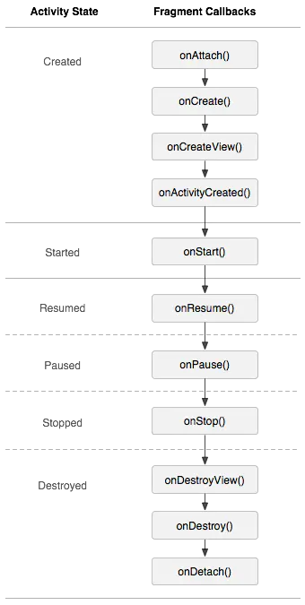

```
第一条主线
1：Activity 如何通过生命周期去调用fragment的生命周期
   其实就是调用了fragmentManagerImpl这个类来进行分发
    发现最终都是走的dispatchStateChange();

2：发现fragment的生命周期状态只有5个
    通过降序以及升序来进行判断   如果是升序，走显示的生命周期

3：发现case里面没有break。这样的好处，是为了让fragment走完整的生命周期

第二条主线：
commit
commitAllowingStateLoss

commitNow
commitNowAllowingStateLoss


mPendingActions最终添加的就是transaction

allocBackStackIndex（)  这个函数内部数据结构

viewpager+fragment
viewpager2+fragment+fragmentstateAdapter
onresume onstart

借鉴了glide （他是定义了一个hashMap，使用这个hashmap来做中间存储）

fragment逻辑流程
https://www.processon.com/view/link/61c569bae401fd442437da1f
```

