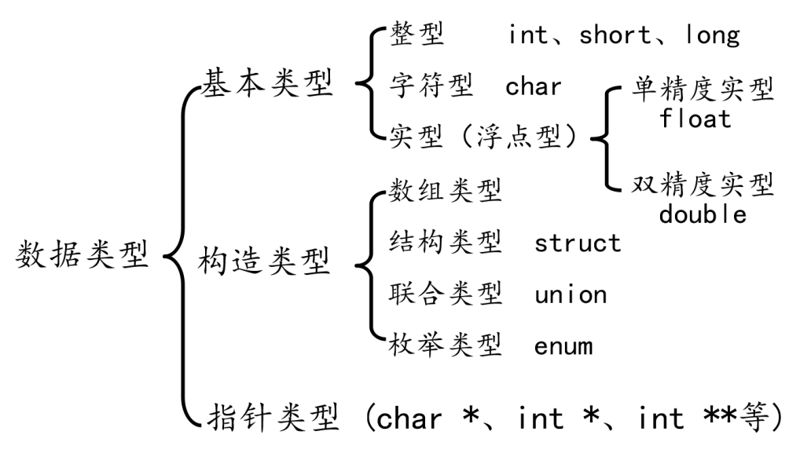
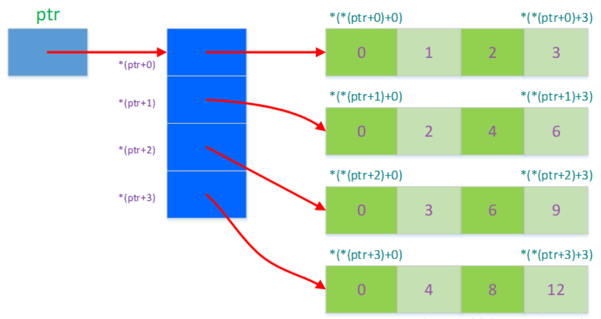
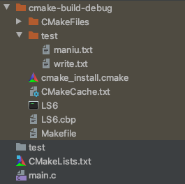
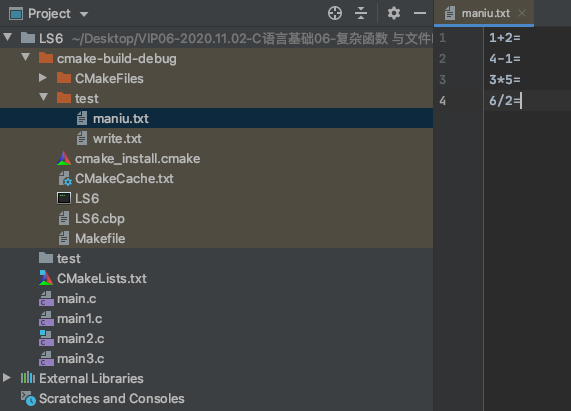
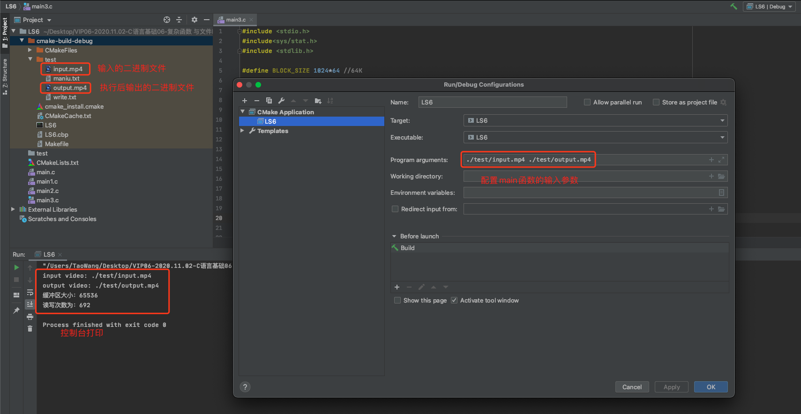

# C语言基础

## 数据类型



## struct

### 结构体简单使用

```c
#include <stdio.h>
#include <stdlib.h>

typedef struct {
    unsigned int a;// 无符号正数
    int b;
} Person;

int main() {
    Person *person = malloc(sizeof(Person));
  
    person->a = 44;
    person->b = 22;
  
    printf("a = %d\n", person->a);
    printf("b = %d\n", person->b);
  
    return 0;
}
```

### 结构体的字节对齐

所以每个成员存储的起始位置，要从最大成员的整数倍开始。

```c
#include <stdio.h>

int main() {
    // -------------------------------------
    // 结构体
    // -------------------------------------

    struct Person {
        char name;      // 姓名 1
        int num;        // 学号 4
        int age;        // 年龄 4
        char group;     // 归属的小组 1
        float score;    // 成绩  4
    } person1, person2;

    // 之所以这里是20个字节，是因为 "字节对齐" 导致的。
    // 该结构体的最大成员大小是4，所以内存排列如下：
    // ---------------------------
    // name(1)     空(3)
    // num(4) 
    // age(4)   
    // group(1)    空(3)
    // score(4)
    // ---------------------------
    // 所以所占用的大小才为20个字节
    printf("sizeof(person1) = %d\n", sizeof(person1));

    return 0;
}
```

## 宏

```c
#define David  99// 宏变量
#define ADD(x,y) ((x)+(y))// 宏函数

// 宏定义一个函数 void (int, int);
// 该函数的别名为 FUNC
typedef void FUNC(int, int);
```

## 指针

> 理解一个指针，务必清楚如下三点：
>
> - 指针自身的类型
>
> - 指针指向的类型
>
> - 指针指向的内容

### 基本使用

```c
#include <stdio.h>

int main() {
    int a = 10;
    int *p;// 定义一个地址的变量
    p = &a;// 把a的地址赋值给p

    printf("p = %d\n", *p);
    return 0;
}
```

### 指针的类型（重要）

从语法的角度看，你只要把指针声明语句里的指针名字去掉，剩下的部分就是这个指针的类型。

让我们看看如下各个指针的类型：

```
(1) int *ptr; //指针的类型是int *

(2) char *ptr; //指针的类型是char *

(3) int **ptr; //指针的类型是int **

(4) int (*ptr)[3]; //指针的类型是int(*)[3]

(5) int *(*ptr)[4]; //指针的类型是int*(*)[4]
```

###  指针所指向的类型（重要）

当你通过指针来访问指针所指向的内存区时，指针所指向的类型决定了编译器将把那片内存区里的内容当做什么来看待。

从语法上看，你只须把指针声明语句中的指针名字和名字左边的指针声明符*去掉，剩下的就是指针所指向的类型。例如：

```
(1) int *ptr; //指针所指向的类型是int

(2) char *ptr; //指针所指向的的类型是char

(3) int **ptr; //指针所指向的的类型是int*

(4) int (*ptr)[3]; //指针所指向的的类型是int()[3]

(5) int *(*ptr)[4]; //指针所指向的的类型是int *()[4]
```

在指针的算术运算中，指针所指向的类型有很大的作用，他决定步长。

“指针的类型” 和 “指针所指向的类型” 是两个概念。当你对C 越来越熟悉时，你会发现，这个是精通指针的关键点之一。

### 函数指针（重要）

```c
#include <stdio.h>

// 宏定义一个函数 void (int, int);
// 该函数的别名为 FUNC
typedef void FUNC(int, int);

void func(int a, int b) {
    printf("a = %d, b = %d\n", a, b);
}

void test(int a, int b, void (*callback)(int)) {
    int result = a + b;
    callback(result);
}

void callback(int result) {
    printf("result = %d\n", result);
}

int main() {
    /// ---- 函数也是一个指针 ----
    // 函数的 func、&func、*func 地址都相同
    func(20, 10);
    (&func)(20, 10);
    (*func)(20, 10);
    printf("func = %p\n", func);
    printf("&func = %p\n", &func);
    printf("*func = %p\n", *func);

    /// ---- 函数指针的简单使用 ----
    // 定义一个函数指针
    // p 的类型是 void (*)(int, int);
    // p 指向的内容是 void (int, int);
    void (*p)(int, int);
    // 给函数指针赋值
    p = func;
    // 调用函数指针
    p(10, 20);

    /// ---- 函数指针作为一个形参 ----
    test(30, 40, callback);

    /// ---- 使用宏来简化 函数指针的定义 ----
    FUNC *p2 = func;
    // 函数指针的取值，还是函数指针
    p2(10, 20);
    (*p2)(30, 20);

    return 0;
}
```

### 异常指针

空悬指针：指针正常初始化，曾指向过一个正常的对象，但是对象销毁了，该指针未置空，就成了悬空指针。

野指针：未初始化的指针，其指针内容为一个垃圾数。存在野指针是一个严重的错误。

### 二级指针的实现

- 实现方法一



```c
#include <stdio.h>
#include <stdlib.h>

int main() {
    int **ptr = NULL;
    int num = 4, size = 4, i, j;

    ptr = (int **) malloc(num * sizeof(int *));
    for (i = 0; i < num; ++i) {
        *(ptr + i) = (int *) malloc(size * sizeof(int));
        for (j = 0; j < size; ++j) {
            *(*(ptr + i) + j) = (i + 1) * j;
        }
    }

    for (i = 0; i < num; ++i) {
        for (j = 0; j < size; ++j) {
            printf("(%d, %d) -> %d;\t", i, j, *(*(ptr + i) + j));
        }
        printf("\n");
    }
    return 0;
}

// 输出如下：
// (0, 0) -> 0;		(0, 1) -> 1;		(0, 2) -> 2;		(0, 3) -> 3;	
// (1, 0) -> 0;		(1, 1) -> 2;		(1, 2) -> 4;		(1, 3) -> 6;	
// (2, 0) -> 0;		(2, 1) -> 3;		(2, 2) -> 6;		(2, 3) -> 9;	
// (3, 0) -> 0;		(3, 1) -> 4;		(3, 2) -> 8;		(3, 3) -> 12;
```

- 实现方法二


```c
#include <stdio.h>
#include <stdlib.h>

int main() {
    int **ptr = NULL;
    int num = 4, size = 4, i, j;

    ptr = (int **) malloc(num * sizeof(int *));
    for (i = 0; i < num; ++i) {
        ptr[i] = (int *) malloc(size * sizeof(int));
        for (j = 0; j < size; ++j) {
            ptr[i][j] = (i + 1) * j;
        }
    }

    for (i = 0; i < num; ++i) {
        for (j = 0; j < size; ++j) {
            printf("(%d, %d) -> %d;\t", i, j, ptr[i][j]);
        }
        printf("\n");
    }

    return 0;
}

// 输出如下：
// (0, 0) -> 0;    (0, 1) -> 1;   (0, 2) -> 2;   (0, 3) -> 3;
// (1, 0) -> 0;    (1, 1) -> 2;   (1, 2) -> 4;   (1, 3) -> 6;
// (2, 0) -> 0;    (2, 1) -> 3;   (2, 2) -> 6;   (2, 3) -> 9;
// (3, 0) -> 0;    (3, 1) -> 4;   (3, 2) -> 8;   (3, 3) -> 12;
```

### 常量指针和指针常量（重点）

```c
// 常量指针：指向常量的指针
// 不能修改指针指向的内容，但是能修改指针的指向
// 快速记忆：指针不是常量，那么就是常量指针
int const *p;
const int *p1;

// 指针常量：指针本身是常量
// 不能修改指针的指向，但是能修改指针指向的内容
// 快速记忆：指针是常量，那么就是指针常量
int *const x;
```

## 数组

### 数组是特殊的指针

```c
#include <stdio.h>

int main() {
    int c[9] = {1, 2, 3, 4, 5, 6, 7, 8, 9};

    // 数组是一个比较特殊的指针
    printf("%p \n", c);// 首地址
    printf("%p \n", &c);// 首地址的地址，还是首地址
    printf("%p \n", &c[0]);// 第一个元素的地址，还是首地址

    printf("%d \n", *c);// 取首地址的值
    printf("%d \n", c[0]);// 取首地址的值
    printf("%d \n", *(c + 1));// 取第二个元素的值
    
    return 0;
}
```

### 指针数组

```c
#include <stdio.h>

int main() {
    int a = 10;
    int b = 20;
    int c = 30;
    int *p1 = &a;
    int *p2 = &b;
    int *p3 = &c;
    int *arr[3] = {p1, p2, p3};// 指针数组：数组里的元素是指针

    printf("%d \n", *arr[0]);// 10
    printf("%d \n", **arr);// 10

    return 0;
}
```

### 指针数组和数组指针（重点）

```c
// 指针数组：数组里面放指针
// 快速记忆：因为它是数组，所以是“指针数组”
int *arr[3];

// 数组指针：指针指向了一个数组
// 快速记忆：因为它是指针，所以是“数组指针”
int (*p)[3];
```

### 函数指针数组（重要）

```c
#include <stdio.h>

int jia(int a, int b) {
    return a + b;
}
int jian(int a, int b) {
    return a - b;
}
int cheng(int a, int b) {
    return a * b;
}
int chu(int a, int b) {
    return a / b;
}

void changeJia(int (**p)(int, int)) {
    *p = jia;
}

int main() {
    // 指针数组
    int *px[4];

    // 函数指针数组
    int (*pn[4])(int, int) = {jia, jian, cheng, chu};

    // 调用函数指针数组
    for (int i = 0; i < 4; i++) {
        printf("result = %d\n", pn[i](30, 20));
    }

    // 如果希望通过方法 改变函数指针，要传函数指针的地址
    int (*pArr)(int, int) = jian;
    printf("before changeJia = %d\n", pArr(20,10) );
    changeJia(&pArr);
    printf("after changeJia = %d\n", pArr(20,10) );

    return 0;
}
```

### 二维数组

```c
#include <stdio.h>

int main() {
    int a[] = {10, 20};																			
    int b[] = {30, 10};
    int c[] = {10};
    int *arr[3] = {a, b, c};// 二维数组

    printf("%d \n", **arr);// 10
    printf("%d \n", arr[1][1]);// 30

    return 0;
}
```

### 二维数组的使用（重点）

```c
#include <stdio.h>

int main() {
    // a[0][0]=1;		a[0][1]=2;		a[0][2]=3;		a[0][3]=4;
    // a[1][0]=5;		a[1][1]=8;		a[1][2]=7;		a[1][3]=8;
    // a[2][0]=9;		a[2][1]=10;		a[2][2]=11;		a[2][3]=12;
    int a[3][4] = {1, 2, 3, 4, 5, 8, 7, 8, 9, 10, 11, 12};

    printf("&a:%p\n", &a);// 指向整个二维数组的首地址
    printf("a:%p\n", a);// 指向第一行的首地址
    printf("*a:%p\n", *a);// 指向第一个元素的首地址

    printf("-----------------&a\n");

    printf("*&a=%d\n", sizeof(*&a));// 整个二维数组长度为48个字节
    printf("a=0x%x\n", &a);
    printf("a+1=0x%x\n ", &a + 1);// 因为步长为48字节，所以+1相当于加了48个字节

    printf("-----------------a\n");

    printf("*&a=%d\n", sizeof(*a));// 一行数组有4个元素，所以长度为16个字节
    printf("a=0x%x\n", a);
    printf("a+1=0x%x\n ", a + 1);// 因为步长为16个字节，所以+1相当于加了16个字节

    printf("-----------------*a\n");

    printf("**a=%d\n", sizeof(**a));// 第一个元素的长度为4个字节
    printf("a=%d\n", **a);// 第一个元素的值为1
    printf("a+1=%d\n ", **a + 1);// 取出首个元素再加1，所以为2

    printf("-----------------数组取值\n");

    printf("a[1][0]=%d\n ", a[1][0]);// 数组取值

    printf("-----------------指针法\n");

    // 指针法
    // int (*p)[4]: 数组指针
    // int *p[4]: 指针数组
    // p 是数组指针
    // p 指向了第一行

    // (p+1) 指向了第二行
    // *(p+1) 指向了第二行第一个元素
    // **(p+1) 第二行第一个元素的值
    int (*p)[4] = a;
    printf("a[1][0]=%d\n", **(p + 1));
    // (p + 1) 指向第二行
    // *(p + 1) 指向第二行第一个元素
    // (*(p + 1) + 1)) 指向第二行第二个元素
    // *(*(p + 1) + 1) 第二行第二个元素的值
    printf("a[1][1]=%d\n", *(*(p + 1) + 1));
    // (p + 1) 指向第二行
    // (*(p + 1)) 指向第二行第一个元素
    // *(*(p + 1)) 第二行第一个元素的值
    // *(*(p + 1)) + 1 第二行第一个元素的值+1
    printf("a[1][0]+1=%d\n", *(*(p + 1)) + 1);

    printf("-----------------打印数组\n");

    for (int i = 0; i < 3; i++) {
        for (int j = 0; j < 4; j++)
            printf("a[%d][%d]=%d;\t", i, j, *(*(p + i) + j));
        printf("\n");
    }
    
    return 0;
}
```

### 数组的遍历方式

```c
#include <stdio.h>

int main() {
    int b[3] = {10, 20, 30};

    // 下标法
    for (int i = 0; i < 3; i++)
        printf("arr[%d]=%d ", i, b[i]);

    printf("------------------------\n");

    // 地址法
    for (int i = 0; i < 3; i++)
        printf("arr[%d]=%d ", i, *(b + i));


    printf("------------------------\n");

    //指针法
    int *d = b;
    for (int i = 0; i < 3; i++)
        printf("arr[%d]=%d ", i, *(d + i));
    
    return 0;
}
```

## 字符串

### 字符串的大小和长度

```c
#include <stdio.h>
#include "string.h"

int main() {

    char str[] = {'h', 'e', 'l', 'l', 'o'};// 栈区
    char str1[] = "hello";// 栈区
    char *str2 = "hello";// 常量区

    printf("sizeof(str)=%d\n", sizeof(str));// 5个字节大小
    printf("sizeof(str1)=%d\n", sizeof(str1));// 6个字节大小，因为尾部会自动加一个字符'\0'
    printf("sizeof(str2)=%d\n", sizeof(str2));// 8个字节大小，因为指针的大小都是8个字节

    printf("strlen(str)=%d\n", strlen(str));// 5个字符长度
    printf("strlen(str1)=%d\n", strlen(str1));// 5个字符长度
    printf("strlen(str2)=%d\n", strlen(str2));// 5个字符长度

    return 0;
}
```

### 字符串的拷贝

```c
#include <stdio.h>
#include "string.h"

int main() {
    char s1[] = "123456789";// 栈区

    printf("s1 = %s\n", s1);// 123456789
    printf("strlen(s1) = %d\n", strlen(s1));// 9
    printf("sizeof(s1) = %d\n", sizeof(s1));// 10

    strcpy(s1, "david");// 把 “参数2” 的值拷贝给 “参数1”
    printf("s1 = %s\n", s1);// david
    printf("strlen(s1) = %d\n", strlen(s1));// 5
    printf("sizeof(s1) = %d\n", sizeof(s1));// 10
    printf("s1[5] = %d\n", s1[5]);// 0
}

// 1, 2, 3, 4, 5, 6,	 	7, 8, 9, '\0'
// d, a, v, i, d, '\0',	7, 8, 9, '\0'
```

### 常量字符串不能被修改

```c
// 在栈区定义一个指针变量 "str2"
// 在常量区有一个值为 "hello"
// "str2" 指向 "hello"
char *str2 = "hello";

// 因为 "hello" 在常量区，所以不能被修改
//*str2 = "david";

// 虽然 "hello" 在常量区，不能被修改
// 但是指针变量 "str2" 的指向可以被修改
str2 = "kitty";
```

### 拼接字符串

```c
void mystrcat(char *s1, char *s2) {
    // -----------------------------------
    // 拼接两个字符串：将 s2 拼接到 s1 的尾部
    // -----------------------------------

    // *s1 不为空，指针就会一直往后移动，最后移动到 s1 的尾部
    while (*s1) s1++;
    // 要把 s2 拼接到 s1 的尾部
    // *s1 = *s2
    // *s1+1 = *s2+1
    // ......
    // 直到 s1 指向 s2 的末尾，也就是 *s1 为空时跳出循环
    while (*s1++ = *s2++);
}

int main() {
    char s1[] = "abc";
    char s2[] = "123";

    // 拼接两个字符串：将 s2 拼接到 s1 的尾部
    mystrcat(s1, s2);

    printf("s1 = %s\n", s1);// abc123
    printf("s2 = %s\n", s2);// 123
    printf("str[6] = %d\n", s1[6]);// 0
  
    // 如下方式是错误的，原因分析内存图便知
    char *s3 = "abc";
    char *s4 = "123";
    //mystrcat(s3, s4);
    //printf("s3 = %s\n", s3);

    return 0;
}
```

### 字符串数组（重点）

```c
#include <stdio.h>
#include "string.h"

int main() {
    // ----------------------------------------------
    // 字符串数组（指针常量）
    // ----------------------------------------------

    // 字符串数组是 "二维数组"
    // 指针是常量，但是指针指向的元素不是常量
    // 因此 arr 是 "指针常量"
    char arr[4][6] = {"abc", "efg", "hij", "klm"};

    // 因为指针指向的元素不是常量，所以能被修改
    // 将 "abc" 修改为 "aaaaa"
    strcpy(arr[0], "aaaaa");
    printf("arr[0] = %s\n", arr[0]);

    // ----------------------------------------------
    // 字符串数组（常量指针）
    // ----------------------------------------------

    // 因为 arr1 是个数组，数组中的元素是指针
    // 所以 arr1 是 "数组指针"
    //
    // 因为指针(arr1)不是常量，指针(arr1)指向的内容是常量
    // 所以 arr1 是 "常量指针"
    char *arr1[4] = {"abc", "efg", "hij", "klm"};

    // 因为 "abc" 是常量，所以不能被修改
    //strcpy(arr1[0], "aaaaa");
  
    return 0;
}
```

## 复杂函数

### 右左法则

**阅读复杂函数遵循 “右左法则”：**

首先要找到未定义的标识符，然后向右看，每当遇到圆括号时，就调转阅读方向，当括号内的内容解析完毕，就跳出这个括号，重复这个过程直到表达式解析完毕。

```c
/**
首先找到那个未定义的标识符，就是func，
它的外面有一对圆括号，而且左边是一个*号，这说明func是一个指针，
然后跳出这个圆括号，先看右边，也是一个圆括号，这说明(*func)是一个函数，
而func是一个指向这类函数的指针，就是一个函数指针，
这类函数具有int*类型的形参，返回值类型是 int。
 */
int (*func)(int *pInt);

/**
func被一对括号包含，且左边有一个*号，说明func是一个指针，
跳出括号，右边也有个括号，那么func是一个指向函数的指针，
这类函数具有int *和int (*)(int*)这样的形参，返回值为int类型。
再来看一看func的形参int (*f)(int*)，类似前面的解释，f也是一个函数指针，
指向的函数具有int*类型的形参，返回值为int。
 */
int (*func1)(int *p, int (*f)(int *));

/**
 * func右边是一个[]运算符，说明func是一个具有5个元素的数组，
 * func的左边有一个*，说明func的元素是指针，要注意这里的*不是修饰 func的，
 * 而是修饰func[5]的，原因是[]运算符优先级比*高，func先跟[]结合，
 * 因此*修饰的是func[5]。跳出这个括号，看右边，也是一对圆括号，
 * 说明func数组的元素是函数类型的指针，它所指向的函数具有int*类型的形参，
 * 返回值类型为int。
 */
int (*func2[5])(int *pInt);

/**
 * func被一个圆括号包含，左边又有一个*，
 * 那么func是一个指针，跳出括号，
 * 右边是一个[]运算符号，说明func是一个指向数组的指针，
 * 现在往左看，左边有一个*号，说明这个数组的元素是指针，
 */
int (*(*func3)[5])(int *pInt);
```

### 非法的函数

```c
/**
 * func是一个返回值为具有5个int元素的数组的函数。
 * 但C语言的函数返回值不能为数组，这是因为如果允许函数返回值为数组，
 * 那么接收这个数组的内容的东西，也必须是一个数组，但C语言的数组名是一个右值，
 * 它不能作为左值来接收另一个数组，
 * 因此函数返回值不能为数组。
 */
// int func8(void)[5];

/**
 func是一个具有5个元素的数组，这个数组的元素都是函数。
 这也是非法的，因为数组的元素除了类型必须一样外，
 每个元素所占用的内存空间也必须相同，显然函数是无法达到这个要求的，
 即使函数的类型一样，但函数所占用的空间通常是不相同的。
 */
// int func9[5](void);
```

## 文件的读写

**准备如下：**



### 打开文件

```c
FILE *fopen( const char * filename, const char * mode );
```

访问模式 **mode** 的值可以是下列值中的一个：

- r：打开一个已有的文本文件，允许读取文件。
- w：打开一个文本文件，允许写入文件。如果文件不存在，则会创建一个新文件。在这里，您的程序会从文件的开头写入内容。如果文件存在，则该会被截断为零长度，重新写入。
- a：打开一个文本文件，以追加模式写入文件。如果文件不存在，则会创建一个新文件。在这里，您的程序会在已有的文件内容中追加内容。
- r+：打开一个文本文件，允许读写文件。
- w+：打开一个文本文件，允许读写文件。如果文件已存在，则文件会被截断为零长度，如果文件不存在，则会创建一个新文件。
- a+：打开一个文本文件，允许读写文件。如果文件不存在，则会创建一个新文件。读取会从文件的开头开始，写入则只能是追加模式。

如果处理的是二进制文件，则需使用下面的访问模式来取代上面的访问模式：

```
"rb", "wb", "ab", "rb+", "r+b", "wb+", "w+b", "ab+", "a+b"
```

### 读取文件

```c
// 循环读文件
int main() {
    // 打开文件，允许读取文件
    FILE *p = fopen("./test/maniu.txt", "r");
    if (p) {
        // 循环读取一个字符，直到读取结束符为止
        while (1) {
            int c = fgetc(p);
            if (c == EOF) {
                break;
            }
            printf("%c\n", c);
        }
    }
    // 关闭指针
    fclose(p);
    p = NULL;
}
```

### 写入文件

```c
// 写文件
int main() {
    FILE *p = fopen("./test/maniu.txt", "w");
    if (p) {
        // 写入一个字符
        fputc('a', p);
        fclose(p);
        p = NULL;
    }
}
```

### 拷贝文件

```c
// copy文件
int main6() {
    FILE *p = fopen("./test/maniu.txt", "r");
    FILE *p1 = fopen("./test/write.txt", "w");
    if (p == NULL || p1 == NULL) {
        return -1;
    }
    while (1) {
        int c = fgetc(p);
        if (c == EOF) {
            break;
        }
        fputc(c, p1);
    }
    fclose(p);
    fclose(p1);
    p = NULL;
    p1 = NULL;
}
```

### 小练习：计算数学题

读取文件中的数学题，并打印计算结果：



```c
int calc(int a, char b, int c) {
    int result = 0;
    switch (b) {
        case '+':
            result = a + c;
            break;
        case '-':
            result = a - c;
            break;
        case '*':
            result = a * c;
            break;
        case '/':
            result = a / c;
            break;
    }
    return result;
}

int main() {
    FILE *p = fopen("./test/maniu.txt", "r");
    if (p) {
        while (1) {
            // 申明并初始化缓冲区
            char buffer[100] = {0};
            // 读取一行
            fgets(buffer, sizeof(buffer), p);
            // 分别获取每个字符
            int a = 0;
            char b = 0;
            int c = 0;
            sscanf(buffer, "%d%c%d", &a, &b, &c);
            // 打印计算结果
            printf("%d %c %d = %d\n", a, b, c, calc(a, b, c));
            // 判断文件是否写完
            if (feof(p)) {
                break;
            }
        }
        fclose(p);
        p = NULL;
    }
}
```

### 小练习：视频拷贝



```c
#include <stdio.h>
#include<sys/stat.h>
#include <stdlib.h>

#define BLOCK_SIZE 1024*64 //64K

int main(int argc, char **argv) {
    FILE *pr = fopen(argv[1], "rb");
    printf("input video: %s\n", argv[1]);
    if (pr == NULL) return 0;

    FILE *pw = fopen(argv[2], "wb");
    printf("output video: %s\n", argv[2]);
    if (pw == NULL) return 0;

    // 获取输入文件的大小
    struct stat st = {0};
    stat(argv[1], &st);
    int size = st.st_size;
    if (size > BLOCK_SIZE) {
        size = BLOCK_SIZE;
    }
    printf("缓冲区大小：%d\n", size);

    // 申请指定大小的缓冲区
    // 大小为 1 * size
    char *buf = calloc(1, size);
    // 无符号整数，也就是正数
    unsigned int index = 0;
    // 判断文件是否写完
    while (!feof(pr)) {
        // 将pr文件的数据读到缓冲区
        int res = fread(buf, 1, size, pr);
        // 将缓冲区的数据写到pw文件中
        fwrite(buf, 1, res, pw);
        index++;
    }
    free(buf);
    fclose(pw);
    fclose(pr);
    pw = NULL;
    pr = NULL;

    printf("读写次数为：%u\n", index);
    return 0;
}
```

## 内存分配

C语言的标准内存分配函数：malloc，calloc，realloc，free等。

- malloc(size): 在内存的动态存储区中分配一块长度为size字节的连续区域，返回该区域的首地址。
  - malloc只分配空间不初始化，也就是依然保留着这段内存里的数据。

- calloc(n, size)：在内存的动态存储区中分配n块长度为size字节的连续区域，返回首地址。
  - calloc分配的空间全部初始化为0。

- realloc(*ptr, size)：将ptr内存大小增大到size。

- free(void \*ptr)：释放ptr所指向的一块内存空间。

## 内存管理机制

​		**代码区：**程序被操作系统加载到内存的时候，所有的可执行代码(程序代码指令、常量字符串等)都加载到 代码区，这块内存在程序运行期间是不变的。代码区是平行的，里面装的就是一堆指令，在程序运行期 间是不能改变的。函数也是代码的一部分，故函数都被放在代码区，包括main函数。

​		**静态区：**静态区存放程序中所有的全局变量和静态变量。

​		**栈区：**栈(stack)是一种先进后出的内存结构，所有的自动变量、函数形参都存储在栈中，这个动作由编译器自动完成，我们写程序时不需要考虑。栈区在程序运行期间是可以随时修改的。当一个自动变量超出其作用域时，自动从栈中弹出。

每个线程都有自己专属的栈。栈的最大尺寸固定，超出则引起栈溢出。变量离开作用域后栈上的内存会自动释放。

​		**堆区：**堆和栈一样，也是一种在程序运行过程中可以随时修改的内存区域，但没有栈那样先进后出的顺序。更重要的是堆是一个大容器，它的容量要远远大于栈，这可以解决内存溢出困难。一般比较复杂的数据类型都是放在堆中。但是在C语言中，堆内存空间的申请和释放需要手动通过代码来完成。

malloc函数用来在堆中分配指定大小的内存，单位为字节(Byte)，函数返回void *指针。free负责在 堆中释放malloc分配的内存。

​		**什么时候用堆什么时候用栈呢？**一般遵循以下三个原则：

- 如果明确知道数据占用多少内存，那么数据量较小时用栈，较大时用堆。
- 如果不知道数据量大小(可能需要占用较大内存)，最好用堆(因为这样保险些)。
- 如果需要动态创建数组，则用堆。

​		操作系统在管理内存时，最小单位不是字节，而是**内存页**(32位操作系统的内存页一般是4K)。比如，初次申请1K内存，操作系统会分配1个内存页，也就是4K内存。4K是一个折中的选择，因为内存页越大，内存浪费越多，但操作系统内存调度效率高，不用频繁分配和释放内存。内存页越小，内存浪费越 少，但操作系统内存调度效率低，需要频繁分配和释放内存。