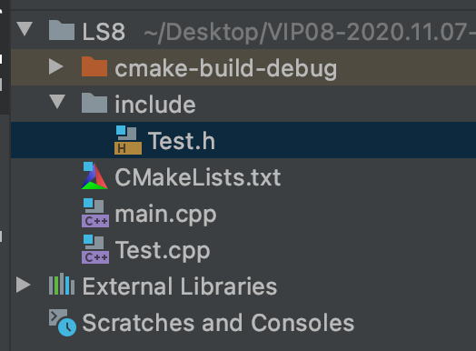

# C++基础

> 从语法上看，C语言是 C++ 的一部分，学了C语言就相当于学了 C++ 的一半。

## 类的定义及调用

```c++
#include <iostream>

class Student {
public:
    char *name;
    int age;
    float score;

    void say() {
        printf("name %s age %d score %f\n", name, age, score);
    }
};

int main() {
    class Student stu{};
    stu.name = "xiaoping";
    stu.age = 15;
    stu.score = 92.5f;
    stu.say();
    return 0;
}
```

## 命名空间

```c++
namespace namespaceA {
    namespace namespaceB {
        struct Teacher {
            int age = 30;
        };
    }
    int a = 10;
}

int main() {
    int a = namespaceA::a;

    using namespace namespaceA;
    int c = a;

    using namespace namespaceA::namespaceB;
    Teacher teacher;

    return 0;
}
```

## cin和cout

```c++
#include <iostream>

using namespace std;

int main() {
    // 输出流 cout <<
    // endl: 作用相当于 flush()，并会换行
    cout << "Hello, World!" << endl;

    cout << "hello, ";
    cout << "World!";
    cout << endl;

    cout << "hello, "
         << "World!"
         << endl;

    // 输入流 cin >>
    // 定义三个变量，并从输入流中接收。
    // 输入一个数值后，回车，接收下一个数值
    //
    // 控制台打印如下：
    // h
    // 67
    // 4724723
    // a = h
    // b = 67
    // c = 4.72472e+06
    char a;
    int b;
    float c;
    cin >> a >> b >> c;
    cout << "a = " << a << endl
         << "b = " << b << endl
         << "c = " << c << endl;

    return 0;
}
```

## 引用

### 引用是什么

```c++
#include <iostream>

int main() {
    // 引用：就是某一变量的一个别名，对引用的操作与对变量直接操作完全一样。
    // 引用不会开辟内存空间，所以相对于指针更为省空间
    // & 在等于号前表示 引用
    int a = 10;
    int &b = a;
    b = 100;

    printf("a: %d \n", a);
    printf("b: %d \n", b);
    printf("a: %p \n", &a);
    printf("b: %p \n", &b);

    // 常量引用不能被修改
    int const &c = a;
    // c = b;

    return 0;
}
```

### 引用实现两数交换

```c++
#include <iostream>

using namespace std;

// 引用实现两数交换
void swap(int &p1, int &p2) {
    int p = p1;
    p1 = p2;
    p2 = p;
}

int main() {
    int a = 20, b = 40;
    cout << "a = " << a << ", b = " << b << endl;
    swap(a, b);
    cout << "a = " << a << ", b = " << b << endl;

    return 0;
}
```

### 引用作为返回值

```c++
#include <iostream>

using namespace std;

float temp;

float &fn2(float r) {
    temp = (float) (r * r * 3.14);
    return temp;
}

float &fn1(float r) {
    // 1) 如果函数返回是&，内部不可以直接 return (float)(r*r*3.14)
    //    因为返回值为引用类型，而这样的返回是 float 类型
    // 2) 可以这样返回：float &b = a; return b;
    // 3) 也可以直接返回：return a; (因为编译器会自动把该值转换成引用)
    // 4) 变量 a 必须为全局变量，否则一旦走出该函数的作用域，变量 a 便不存在，同样 a 的引用也不存在
    float a = (float) (r * r * 3.14);
    return a;
}

int main() {
    // 错误：虽然有值，但值是错误的
    float &f1 = fn1(100.0);
    cout << "错误举例：" << f1 << endl;// 错误举例：2.1577e+20

    // 正确
     float &f2 = fn2(100.0);
    cout << "正确举例：" << f2 << endl;// 正确举例：31400

    // 正确
    float f3 = fn2(100.0);
    cout << "正确举例：" << f3 << endl;// 正确举例：31400
}
```

### 引用作为返回值2

```c++
#include <iostream>

using namespace std;

int data[10];
int error = -1;

int &put(int n) {
    if (n >= 0 && n <= 9) {
        return data[n];
        // 相当于如下：
        // int &d = data[n];
        // return d;
    } else {
        cout << "subscript error";
        return error;
    }
}

int main() {
    put(0) = 10;// 等价于 data[0] = 10
    put(9) = 20;// 等价于 data[9] = 20;

    cout << "data[0] = " << data[0] << endl;// data[0] = 10
    cout << "data[9] = " << data[9] << endl;// data[9] = 20
}
```

## 函数

### 内联函数

```c++
#include <iostream>

using namespace std;
#define ADD(x, y) (x+y)// 宏定义

// 內联函数：在编译时将函数体嵌入在每一个调用处
//
// 内联函数和宏定义的区别：宏是由预处理器对宏进行替代，而内联函数是通过编译器控制来实现的
//
// 內联函数使用的注意事项：
// 1）不能存在任何形式的循环语句
// 2）不能存在过多的条件判断语句
// 3）函数体不能过于庞大
// 4）不能对函数进行取址操作
// 总结：內联函数内不要有 for循环、switch语句、递归。否则內联函数会被当作普通函数处理
inline int Add(int x, int y) {
    return x + y;
}

int main() {
    int result = Add(10, 20);
    cout << "result = " << result << endl;
    return 0;
}
```

### 函数的默认参数

```c++
#include <iostream>

using namespace std;

// 函数的默认参数
//
// int x 实参；int y = 10 默认参数；int = 10 占位参数
// 实参在前，默认参数在后。
//
// 占位参数的作用是：
// 1）兼容C语言程序中可能出现的不规范写法
// 2）为以后程序的扩展留下线索
void test(int x, int y = 10, int = 10) {
    cout << "x: " << x << ", y: " << y << endl;
}

int main() {
    test(10);
    test(10, 20);
    test(10, 20, 30);
    return 0;
}
```

### 函数的重载

```c++
// ----------------------------------------------
// 重载函数
// ----------------------------------------------

void test(int a) {}

// 与 void test(int a) {} 是重载
// 与 void test(int a, int b = 20) {} 不是重载
// void test(int a, int b) {}

// 默认参数
void test(int a, int b = 20) {}

// 指针
void test(int *a) {}

// 常量指针：指针指向常量
void test(const int *a) {}

// 指针常量 不是重载：(int *a) 和 (int *const a) 存在二义性
// void test(int *const a) {}

// 引用 不是重载：(int a) 和 (int &a) 存在二义性
// void test(int &a) {}

// 常量引用 不是重载：(int a) 和 (const int &a) 存在二义性
// void test(const int &a) {}

// ----------------------------------------------
// typedef
// ----------------------------------------------

typedef void (*myFunc)(int a);
typedef void (*myFunc2)(int a, int b);

// ----------------------------------------------
// main函数
// ----------------------------------------------

int main() {
    // void test(int a) {}
    myFunc func1 = test;
    func1(10);

    // void test(int a, int b = 20) {}
    myFunc2 func2 = test;
    func2(10, 20);

    // void test(int *a) {}
    int a = 10;
    int *p = &a;
    test(p);

    // void test(const int *a) {}
    int a2 = 10;
    const int *p2 = &a2;
    test(p2);

    return 0;
}
```

## 防止头文件重复引用



**Test.h**

```c++
#ifndef LS8_TEST_H
#define LS8_TEST_H

class Test {

private:
    int b;
protected:
    int c;
public:
    int age;

    int getAge();

    void setAge(int age);

};

#endif
```

**Test.cpp**

```c++
#include "include/Test.h"

int Test::getAge() {
    return age;
}

void Test::setAge(int age) {
    this->age = age;
}
```

**main.cpp**

```c++
#include <iostream>

using namespace std;

#include "include/Test.h"

int main() {
    Test *test = new Test;
    test->setAge(18);
    cout << "age: " << test->getAge() << endl;
}
```

**CMakeLists.txt**

```
cmake_minimum_required(VERSION 3.16.5)
project(LS8)

set(CMAKE_CXX_STANDARD 14)

add_executable(LS8 Test.cpp include/Test.h main.cpp)
```