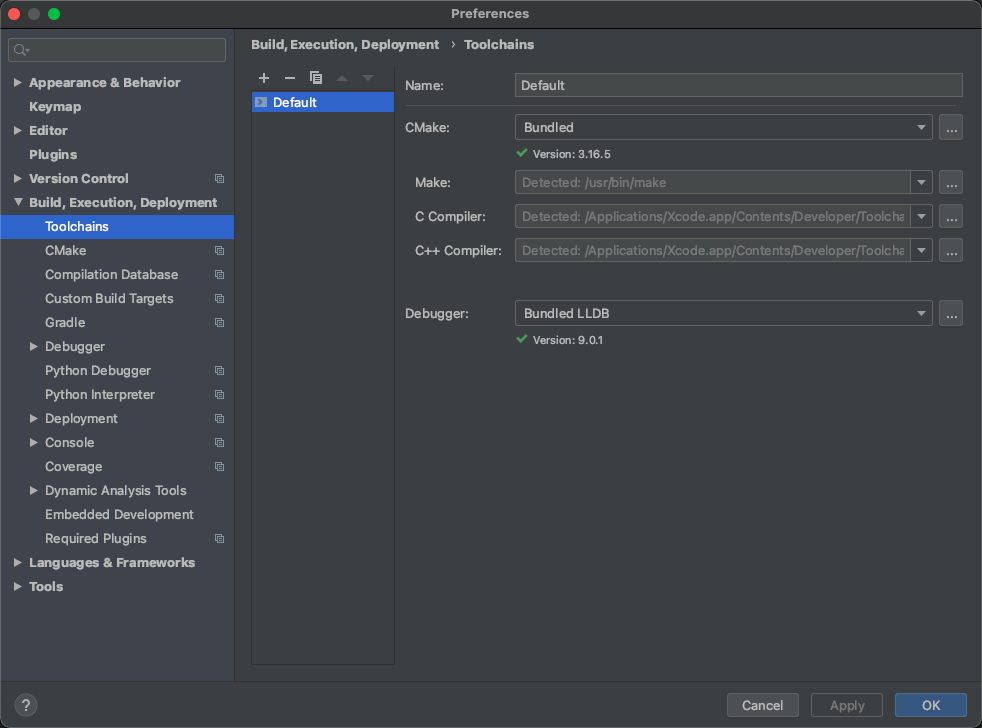

# C和C++环境搭建

> https://blog.csdn.net/kevinmeanscool/article/details/87174823

- 安装IDE：CLion
- 安装C和C++的编译器
  - 如果安装了Xcode，那么MacOS系统已经存在 ”C和C++的编译器“
  - 否则下载cmake：https://cmake.org/download/

- 如下图所示，表示已经安装成功

