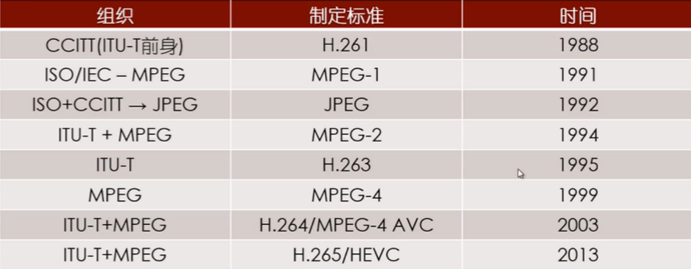
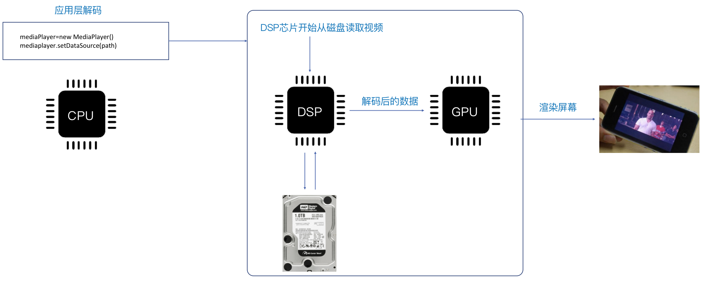
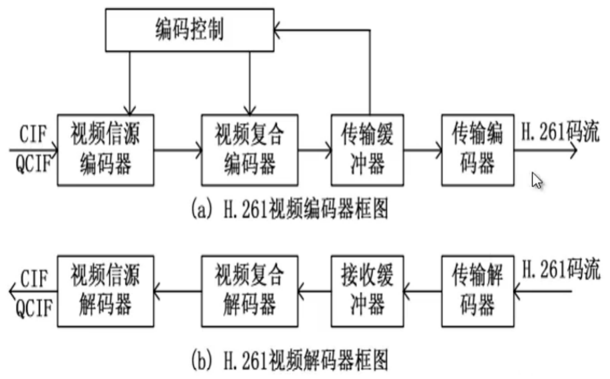
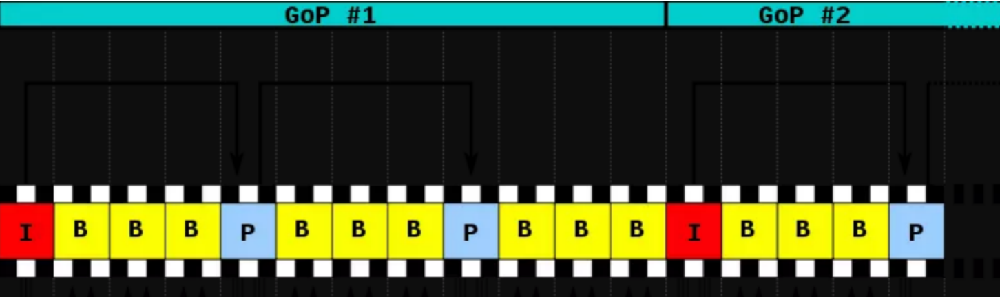
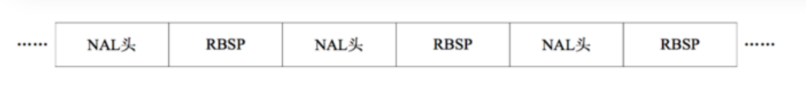
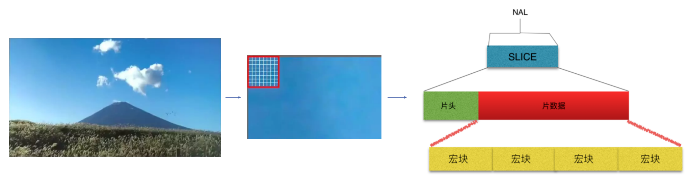
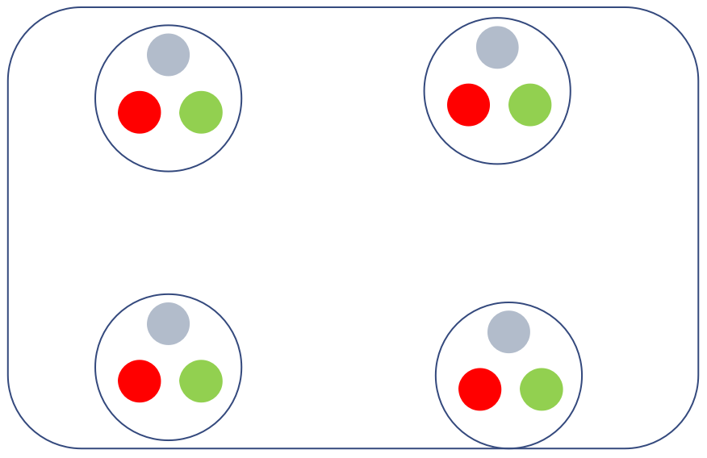
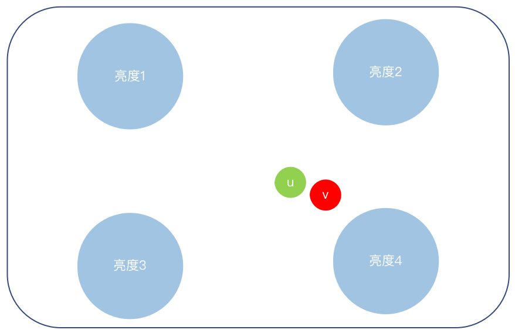

# H264视频编码原理

## H264理论知识

**H264编码定义：**对摄像头采集的每一帧视频需要进行编码，由与视频中存在空间和时间的冗余，需要用算法来去除这些冗余。H264是专门去除这些冗余的算法，我们把这种算法称为H264编码。

**H264编码应用：**如rmvb、avi、mp4、flv大都是由h264进行编码，当然也会有不同的编码，如：mpeg4、vp9这样比较冷门的编码。无论是h264、mpeg4、vp9都是基于宏块的方式进行编码，原理是一样的，只不过实现的算法不一致罢了。

**H264编码发展过程：**

国际电信联盟(ITU-T)：H261、H262、H263、H264

国际标准化组织(ISO)：MPEG1、MPEG2、MPEG4

国际电信联盟(ITU-T) + 国际标准化组织(ISO)：H264/MPEG4 AVC

## DSP芯片

- 俗语中的CPU实际是一个芯片的集合，里面包含：CPU、DSP、GPU
  - CPU是处理读取视频二进制数据
  - DSP是将视频二进制数据解码成 YUV 数据
  - GPU是将 YUV 数据渲染成真正的视频
- MediaCodec 是 DSP 芯片的接口类，调用 MediaCodec，实际上就是操作 DSP 芯片
- 如果用 CPU 进行 H264 的解码称为 “软解码”，用 DSP 进行 H264 的解码，则称为 “硬解码”

## DSP芯片视频编码器流程

1. CIF 称为一个完整帧，一段视频有N个完整帧，由设备输入到完整帧
2. 视频信源编码器：主要用来将一个完整帧实现块结构编码
3. 视频复合器：将视频与声音进行混合
4. 传输缓冲器：缓冲待输出的图像与音频
5. 传输编码器：对视频和音频进行格式化输出成H261码流

## I帧 B帧 P帧

- I帧：完整编码的帧叫I帧
- P帧：参考之前的I帧生成的只包含差异部分编码的帧叫P帧
- B帧：参考前后的帧编码的帧叫B帧

与I帧相似程度极高达到95%以上编码成B帧

相似程度70%编码成P帧。

如何编码不需要程序员来实现，已经由x264这个工具帮我们做了

## H264编码规则

- 在相邻几幅图像画面中，一般有差别的像素只有10%以内的点,亮度差值变化不超过2%，而色度差值的变化只有1%以内，所以对于一段变化不大图像画面，我们可以先编码出一个完整的图像帧A，
- 随后的B帧就不编码全部图像，只写入与A帧的差别，这样B帧的大小就只有完整帧的1/10或更小，B帧之后的C帧如果变化不大，我们可以继续以参考B的方式编码C帧，这样循环下去。
- 这段图像我们称为一个序列：序列就是有相同特点的一段数据，当某个图像与之前的图像变化很大，无法参考前面的帧来生成，那我们就结束上一个序列，开始下一段序列也就是对这个图像生成一个完整帧A1，随后的图像就参考A1生成，只写入与A1的差别内容。

## 图像序列GOP

除了I/P/B帧外，还有图像序列GOP，GOP图像序列可以理解成一个场景，场景的物体都是相似的。

GOP：两个I帧之间是一个图像序列，在一个图像序列中只有一个I帧。

## NALU单元设计

H.264 原始码流(又称为裸流)，是有一个接一个的 NALU 组成的

上图中的 NALU头 + RBSP（切片） 就相当与一个 NALU，每个单元都按独立的 NALU 传送。 

其实说白了，H.264 中的结构全部都是以 NALU 为主的，理解了 NALU，就理解 H.264 的结构了。

## 切片由来

把一张图片划分成若干个小的区域，这些小的区域称之为宏块。

H264默认是使用 16X16 大小的区域作为一个宏块，也可以划分成 8X8 大小。

若干个连续性的宏块组成了切片。

## SPS与PPS

- SPS和PPS ，包含了初始化H.264解码器所需要的信息参数，包括编码所用的profile、level、图像的宽和高、deblock滤波器等。
- SPS：序列参数集
- PPS：图像参数集
- 在H264码流中，都是以 "0x00 0x00 0x01" 或者 "0x00 0x00 0x00 0x01" 为开始码的，找到开始码之后，使用开始码之后的第一个字节的低5位判断是否为7(sps)或者8(pps)（即data[4] & 0x1f == 7 || data[4] & 0x1f == 8）。然后对获取的nal去掉开始码之后进行base64编码，得到的信息就可以用于sdp、sps和pps需要用逗号分隔开来

## YUV

**RGB原理**：定义 RGB 是从颜色发光的原理来设计定的，由红、绿、蓝三盏灯，当它们的光相互叠合的时候，色彩相混，而亮度则等于三盏灯亮度总和。RGB24 是指 R、G、B 三个分量各占 8 位。

**YUV原理：**人眼对亮度是比较敏感的，对色度不敏感。利用这点 YUV 优化彩色视频信号的传输，与 RGB 视频信号传输相比，它最大的优点在于只需占用极少的带宽（ RGB 要求三个独立的视频信号同时传输）。其中 “Y” 表示明亮度也就是灰阶值，而 “U” 和 “V” 表示的则是色度。

## H264拓展阅读资料

[H264拓展阅读资料](./004_H264拓展阅读资料)