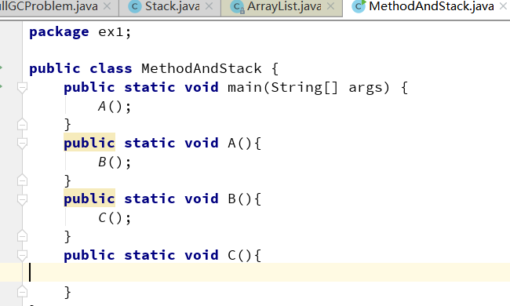

# JVM运行时数据区

> 来自：https://app.yinxiang.com/fx/a0ed989f-d653-417b-bf5a-94d766d95ed4

## 1、JVM是一种规范

### 1）Java程序的执行过程

​		一个 Java 程序，首先经过 javac 编译成 .class 文件，然后 JVM 将其加载到方法区，执行引擎将会执行这些字节码。执行时，会翻译成操作系统相关的函数。JVM 作为 .class 文件的翻译存在，输入字节码，调用操作系统函数。

​		过程如下：Java 文件 --> 编译器 --> 字节码 --> JVM --> 机器码。

​		JVM 全称 Java Virtual Machine，也就是我们耳熟能详的 Java 虚拟机。它能识别 .class后缀的文件，并且能够解析它的指令，最终调用操作系统上的函数，完成我们想要的操作。

### 2）JVM、JRE、JDK的关系

​		JVM只是一个翻译，把Class翻译成机器识别的代码，但是需要注意，JVM 不会自己生成代码，需要大家编写代码，同时需要很多依赖类库，这个时候就需要用到JRE。

​		JRE是什么，它除了包含JVM之外，提供了很多的类库（就是我们说的jar包，它可以提供一些即插即用的功能，比如读取或者操作文件，连接网络，使用I/O等等之类的）这些东西就是JRE提供的基础类库。JVM 标准加上实现的一大堆基础类库，就组成了 Java 的运行时环境JRE

​		但对于程序员来说，JRE还不够。我写完要编译代码，还需要调试代码，还需要打包代码、有时候还需要反编译代码。所以我们会使用JDK，因为JDK还提供了一些非常好用的小工具，比如 javac（编译代码）、java、jar （打包代码）、javap（反编译<反汇编>）等。这个就是JDK。

​		具体文档可以通过官网去下载：https://www.oracle.com/java/technologies/javase-jdk8-doc-downloads.html

​		JVM的作用是：从软件层面屏蔽不同操作系统在底层硬件和指令的不同.

​		**同时JVM是一个虚拟化的操作系统，类似于Linux或者Windows的操作系统，只是它架在操作class**

### 3）从跨平台到跨语言

**跨平台：**我们写的一个类，在不同的操作系统上（Linux、Windows、MacOS 等平台）执行，效果是一样，这个就是JVM的跨平台性。

为了实现跨平台型，不同操作系统有对应的JDK的版本。

https://www.oracle.com/java/technologies/javase/javase-jdk8-downloads.html

**跨语言（语言无关性）：**JVM只识别字节码，所以JVM其实跟语言是解耦的，也就是没有直接关联。JVM运行不是翻译Java文件，而是识别class文件，这个一般称之为字节码。还有像Groovy 、Kotlin、Scala等等语言，它们其实也是编译成字节码，所以它们也可以在JVM上面跑，这个就是JVM的跨跨语言性。Java的跨语言性一定程度上奠定了非常强大的java语言生态圈。

### 4）常见的JVM实现

​		对于Java开发来说，《Java虚拟机规范》才是最为官方、准确的一个文档，了解这个规范可以让我们更深入地理解JVM。我们平常说的JVM其实更多说的是HotSpot。规范文档如下，7版本做了中文翻译，8版本没有。

**Hotspot虚拟机：**目前使用的最多的Java虚拟机。在命令行 java –version。它会输出你现在使用的虚拟机的名字、版本等信息、执行模式。

```
TaoWang-MacBook-Pro:ios TaoWang$ java -version
java version "1.8.0_261"
Java(TM) SE Runtime Environment (build 1.8.0_261-b12)
Java HotSpot(TM) 64-Bit Server VM (build 25.261-b12, mixed mode)
```

**Jrockit**：原来属于 BEA公司，曾号称世界上最快的JVM，后被Oracle公司收购，合并于Hotspot

**J9:** IBM有自己的java虚拟机实现，它的名字叫做J9，主要是用在IBM产品（IBM WebSphere和IBM的AIX平台上）

**TaobaoVM:** 只有一定体量、一定规模的厂商才会开发自己的虚拟机，比如淘宝有自己的VM,它实际上是Hotspot的定制版，专门为淘宝准备的，阿里、天猫都是用的这款虚拟机。

**LiquidVM:** 它是一个针对硬件的虚拟机，它下面是没有操作系统的（不是Linux也不是windows）,下面直接就是硬件，运行效率比较高。

**zing:** 它属于zual这家公司，非常牛，是一个商业产品，很贵！它的垃圾回收速度非常快（1毫秒)

**毕昇：**毕昇JDK是华为内部OpenJDK定制版Huawei JDK的开源版本，是一个高性能、可用于生产环境的OpenJDK发行版。Huawei JDK运行在华为内部500多个产品上，积累了大量使用场景和java开发者反馈的问题和诉求，解决了业务实际运行中遇到的多个问题，并在ARM架构上进行了性能优化，毕昇JDK运行在大数据等场景下可以获得更好的性能。毕昇JDK 8与Java SE标准兼容，目前仅支持Linux/AArch64平台。具体https://gitee.com/openeuler/bishengjdk-8

## 2、JVM的内存区域

### 1）运行时数据区域

**运行时数据区的定义**：Java虚拟机在执行Java程序的过程中会把它所管理的内存划分为若干个不同的数据区域。

Java 引以为豪的就是它的自动内存管理机制。相比于 C++的手动内存管理、复杂难以理解java的内存管理方便实用。

所以要深入理解JVM必须理解内存虚拟化的概念。

在JVM中，JVM 内存主要分为堆、程序计数器、方法区、虚拟机栈和本地方法栈等。

同时按照与线程的关系也可以这么划分区域：

- 线程私有区域：一个线程拥有单独的一份内存区域。

- 线程共享区域：被所有线程共享，且只有一份。

这里还有一个直接内存，这个虽然不是运行时数据区的一部分，但是会被频繁使用。你可以理解成没有被虚拟机化的操作系统上的其他内存（比如操作系统上有8G内存，被JVM虚拟化了3G，那么还剩余5G， JVM是借助一些工具使用这5G内存的，这个内存部分称之为直接内存。


### 2）JAVA方法的运行与虚拟机栈

**虚拟机栈是用来存放线程运行java方法所需的数据，指令、返回地址。**

其实在我们实际的代码中，一个线程是可以运行多个方法的。

比如：



这段代码很简单，就是起一个main方法，在main方法运行中调用A方法，A方法中调用B方法B方法调用了C方法。

我们把代码跑起来，线程1来运行这段代码，线程1跑起来，就会有一个对应的虚拟机栈，同时在执行每个方法的时候都会打包成一个栈帧。

比如main开始运行，打包一个栈帧送入到虚拟机栈。


C方法运行完了，C方法出栈，接着B方法运行完了，B方法出栈、接着A方法运行完了，A方法出栈，最后main方法运行完了，main方法这个栈帧就出栈了。

这个就是Java方法运行对虚拟机栈的一个影响。虚拟机栈就是用来存储线程运行方法中的数据的。而每一个方法对应一个栈帧。

### 3）虚拟机栈

**栈的数据结构：**先进后出(FILO)的数据结构。

**虚拟机栈的作用：**在JVM运行过程中存储当前线程运行方法所需的数据，指令、返回地址**。**

**虚拟机栈是基于线程的**：哪怕你只有一个 main() 方法，也是以线程的方式运行的。在线程的生命周期中，参与计算的数据会频繁地入栈和出栈，栈的生命周期是和线程一样的。

虚拟机栈的大小缺省为1M，可用参数 –Xss调整大小，例如-Xss256k。

参数官方文档（JDK1.8）：https://docs.oracle.com/javase/8/docs/technotes/tools/unix/java.html

**栈帧**：在每个 Java 方法被调用的时候，都会创建一个栈帧，并入栈。一旦方法完成相应的调用，则出栈。

​		**栈帧大体都包含四个区域**：(局部变量表、操作数栈、动态连接、返回地址)

​		**1、局部变量表:**

​		顾名思义就是局部变量的表，用于存放我们的局部变量的（方法中的变量）。首先它是一个32位的长度，主要存放我们的Java的八大基础数据类型，一般32位就可以存放下，如果是64位的就使用高低位占用两个也可以存放下，如果是局部的一些对象，比如我们的Object对象，我们只需要存放它的一个引用地址即可。

​		**2、操作数据栈**：

​		存放java方法执行的操作数的，它就是一个栈，先进后出的栈结构，操作数栈，就是用来操作的，操作的的元素可以是任意的java数据类型，所以我们知道一个方法刚刚开始的时候，这个方法的操作数栈就是空的。

​		**操作数栈本质上是JVM执行引擎的一个工作区**，也就是方法在执行，才会对操作数栈进行操作，如果代码不不执行，操作数栈其实就是空的。

​		**3、动态连接:**

​		Java语言特性多态（后续章节细讲，需要结合class与执行引擎一起来讲）。

​		**4、返回地址:**

​		正常返回（调用程序计数器中的地址作为返回）、异常的话（通过异常处理器表<非栈帧中>)

同时，虚拟机栈这个内存也不是无限大，它有大小限制，默认情况下是1M。

如果我们不断的往虚拟机栈中入栈帧，但是就是不出栈的话，那么这个虚拟机栈就会爆掉。


### 4）程序计数器

​		较小的内存空间，当前线程执行的字节码的行号指示器；各线程之间独立存储，互不影响。

​		程序计数器是一块很小的内存空间，主要用来记录各个线程执行的字节码的地址，例如，分支、循环、跳转、异常、线程恢复等都依赖于计数器。

由于 Java 是多线程语言，当执行的线程数量超过 CPU 核数时，线程之间会根据时间片轮询争夺 CPU 资源。如果一个线程的时间片用完了，或者是其它原因导致这个线程的 CPU 资源被提前抢夺，那么这个退出的线程就需要单独的一个程序计数器，来记录下一条运行的指令

​		因为JVM是虚拟机，内部有完整的指令与执行的一套流程，所以在运行Java方法的时候需要使用程序计数器（记录字节码执行的地址或行号），如果是遇到本地方法（native方法），这个方法不是JVM来具体执行，所以程序计数器不需要记录了，这个是因为在操作系统层面也有一个程序计数器，这个会记录本地代码的执行的地址，

​		另外程序计数器也是JVM中唯一不会OOM(OutOfMemory)的内存区域。

## 3、栈帧执行对内存区域的影响

对class进行反汇编 javap –c XXXX.class

字节码助记码解释地址：https://cloud.tencent.com/developer/article/1333540


在JVM中，基于解释执行的这种方式是基于栈的引擎，这个说的栈，就是操作数栈。

**虚拟机栈：**

​		每个线程私有的，线程在运行时，在执行每个方法的时候都会打包成一个栈帧，存储了局部变量表，操作数栈，动态链接，方法出口等信息，然后放入栈。每个时刻正在执行的当前方法就是虚拟机栈顶的栈桢。方法的执行就对应着栈帧在虚拟机栈中入栈和出栈的过程。

​		栈的大小缺省为1M，可用参数 –Xss调整大小，例如-Xss256k

​		在编译程序代码的时候，栈帧中需要多大的局部变量表，多深的操作数栈都已经完全确定了，并且写入到方法表的Code属性之中，因此一个栈帧需要分配多少内存，不会受到程序运行期变量数据的影响，而仅仅取决于具体的虚拟机实现。

**局部变量表:**  顾名思义就是局部变量的表，用于存放我们的局部变量的。首先它是一个32位的长度，主要存放我们的Java的八大基础数据类型，一般32位就可以存放下，如果是64位的就使用高低位占用两个也可以存放下，如果是局部的一些对象，比如我们的Object对象，我们只需要存放它的一个引用地址即可。（基本数据类型、对象引用、returnAddress类型）

**操作数据栈**：存放我们方法执行的操作数的，它就是一个栈，先进后出的栈结构，操作数栈，就是用来操作的，操作的的元素可以是任意的java数据类型，所以我们知道一个方法刚刚开始的时候，这个方法的操作数栈就是空的，操作数栈运行方法是会一直运行入栈/出栈的操作

**动态连接**：Java语言特性多态（需要类加载、运行时才能确定具体的方法，后续有详细的讲解）动态分派

**完成出口(返回地址)**：
		正常返回：（调用程序计数器中的地址作为返回）
		三步曲：
			恢复上层方法的局部变量表和操作数栈、
			把返回值（如果有的话）压入调用者栈帧的操作数栈中、
			调整程序计数器的值以指向方法调用指令后面的一条指令、
			异常的话：（通过异常处理表<非栈帧中的>来确定）

## 4、运行时数据区及JVM的整体内存结构
### 1）本地方法栈
​		本地方法栈跟 Java 虚拟机栈的功能类似，Java 虚拟机栈用于管理 Java 函数的调用，而本地方法栈则用于管理本地方法的调用。但本地方法并不是用 Java 实现的，而是由 C 语言实现的 (比如Object.hashcode方法)。
​		本地方法栈是和虚拟机栈非常相似的一个区域，它服务的对象是 native 方法。你甚至可以认为虚拟机栈和本地方法栈是同一个区域。
​		虚拟机规范无强制规定，各版本虚拟机自由实现 ，HotSpot直接把本地方法栈和虚拟机栈合二为一 。

### 2）方法区

​		方法区（Method Area）是可供各条线程共享的运行时内存区域。它存储了每一个类的结构信息，例如运行时常量池（Runtime Constant Pool）字段和方法数据、构造函数和普通方法的字节码内容、还包括一些在类、实例、接口初始化时用到的特殊方法

​		方法区是JVM对内存的“逻辑划分”，在JDK1.7及之前很多开发者都习惯将方法区称为“永久代”，是因为在HotSpot 虚拟机中，设计人员使用了永久代来实现了 JVM 规范的方法区。在JDK1.8及以后使用了元空间来实现方法区。

## 5、JVM整体知识模块

​		JVM能涉及非常庞大的一块知识体系，比如内存结构、垃圾回收、类加载、性能调优、JVM自身优化技术、执行引擎、类文件结构、监控工具等。

​		但是在所有的知识体系中，都或多或少跟内存结构有一定的关系：

​		比如垃圾回收回收的就是内存、类加载加载到的地方也是内存、性能优化也涉及到内存优化、执行引擎与内存密不可分、类文件结构与内存的设计有关系，监控工具也会监控内存。所以内存结构处于JVM中核心位置。也是属于我们入门JVM学习的最好的选择。

### 1）元空间

​		方法区与堆空间类似，也是一个共享内存区，所以方法区是线程共享的。假如两个线程都试图访问方法区中的同一个类信息，而这个类还没有装入 JVM，那么此时就只允许一个线程去加载它，另一个线程必须等待。

​		在 HotSpot 虚拟机、Java7 版本中已经将永久代的静态变量和运行时常量池转移到了堆中，其余部分则存储在 JVM 的非堆内存中，而 Java8 版本已经将方法区中实现的永久代去掉了，并用元空间（class metadata）代替了之前的永久代，并且元空间的存储位置是本地内存。

**元空间大小参数：**

jdk1.7及以前（初始和最大值）：-XX:PermSize；-XX:MaxPermSize；

jdk1.8以后（初始和最大值）：-XX:MetaspaceSize； -XX:MaxMetaspaceSize

jdk1.8以后大小就只受本机总内存的限制（如果不设置参数的话）

JVM参数参考：https://docs.oracle.com/javase/8/docs/technotes/tools/unix/java.html

Java8 为什么使用元空间替代永久代，这样做有什么好处呢？

官方给出的解释是：

​		移除永久代是为了融合 HotSpot JVM 与 JRockit VM 而做出的努力，因为 JRockit 没有永久代，所以不需要配置永久代。

​		永久代内存经常不够用或发生内存溢出，抛出异常 java.lang.OutOfMemoryError: PermGen。这是因为在 JDK1.7 版本中，指定的 PermGen 区大小为 8M，由于 PermGen 中类的元数据信息在每次 FullGC 的时候都可能被收集，回收率都偏低，成绩很难令人满意；还有为 PermGen 分配多大的空间很难确定，PermSize 的大小依赖于很多因素，比如，JVM 加载的 class 总数、常量池的大小和方法的大小等。

### 2）运行时常量池

​		运行时常量池（Runtime Constant Pool）是每一个类或接口的常量池（Constant_Pool）的运行时表示形式，它包括了若干种不同的常量：从编译期可知的数值字面量到必须运行期解析后才能获得的方法或字段引用。

​		运行时常量池是方法区的一部分。

### 3）堆

​		堆是 JVM 上最大的内存区域，我们申请的几乎所有的对象，都是在这里存储的。

​		堆空间一般是程序启动时，就申请了，但是并不一定会全部使用。堆一般设置成可伸缩的。

​		随着对象的频繁创建，堆空间占用的越来越多，就需要不定期的对不再使用的对象进行回收。这个在 Java 中，就叫作 GC（Garbage Collection）。

那一个对象创建的时候，到底是在堆上分配，还是在栈上分配呢？这和两个方面有关：对象的类型和在 Java 类中存在的位置。

​		Java 的对象可以分为基本数据类型和普通对象。

​		对于普通对象来说，JVM 会首先在堆上创建对象，然后在其他地方使用的其实是它的引用。比如，把这个引用保存在虚拟机栈的局部变量表中。

对于基本数据类型来说（byte、short、int、long、float、double、char)，有两种情况。

​		当你在方法体内声明了基本数据类型的对象，它就会在栈上直接分配。其他情况，都是在堆上分配。

**堆大小参数：**

-Xms：堆的最小值；

-Xmx：堆的最大值；

-Xmn：新生代的大小；

-XX:NewSize；新生代最小值；

-XX:MaxNewSize：新生代最大值；

例如- Xmx256m

### 4）直接内存（堆外内存）

​		直接内存有一种更加科学的叫法，堆外内存。

​		JVM 在运行时，会从操作系统申请大块的堆内存，进行数据的存储；同时还有虚拟机栈、本地方法栈和程序计数器，这块称之为栈区。操作系统剩余的内存也就是堆外内存。

​		它不是虚拟机运行时数据区的一部分，也不是java虚拟机规范中定义的内存区域；如果使用了NIO,这块区域会被频繁使用，在java堆内可以用directByteBuffer对象直接引用并操作；

​		这块内存不受java堆大小限制，但受本机总内存的限制，可以通过-XX:MaxDirectMemorySize来设置（默认与堆内存最大值一样），所以也会出现OOM异常。

**小结：**

​		1、直接内存主要是通过 DirectByteBuffer 申请的内存，可以使用参数 “MaxDirectMemorySize” 来限制它的大小。

​		2、其他堆外内存，主要是指使用了Unsafe 或者其他 JNI 手段直接直接申请的内存。

​		堆外内存的泄漏是非常严重的，它的排查难度高、影响大，甚至会造成主机的死亡。后续章节会详细讲。

​		同时，要注意 Oracle 之前 [计划在Java 9中去掉](https://docs.google.com/document/d/1GDm_cAxYInmoHMor-AkStzWvwE9pw6tnz_CebJQxuUE/edit?pli=1)[ ](https://docs.google.com/document/d/1GDm_cAxYInmoHMor-AkStzWvwE9pw6tnz_CebJQxuUE/edit?pli=1)[sun.misc.Unsafe](https://docs.google.com/document/d/1GDm_cAxYInmoHMor-AkStzWvwE9pw6tnz_CebJQxuUE/edit?pli=1) API。这里删除sun.misc.Unsafe的原因之一是使Java更加安全，并且有替代方案。

目前我们主要针对的JDK1.8，JDK1.9暂时不放入讨论范围中，我们大致知道java的发展即可。

## 6、深入理解JVM的内存区域

### 1）深入理解运行时数据区

代码示例：

```java
public static void main(String[] args){
  Teacher kerwin = new Teacher();
  kerwin.setName("kerwin");
  
  for (int i=0; i<15; i++){
    System.gc();
  }
  
  Teacher jett = new Teacher();
  jett.setName("jett");
}
```

1、 JVM 向操作系统申请内存：

JVM 第一步就是通过配置参数或者默认配置参数向操作系统申请内存空间，根据内存大小找到具体的内存分配表，然后把内存段的起始地址和终止地址分配给 JVM，

2、JVM 获得内存空间后，会根据配置参数分配堆、栈以及方法区的内存大小

-Xms30m -Xmx30m -Xss1m -XX:MaxMetaspaceSize=30m

3、类加载（类加载的细节后续章节会讲）：

这里主要是把class放入方法区、还有class中的静态变量和常量也要放入方法区

4、执行方法及创建对象：

启动 main 线程，执行 main 方法，开始执行第一行代码。此时堆内存中会创建一个 student 对象，对象引用 student 就存放在栈中。

后续代码中遇到new关键字，会再创建一个 student 对象，对象引用 student 就存放在栈中。


**总结一下JVM运行内存的整体流程**

JVM在操作系统上启动，申请内存，先进行运行时数据区的初始化，然后把类加载到方法区中

方法的执行和退出过程在内存上的体现上就是虚拟机栈中栈帧的入栈和出栈。

同时在方法的执行过程中创建的对象一般情况下都是放在堆中，最后堆中的对象也是需要进行垃圾回收清理的。

### 2）堆空间分代划分

堆被划分为新生代和老年代（Tenured），新生代又被进一步划分为 Eden 和 Survivor 区，最后 Survivor 由 From Survivor 和 To Survivor 组成。

（先需要有概念，后续对象分配和垃圾回收会细讲这块）


### 3）GC概念

GC- Garbage Collection 垃圾回收，在JVM中是自动化的垃圾回收机制，我们一般不用去关注，在JVM中GC的重要区域是堆空间。

我们也可以通过一些额外方式主动发起它，比如System.gc(),主动发起。（项目中切记不要使用）

### 4）JHSDB工具

JHSDB是一款基于服务性代理实现的进程外调试工具。

 **JDK1.8的开启方式：**

Jdk1.8启动JHSDB的时候必须将sawindbg.dll（一般会在JDK的目录下）复制到对应目录的jre下(注意在win上安装了JDK1.8后往往同级目录下有一个jre的目录)


然后到目录：C:\Program Files\Java\jdk1.8.0_101\lib 进入命令行，执行 java -cp .\sa-jdi.jar sun.jvm.hotspot.HSDB


**JDK1.9及以后的开启方式：**

进入JDK的bin目录下，我们可以在命令行中使用 jhsdb hsdb 来启动它

### 5）内存溢出

**5.1）栈溢出**

参数：-Xss1m， 具体默认值需要查看官网：[https://docs.oracle.com/javase/8/docs/technotes/tools/unix/java.html#BABHDABI](https://docs.oracle.com/javase/8/docs/technotes/tools/unix/java.html /l BABHDABI)

HotSpot版本中栈的大小是固定的，是不支持拓展的。

java.lang.StackOverflowError一般的方法调用是很难出现的，如果出现了可能会是无限递归。

虚拟机栈带给我们的启示：方法的执行因为要打包成栈桢，所以天生要比实现同样功能的循环慢，所以树的遍历算法中：递归和非递归(循环来实现)都有存在的意义。递归代码简洁，非递归代码复杂但是速度较快。

OutOfMemoryError：不断建立线程，JVM申请栈内存，机器没有足够的内存。

同时要注意，栈区的空间JVM没有办法去限制的，因为JVM在运行过程中会有线程不断的运行，没办法限制，所以只限制单个虚拟机栈的大小。

**5.2）堆溢出**

内存溢出：申请内存空间,超出最大堆内存空间。

如果是内存溢出，则通过 调大 -Xms，-Xmx参数。

如果不是内存泄漏，就是说内存中的对象却是都是必须存活的，那么就应该检查JVM的堆参数设置，与机器的内存对比，看是否还有可以调整的空间，再从代码上检查是否存在某些对象生命周期过长、持有状态时间过长、存储结构设计不合理等情况。

**5.3）方法区溢出**

（1） 运行时常量池溢出

（2）方法区中保存的Class对象没有被及时回收掉或者Class信息占用的内存超过了我们配置。

注意Class要被回收，条件比较苛刻（仅仅是可以，不代表必然，因为还有一些参数可以进行设置

1. 该类所有的实例都已经被回收，也就是堆中不存在该类的任何实例。
2. 加载该类的ClassLoader已经被回收。
3. 该类对应的java.lang.Class对象没有在任何地方被引用，无法在任何地方通过反射访问

代码示例：

cglib是一个强大的，高性能，高质量的Code生成类库，它可以在运行期扩展Java类与实现Java接口。

CGLIB包的底层是通过使用一个小而快的[字节码](https://baike.baidu.com/item/字节码 /t _blank)处理框架ASM，来转换字节码并生成新的类。除了CGLIB包，[脚本语言](https://baike.baidu.com/item/脚本语言 /t _blank)例如Groovy和BeanShell，也是使用ASM来生成java的字节码。当然不鼓励直接使用ASM。

 **5.4）本机直接内存溢出**

直接内存的容量可以通过MaxDirectMemorySize来设置（默认与堆内存最大值一样），所以也会出现OOM异常；

由直接内存导致的内存溢出，一个比较明显的特征是在HeapDump文件中不会看见有什么明显的异常情况，如果发生了OOM，同时Dump文件很小，可以考虑重点排查下直接内存方面的原因
