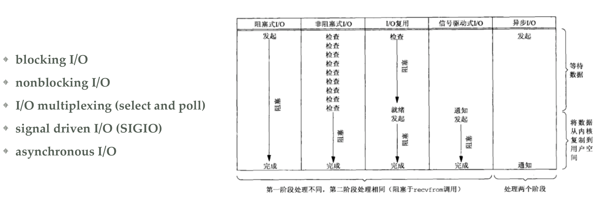
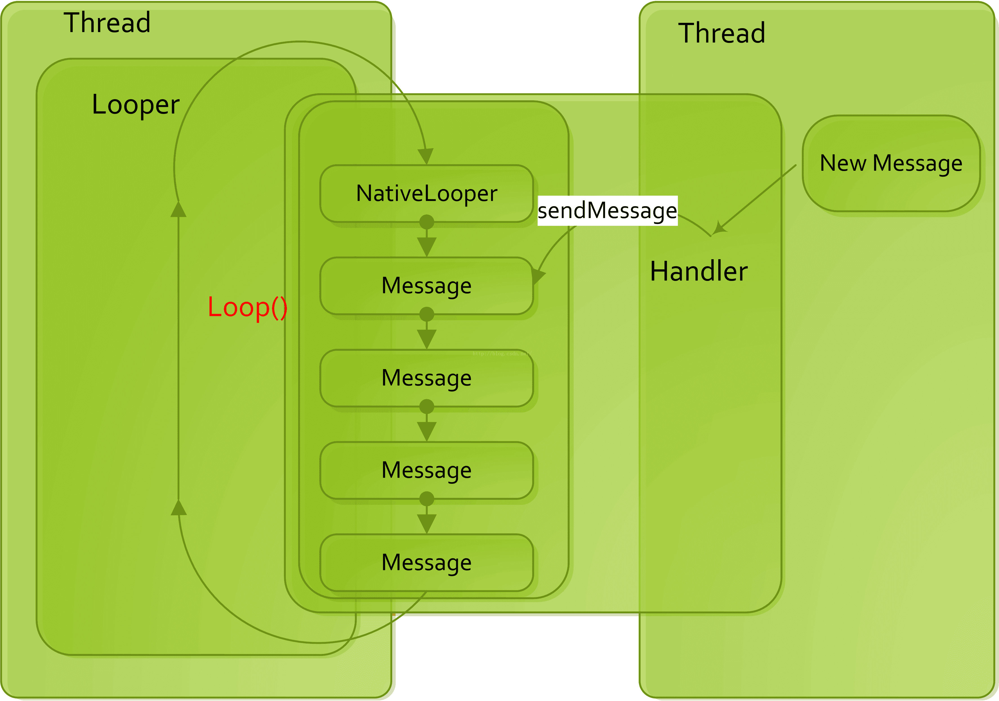
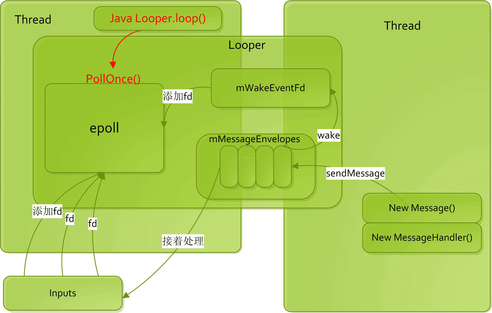

`nativePollOnce` 方法用于“等待”, 直到下一条消息可用为止. 如果在此调用期间花费的时间很长, 则您的主线程没有实际工作要做, 而是等待下一个事件处理.无需担心.

**说明:**

因为主线程负责绘制 UI 和处理各种事件, 所以主线程拥有一个处理所有这些事件的循环. 该循环由 `Looper` 管理, 其工作非常简单: 它处理 `MessageQueue` 中的所有 `Message`.
例如, 响应于输入事件, 将消息添加到队列, 帧渲染回调, 甚至您的 `Handler.post` 调用. 有时主线程无事可做（即队列中没有消息), 例如在完成渲染单帧之后(线程刚绘制了一帧, 并准备好下一帧, 等待适当的时间). `MessageQueue` 类中的两个 Java 方法对我们很有趣: `Message next()`和 `boolean enqueueMessage(Message, long)`. 顾名思义, `Message next()` 从队列中获取并返回下一个消息. 如果队列为空(无返回值), 则该方法将调用 `native void nativePollOnce(long, int)`, 该方法将一直阻塞直到添加新消息为止. 此时,您可能会问`nativePollOnce` 如何知道何时醒来. 这是一个很好的问题. 当将 `Message` 添加到队列时, 框架调用 `enqueueMessage` 方法, 该方法不仅将消息插入队列, 而且还会调用`native static void nativeWake(long)`. `nativePollOnce` 和 `nativeWake` 的核心魔术发生在 native 代码中. native `MessageQueue` 利用名为 `epoll` 的 Linux 系统调用, 该系统调用可以监视文件描述符中的 IO 事件. `nativePollOnce` 在某个文件描述符上调用 `epoll_wait`, 而 `nativeWake` 写入一个 IO 操作到描述符, `epoll_wait` 等待. 然后, 内核从等待状态中取出 `epoll` 等待线程, 并且该线程继续处理新消息. 如果您熟悉 Java 的 `Object.wait()`和 `Object.notify()`方法,可以想象一下 `nativePollOnce` 大致等同于 `Object.wait()`, `nativeWake` 等同于 `Object.notify()`,但它们的实现完全不同: `nativePollOnce` 使用 `epoll`, 而 `Object.wait` 使用 `futex` Linux 调用. 值得注意的是, `nativePollOnce` 和 `Object.wait` 都不会浪费 CPU 周期, 因为当线程进入任一方法时, 出于线程调度的目的, 该线程将被禁用(引用Object类的javadoc). 但是, 某些事件探查器可能会错误地将等待 `epoll` 等待(甚至是 Object.wait)的线程识别为正在运行并消耗 CPU 时间, 这是不正确的. 如果这些方法实际上浪费了 CPU 周期, 则所有空闲的应用程序都将使用 100％ 的 CPU, 从而加热并降低设备速度.

**结论:**

`nativePollOnce`. 它只是表明所有消息的处理已完成, 线程正在等待下一个消息.

## 我以前的理解分享




Linux 有多个 IO 模型:

- 阻塞 IO
- 非阻塞 IO
- IO 复用, 对应 `select` `poll` `epoll` 都属于基于 IO 复用模式的调用
- 信号驱动 IO
- 异步 IO


## 看下源码

### Java 这边

#### `enqueueMessage`:

```java
boolean enqueueMessage(Message msg, long when) {
    if (msg.target == null) {
        throw new IllegalArgumentException("Message must have a target.");
    }
    if (msg.isInUse()) {
        throw new IllegalStateException(msg + " This message is already in use.");
    }
    synchronized (this) {
        msg.markInUse();
        msg.when = when;
        Message p = mMessages;
        boolean needWake;
        if (p == null || when == 0 || when < p.when) {
            // New head, wake up the event queue if blocked.
            msg.next = p;
            mMessages = msg;
            needWake = mBlocked;
        } else {
            // Inserted within the middle of the queue.  Usually we don't have to wake
            // up the event queue unless there is a barrier at the head of the queue
            // and the message is the earliest asynchronous message in the queue.
            needWake = mBlocked && p.target == null && msg.isAsynchronous();
            Message prev;
            for (;;) {
                prev = p;
                p = p.next;
                if (p == null || when < p.when) {
                    break;
                }
                if (needWake && p.isAsynchronous()) {
                    needWake = false;
                }
            }
            msg.next = p; // invariant: p == prev.next
            prev.next = msg;
        }
        // We can assume mPtr != 0 because mQuitting is false.
        if (needWake) {
            // 这里唤醒 nativePollOnce 的沉睡
            nativeWake(mPtr);
        }
    }
    return true;
}
```

#### `next`:

```java
Message next() {
    //...
    int pendingIdleHandlerCount = -1; // -1 only during first iteration
    int nextPollTimeoutMillis = 0;
    for (;;) {
        if (nextPollTimeoutMillis != 0) {
            Binder.flushPendingCommands();
        }
        // nativePollOnce 这里陷入沉睡, 等待唤醒
        nativePollOnce(ptr, nextPollTimeoutMillis);
        synchronized (this) {
            // Try to retrieve the next message.  Return if found.
            final long now = SystemClock.uptimeMillis();
            Message prevMsg = null;
            Message msg = mMessages;
            if (msg != null && msg.target == null) {
                // Stalled by a barrier.  Find the next asynchronous message in the queue.
                do {
                    prevMsg = msg;
                    msg = msg.next;
                } while (msg != null && !msg.isAsynchronous());
            }
            if (msg != null) {
                if (now < msg.when) {
                    // Next message is not ready.  Set a timeout to wake up when it is ready.
                    nextPollTimeoutMillis = (int) Math.min(msg.when - now, Integer.MAX_VALUE);
                } else {
                    // Got a message.
                    mBlocked = false;
                    if (prevMsg != null) {
                        prevMsg.next = msg.next;
                    } else {
                        mMessages = msg.next;
                    }
                    msg.next = null;
                    if (DEBUG) Log.v(TAG, "Returning message: " + msg);
                    msg.markInUse();
                    return msg;
                }
            } else {
                // No more messages.
                nextPollTimeoutMillis = -1;
            }
            //...
        }
        //...
    }
}
```

### CPP 那边

#### `nativeWake`

```cpp
void NativeMessageQueue::wake() {
    mLooper->wake();
}
void Looper::wake() {
    uint64_t inc = 1;
    ssize_t nWrite = TEMP_FAILURE_RETRY(write(mWakeEventFd, &inc, sizeof(uint64_t)));
    if (nWrite != sizeof(uint64_t)) {
        if (errno != EAGAIN) {
            LOG_ALWAYS_FATAL("Could not write wake signal to fd %d: %s",
                    mWakeEventFd, strerror(errno));
        }
    }
}
```

#### `nativePollOnce`:

```cpp
void NativeMessageQueue::pollOnce(JNIEnv* env, jobject pollObj, int timeoutMillis) {
    mPollEnv = env;
    mPollObj = pollObj;
    mLooper->pollOnce(timeoutMillis);
    mPollObj = NULL;
    mPollEnv = NULL;

    if (mExceptionObj) {
        env->Throw(mExceptionObj);
        env->DeleteLocalRef(mExceptionObj);
        mExceptionObj = NULL;
    }
}
int Looper::pollOnce(int timeoutMillis, int* outFd, int* outEvents, void** outData) {
    int result = 0;
    for (;;) {
        while (mResponseIndex < mResponses.size()) {
            const Response& response = mResponses.itemAt(mResponseIndex++);
            int ident = response.request.ident;
            if (ident >= 0) {
                int fd = response.request.fd;
                int events = response.events;
                void* data = response.request.data;
                if (outFd != NULL) *outFd = fd;
                if (outEvents != NULL) *outEvents = events;
                if (outData != NULL) *outData = data;
                return ident;
            }
        }

        if (result != 0) {
            if (outFd != NULL) *outFd = 0;
            if (outEvents != NULL) *outEvents = 0;
            if (outData != NULL) *outData = NULL;
            return result;
        }

        result = pollInner(timeoutMillis);
    }
}
int Looper::pollInner(int timeoutMillis) {
    // Adjust the timeout based on when the next message is due.
    if (timeoutMillis != 0 && mNextMessageUptime != LLONG_MAX) {
        nsecs_t now = systemTime(SYSTEM_TIME_MONOTONIC);
        int messageTimeoutMillis = toMillisecondTimeoutDelay(now, mNextMessageUptime);
        if (messageTimeoutMillis >= 0
                && (timeoutMillis < 0 || messageTimeoutMillis < timeoutMillis)) {
            timeoutMillis = messageTimeoutMillis;
        }
    }

    // Poll.
    int result = POLL_WAKE;
    mResponses.clear();
    mResponseIndex = 0;

    // We are about to idle.
    mPolling = true;

    struct epoll_event eventItems[EPOLL_MAX_EVENTS];
    // 这里重点
    int eventCount = epoll_wait(mEpollFd, eventItems, EPOLL_MAX_EVENTS, timeoutMillis);

    // No longer idling.
    mPolling = false;

    // Acquire lock.
    mLock.lock();

    // Rebuild epoll set if needed.
    if (mEpollRebuildRequired) {
        mEpollRebuildRequired = false;
        rebuildEpollLocked();
        goto Done;
    }

    // Check for poll error.
    if (eventCount < 0) {
        if (errno == EINTR) {
            goto Done;
        }
        ALOGW("Poll failed with an unexpected error: %s", strerror(errno));
        result = POLL_ERROR;
        goto Done;
    }

    // Check for poll timeout.
    if (eventCount == 0) {
        result = POLL_TIMEOUT;
        goto Done;
    }

    // Handle all events.
    for (int i = 0; i < eventCount; i++) {
        int fd = eventItems[i].data.fd;
        uint32_t epollEvents = eventItems[i].events;
        if (fd == mWakeEventFd) {
            if (epollEvents & EPOLLIN) {
                awoken();
            } else {
                ALOGW("Ignoring unexpected epoll events 0x%x on wake event fd.", epollEvents);
            }
        } else {
            ssize_t requestIndex = mRequests.indexOfKey(fd);
            if (requestIndex >= 0) {
                int events = 0;
                if (epollEvents & EPOLLIN) events |= EVENT_INPUT;
                if (epollEvents & EPOLLOUT) events |= EVENT_OUTPUT;
                if (epollEvents & EPOLLERR) events |= EVENT_ERROR;
                if (epollEvents & EPOLLHUP) events |= EVENT_HANGUP;
                pushResponse(events, mRequests.valueAt(requestIndex));
            } else {
                ALOGW("Ignoring unexpected epoll events 0x%x on fd %d that is "
                        "no longer registered.", epollEvents, fd);
            }
        }
    }
Done: ;

    // Invoke pending message callbacks.
    mNextMessageUptime = LLONG_MAX;
    while (mMessageEnvelopes.size() != 0) {
        nsecs_t now = systemTime(SYSTEM_TIME_MONOTONIC);
        const MessageEnvelope& messageEnvelope = mMessageEnvelopes.itemAt(0);
        if (messageEnvelope.uptime <= now) {
            // Remove the envelope from the list.
            // We keep a strong reference to the handler until the call to handleMessage
            // finishes.  Then we drop it so that the handler can be deleted *before*
            // we reacquire our lock.
            { // obtain handler
                sp<MessageHandler> handler = messageEnvelope.handler;
                Message message = messageEnvelope.message;
                mMessageEnvelopes.removeAt(0);
                mSendingMessage = true;
                mLock.unlock();
                handler->handleMessage(message);
            } // release handler

            mLock.lock();
            mSendingMessage = false;
            result = POLL_CALLBACK;
        } else {
            // The last message left at the head of the queue determines the next wakeup time.
            mNextMessageUptime = messageEnvelope.uptime;
            break;
        }
    }

    // Release lock.
    mLock.unlock();

    // Invoke all response callbacks.
    for (size_t i = 0; i < mResponses.size(); i++) {
        Response& response = mResponses.editItemAt(i);
        if (response.request.ident == POLL_CALLBACK) {
            int fd = response.request.fd;
            int events = response.events;
            void* data = response.request.data;
            // Invoke the callback.  Note that the file descriptor may be closed by
            // the callback (and potentially even reused) before the function returns so
            // we need to be a little careful when removing the file descriptor afterwards.
            int callbackResult = response.request.callback->handleEvent(fd, events, data);
            if (callbackResult == 0) {
                removeFd(fd, response.request.seq);
            }

            // Clear the callback reference in the response structure promptly because we
            // will not clear the response vector itself until the next poll.
            response.request.callback.clear();
            result = POLL_CALLBACK;
        }
    }
    return result;
}
```


## 一、管道概述

管道，其本质是也是文件，但又和普通的文件会有所不同：管道缓冲区大小一般为1页，即4K字节。管道分为读端和写端，读端负责从管道拿数据，当数据为空时则阻塞；写端向管道写数据，当管道缓存区满时则阻塞。

在Handler机制中，Looper.loop方法会不断循环处理Message，其中消息的获取是通过 Message msg = queue.next(); 方法获取下一条消息。该方法中会调用nativePollOnce()方法，这便是一个native方法，再通过JNI调用进入Native层，在Native层的代码中便采用了管道机制。


## 二、Handler为何使用管道?

我们可能会好奇，既然是同一个进程间的线程通信，为何需要管道呢？

我们知道线程之间内存共享，通过Handler通信，消息池的内容并不需要从一个线程拷贝到另一个线程，因为两线程可使用的内存时同一个区域，都有权直接访问，当然也存在线程私有区域ThreadLocal（这里不涉及）。即然不需要拷贝内存，那管道是何作用呢？

**Handler机制中管道作用**就是当一个线程A准备好Message，并放入消息池，这时需要通知另一个线程B去处理这个消息。线程A向管道的写端写入数据1（对于老的Android版本是写入字符`W`），管道有数据便会唤醒线程B去处理消息。管道主要工作是用于通知另一个线程的，这便是最核心的作用。

这里我们通过两张图来展示Handler在Java层和在Native层的逻辑：

Java层：



Native层：




## 三、Handler为何采用管道而非Binder？

handler不采用Binder，并非binder完成不了这个功能，而是太浪费CPU和内存资源了。因为Binder采用C/S架构，一般用于不同进程间的通信。

- 从内存角度：通信过程中Binder还涉及一次内存拷贝，handler机制中的Message根本不需要拷贝，本身就是在同一个内存。Handler需要的仅仅是告诉另一个线程数据有了。

- 从CPU角度，为了Binder通信底层驱动还需要为何一个binder线程池，每次通信涉及binder线程的创建和内存分配等比较浪费CPU资源。

从上面的角度分析可得，Binder用于进程间通信，而Handler消息机制用于同进程的线程间通信，Handler不宜采用Binder。


## linux  epoll介绍

Epoll是linux2.6内核的一个新的系统调用，Epoll在设计之初，就是为了替代select，Epoll线性复杂度的模型，epoll的时间复杂度为O(1), 也就意味着，Epoll在高并发场景，随着文件描述符的增长，有良好的可扩展性。

- `select` 和 `poll` 监听文件描述符list，进行一个线性的查找 O(n)
- `epoll`: 使用了内核文件级别的回调机制O(1)

下图展示了文件描述符的量级和CPU耗时：


在linux 没有实现epoll事件驱动机制之前，我们一般选择用select或者poll等IO多路复用的方法来实现并发服务程序。在linux新的内核中，有了一种替换它的机制，就是epoll。

## Socket中 select()和poll() IO多路复用模型

**select的缺点：
mmap内存     **

1.单个进程能够监视的文件描述符的数量存在最大限制，通常是1024，当然可以更改数量，但由于select采用轮询的方式扫描文件描述符，文件描述符数量越多，性能越差；(在linux内核头文件中，有这样的定义：#define __FD_SETSIZE 1024)

2.内核 / 用户空间内存拷贝问题，select需要复制大量的句柄数据结构，产生巨大的开销；

3.select返回的是含有整个句柄的数组，应用程序需要遍历整个数组才能发现哪些句柄发生了事件；
4.select的触发方式是水平触发，应用程序如果没有完成对一个已经就绪的文件描述符进行IO操作，那么之后每次select调用还是会将这些文件描述符通知进程。

相比select模型，poll使用链表保存文件描述符，因此没有了监视文件数量的限制，但其他三个缺点依然存在。

假设我们的服务器需要支持100万的并发连接，则在__FD_SETSIZE 为1024的情况下，则我们至少需要开辟1k个进程才能实现100万的并发连接。除了进程间上下文切换的时间消耗外，从内核/用户空间大量的无脑内存拷贝、数组轮询等，是系统难以承受的。因此，基于select模型的服务器程序，要达到10万级别的并发访问，是一个很难完成的任务。

## epoll IO多路复用模型实现机制

由于epoll的实现机制与select/poll机制完全不同，上面所说的 select的缺点在epoll上不复存在。

设想一下如下场景：有100万个客户端同时与一个服务器进程保持着TCP连接。而每一时刻，通常只有几百上千个TCP连接是活跃的(事实上大部分场景都是这种情况)。如何实现这样的高并发？

在select/poll时代，服务器进程每次都把这100万个连接告诉操作系统(从用户态复制句柄数据结构到内核态)，让操作系统内核去查询这些套接字上是否有事件发生，轮询完后，再将句柄数据复制到用户态，让服务器应用程序轮询处理已发生的网络事件，这一过程资源消耗较大，因此，select/poll一般只能处理几千的并发连接。

epoll的设计和实现与select完全不同。epoll通过在Linux内核中申请一个简易的文件系统(文件系统一般用什么数据结构实现？B+树)。把原先的select/poll调用分成了3个部分：

1）调用epoll_create()建立一个epoll对象(在epoll文件系统中为这个句柄对象分配资源)

2）调用epoll_ctl向epoll对象中添加这100万个连接的套接字

3）调用epoll_wait收集发生的事件的连接

如此一来，要实现上面说是的场景，只需要在进程启动时建立一个epoll对象，然后在需要的时候向这个epoll对象中添加或者删除连接。同时，epoll_wait的效率也非常高，因为调用epoll_wait时，并没有一股脑的向操作系统复制这100万个连接的句柄数据，内核也不需要去遍历全部的连接。

## epoll实现机制

当某一进程调用epoll_create方法时，Linux内核会创建一个eventpoll结构体，这个结构体中有两个成员与epoll的使用方式密切相关。eventpoll结构体如下所示：

```
struct eventpoll{
 ....
 /*红黑树的根节点，这颗树中存储着所有添加到epoll中的需要监控的事件*/
 struct rb_root rbr;
 /*双链表中则存放着将要通过epoll_wait返回给用户的满足条件的事件*/
 struct list_head rdlist;
 ....
};
```

每一个epoll对象都有一个独立的eventpoll结构体，用于存放通过epoll_ctl方法向epoll对象中添加进来的事件。这些事件都会挂载在红黑树中，如此，重复添加的事件就可以通过红黑树而高效的识别出来(红黑树的插入时间效率是lgn，其中n为树的高度)。

而所有**添加到epoll中的事件都会与设备(网卡)驱动程序建立回调关系，也就是说，当相应的事件发生时会调用这个回调方法**。这个回调方法在内核中叫ep_poll_callback,它会将发生的事件添加到rdlist双链表中。

在epoll中，对于每一个事件，都会建立一个epitem结构体，如下所示：

```
struct epitem{
 struct rb_node rbn;//红黑树节点
 struct list_head rdllink;//双向链表节点
 struct epoll_filefd ffd; //事件句柄信息
 struct eventpoll *ep; //指向其所属的eventpoll对象
 struct epoll_event event; //期待发生的事件类型
}
```

当调用epoll_wait检查是否有事件发生时，只需要检查eventpoll对象中的rdlist双链表中是否有epitem元素即可。如果rdlist不为空，则把发生的事件复制到用户态，同时将事件数量返回给用户。

[](javascript:;)

通过红黑树和双链表数据结构，并结合回调机制，造就了epoll的高效。

## epoll的接口

**1.epoll_create**

创建epoll句柄
函数声明：int epoll_create(int size)

参数：size用来告诉内核这个监听的数目一共有多大。
返回值：返回创建了的epoll句柄。
当创建好epoll句柄后，它就是会占用一个fd值，在linux下如果查看/proc/进程id/fd/，是能够看到这个fd的，所以在使用完epoll后，必须调用close()关闭，否则可能导致fd被耗尽。

**2.epoll_ctl**

将被监听的描述符添加到epoll句柄或从epool句柄中删除或者对监听事件进行修改。
函数申明：int epoll_ctl(int epfd, int op, int fd, struct epoll_event*event);

参数：
epfd： epoll_create()的返回值
op：表示要进行的操作，其值分别为：
EPOLL_CTL_ADD： 注册新的fd到epfd中；
EPOLL_CTL_MOD： 修改已经注册的fd的监听事件；
EPOLL_CTL_DEL： 从epfd中删除一个fd；
fd：需要操作/监听的文件句柄
event：是告诉内核需要监听什么事件，struct epoll_event如下：

```
typedef union epoll_data { 
void *ptr; 
int fd; 
__uint32_t u32; 
__uint64_t u64; 
} epoll_data_t; 

struct epoll_event { 
__uint32_t events; /* Epoll events */ 
epoll_data_t data; /* User data variable */ 
}; 
```

events可以是以下几个宏的集合：

EPOLLIN：触发该事件，表示对应的文件描述符上有可读数据。(包括对端SOCKET正常关闭)；
EPOLLOUT：触发该事件，表示对应的文件描述符上可以写数据；
EPOLLPRI：表示对应的文件描述符有紧急的数据可读（这里应该表示有带外数据到来）；
EPOLLERR：表示对应的文件描述符发生错误；
EPOLLHUP： 表示对应的文件描述符被挂断；
EPOLLET：将EPOLL设为边缘触发(EdgeTriggered)模式，这是相对于水平触发(Level Triggered)来说的。
EPOLLONESHOT： 只监听一次事件，当监听完这次事件之后，如果还需要继续监听这个socket的话，需要再次把这个socket加入到EPOLL队列里。

示例：

```
struct epoll_event ev;
//设置与要处理的事件相关的文件描述符
ev.data.fd=listenfd;
//设置要处理的事件类型
ev.events=EPOLLIN|EPOLLET;
//注册epoll事件
epoll_ctl(epfd,EPOLL_CTL_ADD,listenfd,&ev);
```

**1.epoll_wait**

等侍注册在epfd上的socket fd的事件的发生，如果发生则将发生的sokct fd和事件类型放入到events数组中。
函数原型：`int epoll_wait(int epfd, struct epoll_event * events, int maxevents, int timeout);`

参数：
epfd：由epoll_create 生成的epoll文件描述符
events：用于回传代处理事件的数组
maxevents：每次能处理的最大事件数
timeout：等待I/O事件发生的超时毫秒数，-1相当于阻塞，0相当于非阻塞。一般用-1即可

## epoll的工作模式

ET(EdgeTriggered):高速工作模式，只支持no_block(非阻塞模式)。在此模式下，当描述符从未就绪变为就绪时，内核通过epoll告知。然后它会假设用户知道文件描述符已经就绪，并且不会再为那个文件描述符发送更多的就绪通知，直到某些操作导致那个文件描述符不再为就绪状态了。(触发模式只在数据就绪时通知一次，若数据没有读完，下一次不会通知，直到有新的就绪数据)

LT(LevelTriggered):缺省工作方式，支持blocksocket和no_blocksocket。在LT模式下内核会告知一个文件描述符是否就绪了，然后可以对这个就绪的fd进行IO操作。如果不作任何操作，内核还是会继续通知！若数据没有读完，内核也会继续通知，直至设备数据为空为止！

## 示例说明：

1.我们已经把一个用来从管道中读取数据的文件句柄(RFD)添加到epoll描述符
\2. 这个时候从管道的另一端被写入了2KB的数据
\3. 调用epoll_wait(2)，并且它会返回RFD，说明它已经准备好读取操作
\4. 然后我们读取了1KB的数据
\5. 调用epoll_wait(2)……